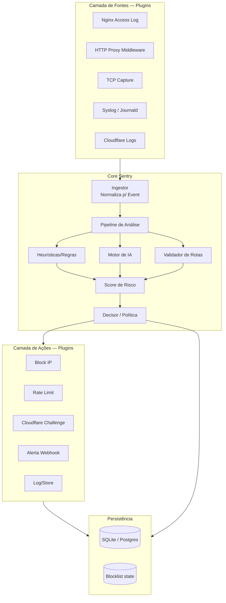
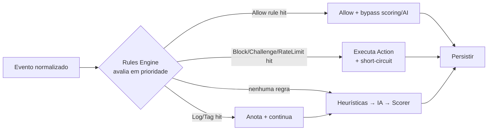
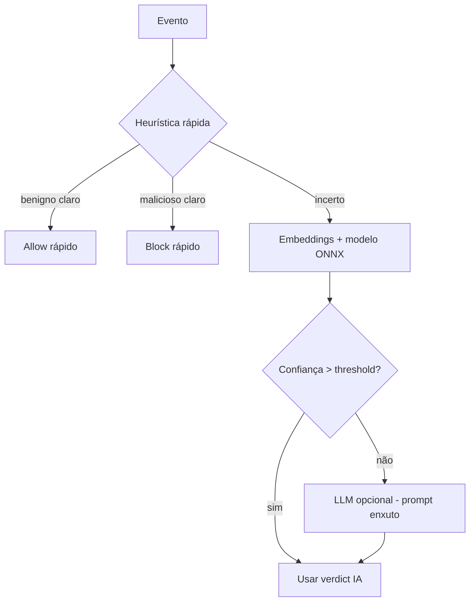
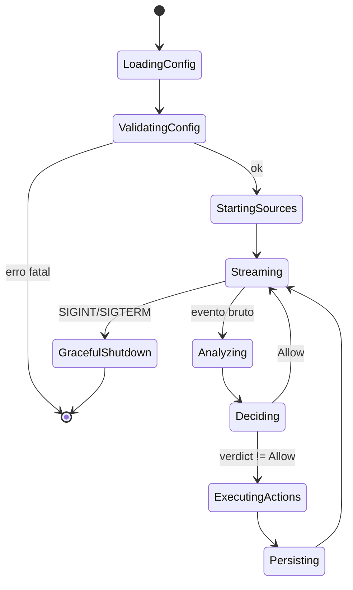
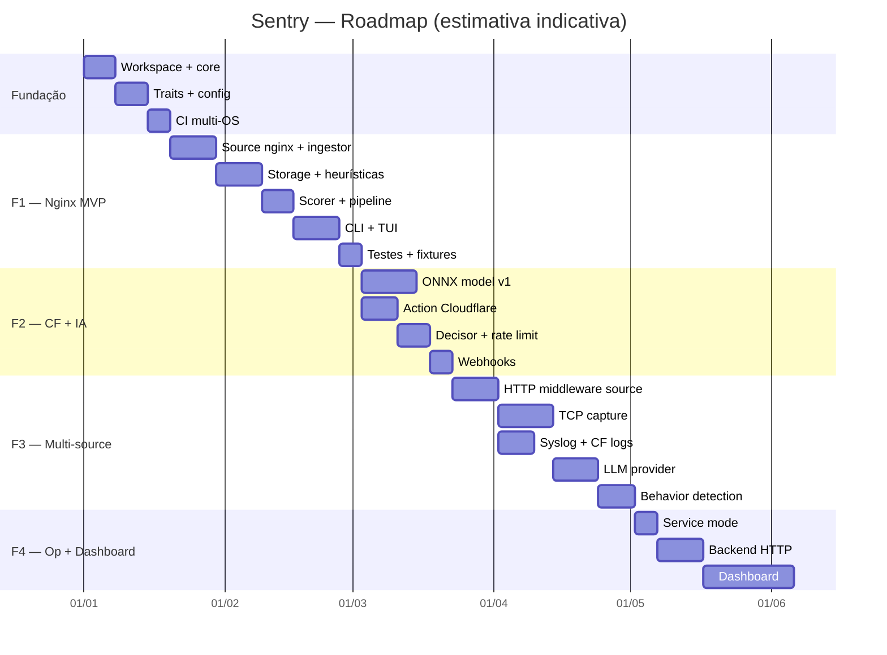
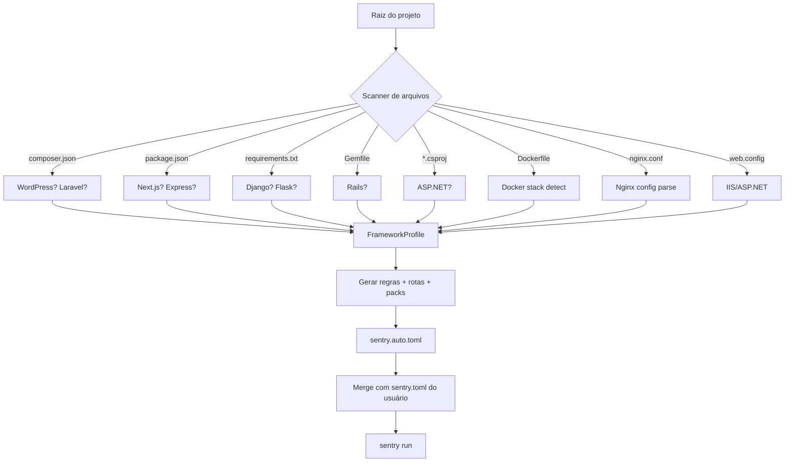

# Sentry — Monitor de Acessos com Detecção de Ameaças por IA

> Status: **Planejamento**
> Linguagem: **Rust** (multi-plataforma: Linux, macOS, Windows, BSD)
> Interface atual: **CLI** (dashboard web futuramente)
> Repositório: `C:\dev\rust\sentry`

---

## 1. Visão Geral

O **Sentry** é um observador de acessos em tempo real para serviços expostos à internet. Começa monitorando o **nginx** (via access logs), mas é desenhado para escalar para **qualquer porta/protocolo** (HTTP, TCP, proxies reversos, packet capture, syslog). Usa IA + heurísticas para detectar payloads maliciosos, comportamento suspeito, rotas inválidas e calcula um **nível de risco** por requisição/IP. Integra-se com **Cloudflare** para challenge/block em camada de edge.

### 1.1 Objetivos

- **Modularidade total**: cada origem de dados (nginx, tcp, http-proxy) é um plugin por trás de um trait comum.
- **Tempo real**: stream de eventos, não batch.
- **Precisão**: combinar regras determinísticas (rápidas, zero falso-positivo conhecido) com IA (para o desconhecido).
- **Ação**: não apenas detectar — bloquear, desafiar, rate-limitar.
- **Multi-plataforma**: um único binário em Rust.
- **Operável**: CLI rica para tail ao vivo, relatórios, export, gestão de blocklist.

### 1.2 Não-objetivos (fase atual)

- Dashboard web (fase futura, via Tauri ou backend HTTP separado).
- Substituir um WAF comercial — é complementar.
- Deep packet inspection de protocolos não-HTTP na fase 1.

---

## 2. Arquitetura de Alto Nível



### 2.1 Princípios de design

1. **Trait `Source`**: todo plugin implementa `fn stream_events(&self) -> impl Stream<Item = RawEvent>`. Adicionar nginx = implementar o trait.
2. **Trait `Action`**: `fn execute(&self, decision: &Decision) -> Result<()>`. Block, Challenge, Alert etc.
3. **Event normalizado**: um único `struct Event` independente da origem. O core nunca sabe se veio do nginx ou do TCP.
4. **Pipeline assíncrono**: `tokio` + canais. Cada estágio é um actor/fan-out.
5. **Configuração declarativa**: `sentry.toml` define fontes ativas, ações ativas, thresholds.

---

## 3. Stack Técnica

| Camada            | Crate / Tecnologia                                  | Justificativa                                          |
|-------------------|-----------------------------------------------------|--------------------------------------------------------|
| Async runtime     | `tokio`                                             | Padrão de facto, multi-plataforma                      |
| CLI               | `clap` (derive) + `ratatui` para TUI live          | Ergonomia, subcomandos, painel ao vivo                 |
| Config            | `serde` + `toml` + `figment` (env+file merge)      | Override por env var em prod                           |
| Logs/Tracing      | `tracing` + `tracing-subscriber`                   | Structured logging, spans por requisição               |
| Parser nginx      | `nom` ou `regex` + `serde`                         | Linhas de log access_log custom format                 |
| HTTP client       | `reqwest` (rustls)                                 | Cloudflare API, webhooks, geolookup                    |
| ML/IA local       | `ort` (ONNX Runtime) + `candle` fallback           | Inferência local sem depender de API externa           |
| LLM (opcional)    | trait `LlmProvider` + adapters: **OpenRouter** (rota p/ qualquer modelo), `async-openai`, `ollama-rs` | Análise de payload complexa sob demanda, provider-agnostic |
| Storage           | `sqlx` com **Postgres** default (migrations sqlx), SQLite opcional via feature | Mesmo schema, troca por feature flag; Postgres suporta HA e múltiplos nós desde cedo |
| Geolookup         | `maxminddb` (DB local)                             | Sem chamada externa por evento                         |
| IPC/Embeddable    | `core` como lib crate (`sentry-core`)              | Futuro dashboard consome a mesma lib                    |
| Serialização      | `serde` + `serde_json`                             | Eventos, export, API futura                            |
| Erros             | `thiserror` (lib) + `color-eyre` (bin)             | Ergonomia + backtraces legíveis                        |
| Testes            | `proptest` + `insta` (snapshots) + `wiremock`      | Payloads maliciosos, fixtures de log                   |
| Build/Release     | `cargo-dist` ou `cross`                            | Binários multi-OS                                      |

---

## 4. Modelo de Dados

O `Event` é **modular por design**: campos comuns a qualquer origem vivem no top-level; o que é específico de protocolo fica em `ProtocolData` (enum extensível). Hoje `Http` cobre nginx; amanhã `Tcp`, `Udp`, `Tls` etc. entram sem mudar o core — basta a source popular a variante correspondente. As heurísticas e o scorer operam sobre o `Event` e fazem *pattern matching* em `protocol`, ignorando campos ausentes.

```rust
// sentry-core/src/event.rs
pub struct Event {
    // --- comuns a qualquer protocolo ---
    pub id: Uuid,
    pub timestamp: DateTime<Utc>,
    pub source: SourceKind,          // Nginx, Tcp, HttpProxy, CloudflareLogs...
    pub transport: Transport,        // Tcp | Udp | Tls | Internal
    pub client_ip: IpAddr,
    pub client_port: Option<u16>,
    pub server_port: Option<u16>,    // porta exposta observada
    pub geo: Option<GeoInfo>,
    pub asn: Option<u32>,
    pub direction: Direction,        // Inbound | Outbound
    pub bytes_in: Option<u64>,
    pub bytes_out: Option<u64>,
    pub duration_ms: Option<u64>,
    pub raw: Option<String>,         // registro original p/ auditoria

    // --- específico do protocolo ---
    pub protocol: ProtocolData,
}

pub enum ProtocolData {
    Http(HttpData),
    Tcp(TcpData),
    Udp(UdpData),
    TlsHandshake(TlsData),
    Raw(RawData),                    // fallback: bytes + nota
    // futuras variantes entram aqui sem quebrar consumidores
}

pub struct HttpData {
    pub method: HttpMethod,
    pub scheme: Option<String>,      // http | https
    pub host: Option<String>,
    pub path: String,
    pub query: Option<String>,
    pub fragment: Option<String>,
    pub status: Option<u16>,
    pub user_agent: Option<String>,
    pub referer: Option<String>,
    pub headers: HashMap<String, String>,
    pub body: Option<Vec<u8>>,       // quando disponível (proxy/middleware)
    pub cookies: Option<HashMap<String, String>>,
}

pub struct TcpData {
    pub flags: TcpFlags,             // syn/fin/rst/ack...
    pub payload: Option<Vec<u8>>,    // bytes do stream reconstruído (quando capturável)
    pub stream_id: Option<u64>,      // p/ correlacionar segmentos
    pub stage: TcpStage,             // Syn | SynAck | Data | Fin | Reset
}

pub struct UdpData {
    pub payload: Option<Vec<u8>>,
    pub dns_query: Option<String>,   // se for DNS reconhecido
}

pub struct TlsData {
    pub sni: Option<String>,
    pub ja3: Option<String>,         // fingerprint TLS
    pub ja4: Option<String>,
    pub cipher: Option<String>,
    pub version: Option<String>,
}

pub struct RawData {
    pub note: String,
    pub bytes: Vec<u8>,
}

// Helpers de ergonomia: e.kind_http() -> Option<&HttpData> etc.
impl Event {
    pub fn http(&self)  -> Option<&HttpData>  { match &self.protocol { ProtocolData::Http(d) => Some(d), _ => None } }
    pub fn tcp(&self)   -> Option<&TcpData>   { match &self.protocol { ProtocolData::Tcp(d) => Some(d), _ => None } }
    pub fn tls(&self)   -> Option<&TlsData>   { match &self.protocol { ProtocolData::TlsHandshake(d) => Some(d), _ => None } }
    pub fn is_http(&self) -> bool { matches!(self.protocol, ProtocolData::Http(_)) }
}
```

> **Regra**: nenhum estágio do pipeline pode assumir `ProtocolData::Http`. Heurísticas HTTP verificam `evt.http()` e retornam `None` para outras variantes; heurísticas TCP fazem o análogo. Assim o mesmo pipeline roda para nginx hoje e para captura TCP amanhã.

pub struct AnalysisResult {
    pub risk_score: u8,               // 0..=100
    pub risk_level: RiskLevel,        // Info|Low|Medium|High|Critical
    pub signals: Vec<Signal>,         // o que disparou
    pub verdict: Verdict,             // Allow|Challenge|Block|Quarantine
}

pub enum Signal {
    PathTraversal, SqlInjection, Xss, CmdInjection,
    UnknownRoute, ScanBehavior, AbnormalRate,
    SuspiciousUA, TorExitNode, KnownBadIp,
    AnomalousPayload(/* modelo */),
    Custom(String),
}
```

---

## 5. Fluxo de uma Requisição

```mermaid
sequenceDiagram
    participant N as Nginx (log)
    participant I as Ingestor
    participant P as Pipeline
    participant H as Heurísticas
    participant A as IA (ONNX)
    participant R as Roteiro (rotas válidas)
    participant S as Scorer
    participant D as Decisor
    participant CF as Cloudflare API
    participant DB as SQLite

    N->>I: linha de access_log
    I->>I: parse + normalizar p/ Event
    I->>P: Event
    par fan-out paralelo
        P->>H: regex/sigs (SQLi, XSS, LFI...)
        P->>A: payload suspeito? embeddings
        P->>R: path existe? método permitido?
    end
    H-->>S: signals + pesos
    A-->>S: score anomalia
    R-->>S: -delta se rota inválida
    S->>S: combinar → risk_score + level
    S->>D: AnalysisResult
    D->>D: aplicar política (ex: High+IP novo = Challenge)
    alt Decision == Block
        D->>CF: firewall_rules: block IP
        D->>DB: registrar incidente
    else Decision == Challenge
        D->>CF: challenge IP (JS/Turnstile)
    else Allow
        D->>DB: métricas only
    end
    D-->>N: (não interfere no nginx na fase 1; modo inline no futuro)
```

---

## 6. Níveis de Risco e Vereditos

| Score  | Level    | Cor       | Veredito padrão                  |
|--------|----------|-----------|----------------------------------|
| 0–9    | Info     | cinza     | Allow                            |
| 10–29  | Low      | azul      | Allow + observação               |
| 30–49  | Medium   | amarelo   | Rate-limit crescente             |
| 50–74  | High     | laranja   | Challenge (Cloudflare)           |
| 75–100 | Critical | vermelho  | Block IP + alerta                |

Política configurável por rota/IP-range/ASN. Ex: `/admin/*` tem threshold mais baixo.

---

## 7. Modularidade — Plugins

### 7.1 Trait de Source

```rust
// sentry-core/src/source.rs
#[async_trait]
pub trait Source: Send + Sync {
    fn name(&self) -> &'static str;
    async fn stream(&self) -> anyhow::Result<mpsc::Receiver<RawEvent>>;
}

// Implementações:
// sentry-source-nginx    -> tail do access.log
// sentry-source-http     -> middleware axum/actix que recebe cópia
// sentry-source-tcp      -> captura via `pnet`/`pcap` (libpcap)
// sentry-source-cloudflare -> pull de logs via API em polling
```

### 7.2 Trait de Action

```rust
// sentry-core/src/action.rs
#[async_trait]
pub trait Action: Send + Sync {
    fn name(&self) -> &'static str;
    async fn execute(&self, evt: &Event, decision: &Decision) -> anyhow::Result<()>;
}

// Implementações:
// sentry-action-cloudflare  -> regras de firewall, challenge
// sentry-action-blocklist   -> estado local (para inline proxy)
// sentry-action-webhook     -> Discord/Slack/Telegram/email
// sentry-action-iptables    -> nftables/iptables (Linux)
// sentry-action-log         -> registrar em DB
```

### 7.3 Registro dinâmico

Cada plugin expõe `pub fn register(reg: &mut Registry)`. O binário habilita plugins via feature flags Cargo + entry em `sentry.toml`. **Sem recompilar para ativar/desativar** — só config.

---

## 8. Integração Cloudflare (Sinergia de Challenge)

```mermaid
flowchart LR
    EVT[Evento High/Critical] --> CF1{Cloudflare habilitado?}
    CF1 -->|sim| CF2[Resolver zona+IP]
    CF2 --> CF3{Já bloqueado recentemente?}
    CF3 -->|não| CF4[Criar/Atualizar firewall rule]
    CF3 -->|sim| CF5[Estender TTL]
    CF4 --> CF6[Challenge mode: js_challenge|managed_challenge|block]
    CF6 --> CF7[Webhook confirmação]
    CF1 -->|não| BL[Blocklist local only]
```

- Tokens via env (`SENTRY_CF_TOKEN`, `SENTRY_CF_ZONE`).
- Cache local de IPs já desafiados (TTL configurável) para não bombardear a API.
- Modos: `block`, `js_challenge`, `managed_challenge`, `rate_limit`.
- **Importante**: na fase 1 o Sentry é **read-only + Cloudflare action**. Não há inline proxy. Inline é fase futura (`sentry-proxy`).

---

## 9. Detecção de Rotas Válidas

1. **Discovery controlado**: o usuário fornece rotas válidas via config (allowlist) **ou** o Sentry aprende em modo `learn` (período de baseline sem ataques).
2. Estrutura: trie de paths com métodos permitidos + parâmetros esperados.
3. Sinais derivados:
   - Rota inexistente → +pontos (scan/directory brute-force).
   - Muitos 404 do mesmo IP em janela → scan behavior.
   - Hits em paths sensíveis (`/.env`, `/wp-admin`, `/api/admin`) mesmo inexistentes → peso alto.
4. Saída: relatório `sentry routes` mostrando rotas conhecidas vs. tentadas.

---

## 10. Rules Engine — Blacklist/Allowlist (WAF-style)

O Sentry tem um **motor de regras determinístico** que roda **antes** das heurísticas e da IA — é o "fast path". Inspirado nas Custom Rules / WAF da Cloudflare: cada regra é um *match* + *action*, avaliada em ordem de prioridade, com **short-circuit**. Regras são a primeira linha de defesa (bloqueio instantâneo de VPNs, crawlers, ASNs, países) e também a fonte de **allowlists** (IPs/ASNs confiáveis que bypassam todo o scoring).

### 10.1 Modelo

```rust
// sentry-core/src/rules.rs
pub struct Rule {
    pub id: RuleId,
    pub name: String,
    pub priority: i32,              // menor = avalia primeiro
    pub enabled: bool,
    pub match_: RuleMatch,          // condição (combinável com AND/OR)
    pub action: RuleAction,
    pub ttl: Option<Duration>,      // regras dinâmicas expiram (ex: block temporário)
    pub source: RuleSource,         // Config | Db | CloudflareSync | AutoLearned
    pub tags: Vec<String>,          // ex: "default", "vpn", "crawler"
}

pub enum RuleAction {
    Allow,                          // bypassa scoring + AI (allowlist absoluta)
    Block,
    Challenge,                      // Cloudflare managed/js challenge
    RateLimit { req_per_sec: u32, window: Duration },
    Log,                            // só registra, não age (modo shadow)
    Tag(String),                    // anota o evento, continua pipeline
}

// Expressões combináveis — mesma ideia de matchers da CF
pub enum RuleMatch {
    Ip(IpMatcher),                 // IP exato | CIDR | range
    Asn(u32),
    Country(IsoCode),
    Path(PathMatcher),             // exato | glob | regex
    Method(HttpMethod),
    Header { name: String, op: StrOp },
    UserAgent(StrOp),
    Query(StrOp),
    Body(StrOp),                   // quando disponível
    Protocol(ProtocolKind),        // Http | Tcp | Tls...
    TlsFingerprint { ja3: Option<String>, ja4: Option<String> },
    Reputation(ReputationTier),    // Clean | Suspicious | Malicious | Datacenter | Vpn | Tor
    Status(u16),                   // ex: status == 404
    Rate { count: u32, per: Duration, scope: RateScope },
    Time { window: TimeWindow },   // só ativa em horário comercial etc.
    All(Vec<RuleMatch>),           // AND
    Any(Vec<RuleMatch>),           // OR
    Not(Box<RuleMatch>),
}

pub enum IpMatcher { Single(IpAddr), Cidr(IpCidr), Range { from: IpAddr, to: IpAddr } }
pub enum StrOp { Equals(String), Contains(String), Regex(Regex), StartsWith(String), In(Vec<String>) }
```

### 10.2 Precedência no pipeline



Ordem: **Allowlist** (trust absoluto) > **Blocklist explícita** > **Reputation/VPN/Tor defaults** > **Crawler/UA defaults** > **path sensíveis** > (cai para heurísticas+IA). Allowlist é o *escape hatch* para evitar falso-positivo em IPs próprios (healthchecks, monitoring, CI).

### 10.3 Default Rule Packs (pré-configurados, ligar/desligar por config)

Packs shipados com o Sentry, ativáveis com uma linha. Cada pack é um conjunto de regras com `tags` para fácil inspeção/edição via CLI.

| Pack            | Default | O que faz                                                                     |
|-----------------|---------|-------------------------------------------------------------------------------|
| `vpn_proxy`     | on      | Block/Challenge IPs classificados como VPN/proxy (reputation = Vpn/Proxy)     |
| `tor`           | on      | Block exit nodes Tor (reputation = Tor)                                        |
| `datacenter_abuse` | on   | Challenge ASNs de datacenter fora de allowlist (DigitalOcean, OVH, Hetzner, etc. — alvos de bots) |
| `crawlers_bad`  | on      | Block UAs de scanners/ferramentas de ataque: `sqlmap`, `nikto`, `nmap`, `masscan`, `zgrab`, `curl/8.*` suspeito, `python-requests` sem contexto |
| `crawlers_good` | off     | **Allow** bots legítimos (Googlebot, Bingbot, etc.) — verificação via reverse-DNS conforme spec do Google |
| `empty_ua`      | on      | Challenge/block requisições sem User-Agent (raro em tráfego legítimo)         |
| `sensitive_paths` | on (enforce) | **Block** hits em arquivos/dirs sensíveis por default (ver §10.3.1 para lista completa) |
| `country_blocklist` | off | Block países não atendidos (configura lista ISO)                           |
| `country_allowlist` | off | Allow só países da lista (mais restritivo, modo opt-in)                    |
| `http_anomaly`  | on      | Block métodos raros não usados (`TRACE`, `CONNECT`), HTTP/0.9, headers malformados |
| `rate_scan`     | on      | Rate-limit/Block IP com >N 404 em janela (directory brute-force)             |

**Semântica de default `on`**: packs vêm ativos mas em modo `Log` ou `Challenge` (não `Block` direto) no primeiro deploy — modo *shadow* para validar antes de endurecer. Usuário promove para `Block` após confirmar zero falso-positivo. Controlado por `mode = "shadow" | "enforce"` por pack. **Exceção**: `sensitive_paths` já vem em `enforce` por default (acesso a `.env`/`.git` é sempre malicioso).

### 10.3.1 Pack `sensitive_paths` — lista completa (default enforce)

Arquivos e diretórios cujo acesso é **sempre bloqueado** por default. Cobertura dividida em categorias; cada entrada é uma regra `path regex` → `Block`. A lista é extensível via config/DB.

**Credenciais & configuração:**
```
\.env(\.local|\.production|\.development)?$      # .env, .env.local, ...
\.env\.[a-z]+$                                    # qualquer variante .env.*
config\.(php|json|yml|yaml|ini|conf)              # configs de app
secrets\.(json|yml|yaml)
credentials\.(json|csv)
\.htpasswd
wp-config\.php
local\.xml                                        # Magento
settings\.php                                     # Drupal
configuration\.php                                # Joomla
```

**SCM & metadata de diretório:**
```
/\.git/                                           # .git/, HEAD, config, index
/\.svn/
/\.hg/
/\.bzr/
/\.gitignore
/\.gitattributes
/\.dockerignore
```

**Cloud & infraestrutura:**
```
/\.aws/                                           # credentials, config
/\.ssh/                                           # id_rsa, id_ed25519, authorized_keys
/\.gcp/
/\.azure/
/\.kube/                                          # kubeconfig
/\.docker/                                        # config.json com tokens de registry
/\.terraform(\.tfstate)?
```

**Arquivos de build & artefatos:**
```
/(package-lock\.json|yarn\.lock|composer\.lock)   # opcional: info de versão p/ recon
/(docker-compose\.yml|docker-compose\.yaml)       # expõe topologia de serviços
/(Dockerfile|Puppetfile|Vagrantfile)
/\.npmrc                                          # tokens npm
/\.pypirc                                         # tokens pypi
/\.netrc                                          # creds HTTP
```

**Painéis admin & ferramentas conhecidas:**
```
/(wp-admin|wp-login\.php)                         # WordPress
/(phpmyadmin|pma|phpMyAdmin)                      # phpMyAdmin
/(adminer|adminer\.php)
/(wp-content/uploads/phpmailer)                   # exploit comum
/manager/                                         # Tomcat manager
/server-status                                    # Apache mod_status
/server-info
/nginx-status
/fpm-status
/actuator(/env|/heapdump|/threaddump)?            # Spring Boot actuator sensível
/health(/.*)?                                     # opcional (pode ser legit)
```

**Backup & dump:**
```
/\.(sql|bak|backup|old|swp|tmp|orig|save|copy)$
/(dump|backup|db)\.(sql|tar|gz|zip|tgz)
/www\.(zip|tar|gz|rar|7z)                         # full-site dumps
```

**Sistema & expostos perigosos:**
```
/\.well-known/security\.txt$        # ALLOW (legítimo — RFC 9116) → allowlist explícita
/\.DS_Store
/Thumbs\.db
/(etc/passwd|etc/shadow)             # path traversal via decode
/(proc/self/environ|proc/self/fd/.*)
```

**Implementação técnica:**
- Cada categoria é um *sub-pack* toggleável individualmente (`sentry rules packs list` mostra estado granular).
- A allowlist interna **sempre** permite `/.well-known/security.txt` (RFC 9116 — documento público de divulgação responsável) mesmo com o pack ativo.
- Match case-insensitive (`.ENV` == `.env`) para evitar bypass trivial.
- Considera encodings: `%2e` (`.`), `%2f` (`/`), `..;/` (path traversal smuggling), double-encoding — normalização pré-match.
- Rotas explicitamente allowlistadas pelo usuário (`[[rules.custom]] action = "allow"`) têm prioridade sobre o pack, permitindo expor `/admin/` se a app realmente precisar.

**Por que `enforce` e não `shadow` desde o início**: acessos a `.git/`, `.env`, `.ssh/` são estatisticamente 100% maliciosos em apps web (não há motivo legítimo para um browser acessar isso). O custo de um falso-positivo aqui é nulo vs. o risco de vazar credenciais.

### 10.4 Fontes de regras

1. **Config (`sentry.toml`)** — regras estáticas, versionadas com o app.
2. **Postgres (`rules` table)** — regras dinâmicas criadas via CLI/dashboard, hot-reload sem reiniciar.
3. **Cloudflare sync** — importa Custom Rules/WAF da CF como regras locais (espelho) para decisão local em modo inline futuro.
4. **Auto-learned** — IPs confirmados como maliciosos pelo decisor viram regra dinâmica `Block` com TTL (feedback loop).
5. **Reputation feeds** — blocklists públicas (Spamhaus DROP, Emerging Threats, FireHOL) sincronizadas periodicamente → viram regras `Block` tagadas `feed:spamhaus`.

Hot-reload: o daemon observa a tabela `rules` (Postgres `LISTEN/NOTIFY`) e atualiza um `Arc<RwLock<RuleSet>>` em memória sem restart. Avaliação é indexada por IP-hash/ASN/country para não iterar todas as regras por evento.

### 10.5 CLI — gestão de regras

```
sentry rules list [--tag vpn] [--enabled] [--source db|config|feed]
sentry rules show <id>
sentry rules add --name "block admin from RU" \
    --match 'country=RU AND path=/admin/*' --action block --priority 10
sentry rules allow <ip> [--ttl 24h] [--note "monitoring agent"]
sentry rules block <ip> [--ttl 24h] [--note "scan"]
sentry rules allow-asn <asn> [--note "our DC"]
sentry rules block-asn <asn>
sentry rules enable <id>
sentry rules disable <id>
sentry rules delete <id>
sentry rules import-feed spamhaus      # sincroniza reputation feed
sentry rules packs list                # mostra packs e estado (shadow/enforce/off)
sentry rules packs enable vpn_proxy --mode enforce
sentry rules packs disable crawlers_good
sentry rules test <ip>                 # simula: quais regras bateriam neste IP agora
sentry rules test --path /admin --ua "sqlmap/1.0" --ip 1.2.3.4
```

### 10.6 Config (`sentry.toml`)

```toml
[rules]
# packs default — ligar/desligar e modo por pack
[[rules.pack]]
name = "vpn_proxy"
mode  = "shadow"          # shadow | enforce | off

[[rules.pack]]
name = "tor"
mode  = "enforce"

[[rules.pack]]
name = "crawlers_bad"
mode  = "enforce"

[[rules.pack]]
name = "crawlers_good"
mode  = "enforce"         # allow Googlebot etc.

[[rules.pack]]
name = "sensitive_paths"
mode  = "enforce"         # default: bloqueia .env, .git, .ssh, etc. (ver §10.3.1)

[[rules.pack]]
name = "country_blocklist"
mode  = "enforce"
countries = ["RU","CN","KP"]   # ISO codes

# regras estáticas inline (além das do DB)
[[rules.custom]]
name = "allow internal monitoring"
priority = 1
match = 'ip=10.0.0.0/8'
action = "allow"

[[rules.custom]]
name = "challenge datacenter ASN outside business hours"
priority = 20
match = 'asn=14061 AND time outside(09:00-18:00 America/Sao_Paulo)'
action = "challenge"

# reputation feeds
[[rules.feed]]
name = "spamhaus_drop"
url  = "https://www.spamhaus.org/drop/drop.txt"
refresh_hours = 24
action = "block"
```

> **DSL de `match`**: mini-linguagem declarativa para config/CLI (`ip=`, `asn=`, `country=`, `path=`, `path regex=`, `ua=`, `header.X=`, `method=`, `protocol=`, `reputation=`, `time=`, combináveis com `AND`/`OR`/`NOT` e parênteses). Parseada para `RuleMatch` em runtime. Mesma sintaxe da CLI `--match` e do `rules test`.



- **Camada 0 — Heurísticas** (sempre roda, ~µs): regex de SQLi/XSS/path traversal, allowlist de ASN, reputation IP local.
- **Camada 1 — Modelo ONNX local**: classificador treinado em payloads maliciosos (SQLi, XSS, RCE, log4shell). Treinamento offline, modelo versionado em `models/`.
- **Camada 2 — LLM sob demanda** (opcional, custo alto): só para eventos Medium sem verdict claro; prompt curto com path+headers+payload truncado. Resposta estruturada via JSON schema.
- **Retreinamento**: pipeline offline consome incidentes confirmados → novo modelo → `sentry model reload`.

### 10.1 Abstração de LLM — trait `LlmProvider`

O Sentry é **provider-agnostic**: nunca chama uma API de LLM diretamente, sempre via trait. Isso permite trocar modelo/provider sem mudar código — só config. O adapter **OpenRouter** é o recomendado como default porque um único endpoint roteia para qualquer modelo (Claude, GPT, Gemini, Qwen, Llama, DeepSeek...), útil para experimentar custo×qualidade.

```rust
// sentry-ai/src/llm.rs
#[async_trait]
pub trait LlmProvider: Send + Sync {
    fn name(&self) -> &'static str;            // "openrouter" | "ollama" | "openai" | "anthropic"...
    fn model_id(&self) -> &str;                // ex: "anthropic/claude-3.5-sonnet"
    async fn classify(&self, req: ClassifyRequest) -> anyhow::Result<ClassifyResponse>;
    async fn explain(&self, req: ExplainRequest) -> anyhow::Result<String>;
}

pub struct ClassifyRequest {
    pub protocol: ProtocolData,    // funciona p/ Http, Tcp, etc.
    pub context: String,           // resumo truncado: path, headers-chave, payload preview
    pub schema: JsonSchema,        // resposta estruturada obrigatória
}
pub struct ClassifyResponse {
    pub verdict: Verdict,
    pub risk_score: u8,
    pub signals: Vec<String>,
    pub confidence: f32,           // 0.0–1.0
}

// Adapters (cada um em seu módulo/feature):
// - OpenRouterProvider  -> POST https://openrouter.ai/api/v1/chat/completions
// -                       header: Authorization: Bearer $SENTRY_LLM_KEY
// -                       body: { model, messages, response_format: json_schema }
// - OllamaProvider      -> http://localhost:11434/api/chat (local, sem chave)
// - OpenAiProvider      -> api.openai.com (async-openai)
// - AnthropicProvider   -> api.anthropic.com (messages API)
// - MockProvider        -> para testes determinísticos
```

**Seleção por config**: `llm_provider = "openrouter"`, `llm_model = "anthropic/claude-3.5-sonnet"`. Trocar para Ollama = mudar 2 linhas. Cache de verdicts por hash do payload evita re-chamar o LLM para payloads idênticos em janela curta.

---

## 11. CLI — Interface

```
sentry                          # inicia o monitor (daemon foreground)
sentry daemon start|stop|status # modo service (opcional)
sentry tail                     # live tail de eventos + risk colorido
sentry tail --only High,Critical
sentry incidents list           # lista incidentes
sentry incidents show <id>
sentry ip info <ip>             # histórico, score, ASN, geo
sentry ip block <ip> [--ttl 24h]
sentry ip unblock <ip>
sentry routes list              # rotas conhecidas
sentry routes learn             # modo baseline
sentry report --from 24h        # relatório agregado
sentry report --export json|csv
sentry config validate
sentry config show
sentry model status             # versão do modelo, acc
sentry model reload
sentry test detect "<payload>"  # roda pipeline em string isolada
sentry cloudflare status        # sincroniza estado
sentry cloudflare pull          # importa logs existentes
```

### 11.1 Interface interativa TUI (`ratatui`)

A CLI tem **dois modos de `tail`**:
- `sentry tail` (ou `sentry tail --tui`) → abre **TUI interativa fullscreen** com `ratatui` + `crossterm`. Modo default quando o terminal é TTY.
- `sentry tail --stream` → modo **não-interativo**, uma linha por evento (JSON ou texto colorido). Ideal para pipe (`| jq`, `| grep`), logs estruturados ou redirecionamento. Ativado automaticamente quando stdin/stdout não é TTY (detecção via `std::io::IsTerminal`).

**TUI fullscreen** — layout de 3 zonas:

```
┌──────────────────────── Sentry — live ────────────────────────┐
│ req/s 412 ▁▂▃▅▇▆▄▂   Info 9.8k  Low 142  Med 31  High 7  Crit 1│  ← header/sparkline
├────────────────────────────────────────────────────────────────┤
│ CRIT 1.2.3.4   POST /api/login   SQLi:' OR 1=1--               │  ← stream colorido
│ HIGH 5.6.7.8   GET  /.env         UnknownRoute+sensitive        │     (scroll, filtro)
│ MED  9.0.1.2   GET  /wp-admin     ScanBehavior (12x404/60s)     │
│ ...                                                            │
├────────────────────────────────────────────────────────────────┤
│ Top IPs suspeitos        │ Top paths atacados   │ ASN/Geo      │  ← rodapé agregado
│ 1.2.3.4    18  CRIT      │ /admin     22        │ AS1234  41%  │
│ 5.6.7.8    11  HIGH      │ /.env      9         │ Tor     3%   │
└────────────────────────────────────────────────────────────────┘
 [f]iltrar [b]loquear [c]hallenge [i]nfo IP [r]otas [q]sair
```

- **Interatividade**: navegar com setas/`j`/`k`, Enter abre detalhe do evento (headers, payload, signals, verdict IA), `b` bloqueia IP selecionado (pede confirmação), `c` dispara challenge Cloudflare, `i` mostra histórico completo do IP, `f` abre filtro (por level/IP/path/ASN), `r` abre painel de rotas, `/` busca textual.
- **Render responsivo**: redimensionamento de terminal suportado; alterna colunas do rodapé conforme largura.
- **Modo pausa**: `Space` congela o stream para inspecionar sem perder eventos (bufferizado).
- **Themes**: `--theme dark|light|mono` (acessibilidade / terminais sem cor).

---

## 12. Configuração (`sentry.toml`)

```toml
[core]
data_dir = "/var/lib/sentry"
storage  = "sqlite"        # sqlite | postgres

[storage.postgres]
url = "postgres://..."

[[source]]
type   = "nginx"
path   = "/var/log/nginx/access.log"
format = "$remote_addr - $remote_user [$time_local] \"$request\" $status $body_bytes_sent \"$http_referer\" \"$http_user_agent\""

[[source]]
type = "cloudflare"
zone = "example.com"
poll_secs = 30

[analysis]
risk_threshold_challenge = 50
risk_threshold_block     = 75
learn_unknown_routes     = true

[analysis.ai]
onnx_model = "models/sentry-payload-v1.onnx"
llm_provider = "ollama"      # none | openai | ollama
llm_model = "qwen2.5:7b"
llm_only_above = 30

[routes]
known = [
  { path = "/", methods = ["GET"] },
  { path = "/api/users", methods = ["GET","POST"] },
  { path = "/admin/*", methods = ["GET"], auth_required = true },
]

[[action]]
type = "cloudflare"
mode = "managed_challenge"
ttl_hours = 24

[[action]]
type = "webhook"
url = "https://discord.com/api/webhooks/..."
on_levels = ["High","Critical"]

[[action]]
type = "log"   # sempre
```

---

## 13. Estrutura de Crates (workspace)

```
sentry/
├── Cargo.toml                    # workspace
├── crates/
│   ├── sentry-core/              # lib: Event, traits, pipeline, scoring
│   ├── sentry-source-nginx/      # plugin Source: nginx log tail
│   ├── sentry-source-http/       # plugin Source: middleware proxy (futuro)
│   ├── sentry-source-tcp/        # plugin Source: pcap (futuro)
│   ├── sentry-source-cloudflare/ # plugin Source: pull logs CF
│   ├── sentry-ai/                # ONNX + LLM provider trait
│   ├── sentry-action-cloudflare/ # plugin Action
│   ├── sentry-action-webhook/    # plugin Action
│   ├── sentry-action-blocklist/  # plugin Action
│   ├── sentry-storage/           # sqlx SQLite/Postgres
│   ├── sentry-geo/               # maxminddb wrapper
│   └── sentry-cli/               # binário: clap + ratatui + entrypoint
├── models/                       # modelos ONNX versionados
├── config/sentry.example.toml
├── tests/                        # integration tests
└── docs/
    ├── ARCHITECTURE.md
    ├── THREAT_MODELS.md          # catálogo de payloads/sinais
    └── PLUGIN_DEV.md             # como criar um plugin
```

---

## 14. Fluxograma do Ciclo de Vida do Daemon



---

## 15. Plano de Execução — Backlog

Legenda: **F1** = Fase 1 (MVP nginx), **F2** = Cloudflare + IA local, **F3** = Multi-source + LLM, **F4** = Dashboard.

### Fase 0 — Fundação
- [x] **F0.1** Inicializar workspace Cargo + crates skeleton — `Cargo.toml:1-13` (9 crates)
- [x] **F0.2** Definir `sentry-core`: `Event`, `RawEvent`, `Signal`, `RiskLevel`, `Decision`, erros — `event.rs`, `analysis.rs`, `error.rs`
- [x] **F0.3** Traits `Source`, `Action`, `Registry` — `source.rs`, `action.rs`, `registry.rs`, `challenge.rs`
- [x] **F0.4** Config loader (figment: TOML + env) — `sentry-core/src/config.rs`, `sentry-cli/src/config.rs:13-42`
- [~] **F0.5** `tracing` setup com spans por evento — `logging.rs` init ok; **faltam spans por evento**
- [x] **F0.6** CI: fmt, clippy (-D warnings), testes, build multi-OS — `.github/workflows/ci.yml` (lint + test matrix ubuntu/windows/macos + storage com Postgres)

### Fase 1 — MVP nginx (read-only + console)
- [x] **F1.1** `sentry-source-nginx`: tail de arquivo com `notify`/`tokio`, parse de formato custom `$var` — `source.rs` (rotação), `parser.rs` (`LogFormat::compile`)
- [x] **F1.2** Ingestor: normalização → `Event`, dedupe, enriquecimento geo (maxminddb local) — `sentry-geo` pronto; daemon com geo enrichment + dedupe LRU TTL 10s (`daemon.rs`)
- [x] **F1.3** `sentry-storage`: schema Postgres (events, incidents, ip_state, rules, routes) — 5 repos em `repo.rs`; migrations `init.sql` + `routes.sql`; daemon persiste (async spawn)
- [x] **F1.4** Heurísticas: regex SQLi/XSS/LFI/RCE/path-traversal/log4shell, assinaturas — 9 detectores em `heuristics.rs` (SQLi/XSS/PathTraversal/LFI/Log4Shell/CmdInjection/SensitivePath/BadCrawler/EmptyUserAgent)
- [x] **F1.5** Roteador de rotas: config allowlist + modo `learn` — `RouteValidator` em `pipeline.rs` com globs; `RouteValidator::from_config`; modo `learn` pendente (F2)
- [x] **F1.5b** Rules Engine: trait `Rule`/`RuleMatch`/`RuleAction`, avaliador com short-circuit, hot-reload via Postgres LISTEN/NOTIFY, DSL parser para `match` — tipos + avaliador em `rules.rs`; DSL recursive-descent em `rules/dsl.rs` (14 testes); LISTEN/NOTIFY `sentry_rules_changed`
- [x] **F1.5c** Pack `sensitive_paths` (enforce default): lista completa §10.3.1 com normalização de encoding + allowlist `/.well-known/security.txt` — 6 regex + allowlist em `packs.rs`; URL-decode no matcher (`rules.rs`)
- [x] **F1.5d** Packs default: `vpn_proxy`, `tor`, `crawlers_bad`, `crawlers_good`, `empty_ua`, `http_anomaly`, `rate_scan`, `country_blocklist` em modo shadow; `sentry rules` CLI completa (list/show/add/block/allow/enable/disable/delete/packs/test)
- [x] **F1.6** Scorer: combinar sinais → `risk_score`/`level` (pesos em config) — `from_signals` + `score_with_weights` em `pipeline.rs`; `ScorerConfig` (weights + repetition bonus + window); bônus de repetição (`RepetitionTracker`)
- [~] **F1.7** Pipeline assíncrono: `tokio` mpsc, fan-out heurística+rota, fan-in no scorer — fan-in mpsc no daemon; `process()` é sequencial, sem fan-out
- [x] **F1.8** CLI: `sentry`, `tail` (com cores), `incidents list/show`, `ip block/unblock/info`, `routes list`, `rules *`, `report`, `config validate/show`, `test`, `model`, `cloudflare` — handlers reais em `cmd.rs`
- [x] **F1.9** TUI `ratatui`: standalone lê eventos recentes do Postgres, scrollável, atalhos j/k/Space/g/G/q/Esc — `tui.rs` (~250 linhas)
- [x] **F1.10** Fixtures de logs nginx + testes de parse (`insta` snapshots) — 11 fixtures + 11 snapshots em `sentry-source-nginx/tests/`
- [x] **F1.11** Testes de heurísticas com `proptest` (payloads maliciosos catalogados) — 6 proptests em `heuristics.rs`

### Fase 2 — Cloudflare + IA local
- [~] **F2.1** `sentry-ai`: trait `ThreatModel`, impl ONNX via `ort` — trait em `threat.rs`; feature `onnx` existe; **sem impl ONNX**
- [ ] **F2.2** Treinar modelo v1 (dataset de payloads) — pipeline Python em `tools/train` — sem `tools/`
- [x] **F2.3** `sentry-action-cloudflare`: client API (firewall rules, challenge modes), cache de IPs, TTL — `sentry-action-cloudflare/src/lib.rs` (ChallengeProvider, cache, TTL)
- [~] **F2.4** Decisor: política de verdict → action mapping — scorer→verdict em `analysis.rs`; **sem policy table configurável**
- [ ] **F2.5** `sentry cloudflare status/pull/test` — CLI stubs apenas
- [ ] **F2.6** Rate-limiting por IP/ASN (token bucket em memória + Redis opt) — `RuleMatch::Rate` retorna `false`
- [x] **F2.7** Alertas: `sentry-action-webhook` (Discord/Slack/Telegram genérico) — `sentry-action-webhook/src/lib.rs` (POST JSON com contexto)
- [ ] **F2.8** Métricas: counters/histogramas exportáveis (`sentry report --export`) — só 2 counters in-process
- [ ] **F2.9** Roteador: rotas parametrizadas (`/users/{id}/posts/{post_id}`) — hoje só exato/glob `*` em `glob_simple` (`pipeline.rs:60-112`); adicionar template matcher com placeholders nomeados e normalização de path (colapsar segmentos dinâmicos)
- [ ] **F2.10** Roteador: auto-aprendizado (modo `learn`) — observar tráfego e inferir rotas conhecidas em runtime (frequência + estabilidade de shape), persistir em `routes` no Postgres; referenciado em `cmd.rs:161-163` ("not yet implemented (F2)"); revisar `RouteValidator` para suportar hot-reload das rotas aprendidas
- [ ] **F2.11** Roteador: import de specs OpenAPI/Swagger 2.0/3.x — parser de `paths` + `parameters` para gerar rotas parametrizadas automaticamente (sub-comando `sentry routes import --openapi spec.json|yaml`); suportar também Postman Collection e HAR como fontes secundárias; mapear `path templates` (`/users/{id}`) para o matcher de F2.9

### Fase 3 — Multi-source + LLM
- [ ] **F3.1** `sentry-source-http`: middleware axum que recebe cópia da req (modo sidecar/inline leve) — sem crate
- [ ] **F3.2** `sentry-source-tcp`: captura via `pnet` (filtro por porta), reconstrução de stream HTTP quando possível — sem crate
- [ ] **F3.3** `sentry-source-cloudflare`: pull de logs existentes (polling) — sem crate
- [ ] **F3.4** `sentry-source-syslog`: receptor RFC 5424 (UDP/TCP) para equipamentos de rede — sem crate
- [~] **F3.5** LLM provider trait (`ollama`/`openai`): prompt enxuto, JSON schema strict, cache de verdicts — trait `LlmProvider` em `llm.rs`; **zero adapters**
- [ ] **F3.6** Pipeline de retreinamento: exportar incidentes confirmados → dataset → novo modelo
- [ ] **F3.7** Reputation feeds: importar blocklists públicas (Emerging Threats, Spamhaus) periodicamente — config schema + `ReputationTier` existem; sem fetcher
- [ ] **F3.8** Detecção de comportamento: scan, brute-force, credential stuffing (janelas deslizantes) — signal kinds existem; sem detectores
- [ ] **F3.9** Inline proxy opcional (`sentry-proxy`) — modo bloqueio antes da app (com timeout fallback)

### Fase 4 — Operação & Dashboard
- [ ] **F4.1** Modo serviço: integração systemd unit / Windows Service / launchd plist
- [ ] **F4.2** Backend HTTP minimalista (axum) expondo JSON sobre a lib `sentry-core`
- [ ] **F4.3** Dashboard web (Tauri ou SPA) consumindo o backend
- [ ] **F4.4** Auth + RBAC para dashboard
- [ ] **F4.5** Alertas bidirecionais (ack/resolve no dashboard)
- [ ] **F4.6** Export SIEM (CEF/LEEF, syslog forward)
- [ ] **F4.7** Alta disponibilidade: estado em Redis/Postgres compartilhado

### Cross-cutting (contínuo)
- [ ] **X.1** Documentação de plugin (`docs/PLUGIN_DEV.md`) — sem `docs/`
- [ ] **X.2** Catálogo de threat models (`docs/THREAT_MODELS.md`) — sem `docs/`
- [ ] **X.3** Benchmarks de throughput (criterion) — meta: 10k req/s parsed
- [~] **X.4** Hardening: segredos via env/secret manager, nunca em config commitada — env vars ok; sem secret manager
- [ ] **X.5** Release automation: `cargo-dist` ou `cross` → GitHub Releases multi-OS
- [ ] **X.6** Telemetria opt-in de uso (não de dados) para guiar roadmap

> **Legenda**: `[x]` = feito · `[~]` = parcial (ver nota) · `[ ]` = pendente
> **Devs notáveis**: storage é Postgres (não SQLite); `sentry-auto` não tem crate (só CLI stub); 9 packs default implementados; DSL de `match` completo (recursive-descent, 14 testes); TUI ratatui standalone lê do Postgres; 57 testes (53 core + 3 nginx + 1 snapshot); CI GitHub Actions (fmt/clippy/test 3 OS + storage).

---

## 16. Modelo de Risco — Pesos Iniciais (referência)

| Sinal                         | Peso | Acumula? |
|-------------------------------|------|----------|
| SQLi (regex)                  | 60   | não      |
| XSS (regex)                   | 45   | não      |
| Path traversal (`../`, `%2e`) | 40   | sim      |
| Log4Shell (`${jndi:`)         | 80   | não      |
| RCE/cmd injection             | 70   | não      |
| Rota inexistente              | 8    | sim      |
| >10 404/IP em 60s             | 35   | —        |
| User-agent vazio/suspeito     | 10   | sim      |
| Tor exit node                 | 15   | —        |
| IP em reputation feed         | 50   | —        |
| Anomalia ONNX > 0.8           | 50   | não      |
| Acesso a path sensível        | 30   | sim      |

Pesos combinam (soma com cap 100), com bônus para repetição em janela. **Tudo ajustável em config.**

---

## 17. Decisões Abertas (a validar)

1. **Inline vs. read-only na F1**: recomendado **read-only** (sem risco de quebrar produção); inline só na F3.
2. **LLM default**: recomendado **Ollama local** (sem custo, sem vazamento de dados). OpenAI opt-in.
3. **Modelo ONNX v1**: treinar do zero ou fine-tunar em dataset público (CSIC-2010, HTTP DATASET CSIC)?
4. **Storage default**: SQLite (zero-config) → Postgres quando >1 nó.
5. **TUI vs. CLI puro**: manter **ambos** — `tail --tui` abre painel, `tail --stream` apenas linhas (pipe-friendly).
6. **Geolookup**: MMDB local (MaxMind GeoLite2, gratuito c/ licença) — baixar automaticamente no `sentry init`.

---

## 18. Roadmap Visual



---

## 19. Critérios de "Pronto" por Fase

- **F1**: ao apontar para `access.log` real, `sentry tail` mostra eventos coloridos por risco, identifica SQLi/XSS em payloads, marca rotas inexistentes, persiste tudo em SQLite, exporta relatório JSON. Throughput ≥ 5k req/s sem backlog.
- **F2**: evento High dispara challenge no Cloudflare em < 2s; modelo ONNX classifica payloads com F1 ≥ 0.9 em dataset de teste; webhook entrega alerta com contexto.
- **F3**: múltiplas fontes ativas simultaneamente; LLM só acionado em < 2% dos eventos (custo controlado); detecção de brute-force em janela de 5 min.
- **F4**: dashboard mostra eventos live, permite ack/block, histórico de 30 dias sem degradação.

---

## 20. `sentry auto` — Detecção de Framework e Geração Automática de Regras

Subprojeto que torna o Sentry "zero-config" para apps comuns: ao rodar `sentry auto` na raiz de um site/projeto, o Sentry **detecta o framework/stack** e **gera regras, rotas conhecidas e packs recomendados** sob medida. Em vez de partir de uma config genérica, o Sentry entende o que está rodando e protege o que importa.

### 20.1 Fluxo



### 20.2 Perfis de Framework (`FrameworkProfile`)

Cada perfil é um "preset" que conhece a estrutura do framework e gera regras específicas. Perfis são **plugins** (`sentry-profile-*`) que registram um detector e um gerador de regras.

| Framework       | Detecção (sinais)                              | Regras geradas                                                            |
|-----------------|------------------------------------------------|---------------------------------------------------------------------------|
| **WordPress**   | `wp-config.php`, `wp-login.php`, `wp-admin/`   | Block `wp-login.php` brute-force rate-limit, allowlist `/wp-admin/admin-ajax.php`, protect `wp-content/uploads`, block `xmlrpc.php` abuse |
| **Laravel**     | `artisan`, `composer.json` com `laravel/framework` | Protect `/.env`, block `storage/logs`, allowlist `/storage/app/public`, rate-limit `/login` |
| **Next.js**     | `next.config.js`, `package.json` com `next`    | Allowlist `/_next/static/*` (CDN assets), protect `/api/admin/*`, block `/.next/` |
| **Django**      | `manage.py`, `wsgi.py`, `settings.py`         | Protect `settings.py`, block `admin/` brute-force, allowlist `/static/` |
| **Flask**       | `requirements.txt` com `flask`, `app.py`       | Detect rotas via `@app.route` (AST scan), proteger `/.env` |
| **Rails**       | `Gemfile` com `rails`, `config/routes.rb`     | Parse `routes.rb` para rotas válidas, protect `/admin/*` |
| **Express**     | `package.json` com `express`                   | Detect rotas via AST de `app.js`/`routes/` |
| **ASP.NET**     | `*.csproj` com `Microsoft.AspNetCore`          | Protect `web.config`, allowlist `/wwwroot/*` |
| **Nginx conf**  | `nginx.conf` ou `sites-enabled/*`              | Parse `location` blocks → rotas conhecidas exatas |
| **Docker**      | `docker-compose.yml`, `Dockerfile`             | Detect portas expostas, serviços internos, gerar monitor de cada porta |

### 20.3 Detecção (Scanner)

O scanner lê a raiz do projeto e identifica o(s) framework(s) por:

1. **Arquivos-âncora**: `wp-config.php` → WordPress, `artisan` → Laravel, `manage.py` → Django.
2. **Manifestos**: `composer.json` (PHP), `package.json` (Node), `requirements.txt`/`pyproject.toml` (Python), `Gemfile` (Ruby), `*.csproj` (.NET).
3. **AST parsing** (opcional, profundo): parse de `routes.rb` (Rails), `urls.py` (Django), `app.js` (Express) para extrair rotas **exatas** — não só padrões.
4. **Config de servidor**: `nginx.conf` parse → `location` blocks viram rotas conhecidas.
5. **Múltiplos frameworks**: se detectar mais de um (ex: nginx + WordPress), combina perfis.

```rust
// sentry-auto/src/detect.rs
pub trait FrameworkDetector: Send + Sync {
    fn name(&self) -> &'static str;
    fn detect(&self, root: &Path) -> Option<FrameworkProfile>;
}

pub struct FrameworkProfile {
    pub framework: String,
    pub version: Option<String>,
    pub routes: Vec<RouteDef>,       // rotas exatas detectadas
    pub sensitive_paths: Vec<String>, // específicas do framework
    pub admin_paths: Vec<String>,
    pub recommended_packs: Vec<String>,
    pub recommended_rules: Vec<RuleDef>,
}
```

### 20.4 Geração de Regras

A partir do `FrameworkProfile`, o gerador produz:

1. **Rotas conhecidas** (`[[routes.known]]`): para o validador de rotas — 404 em rota não-listada vira sinal `UnknownRoute`.
2. **Regras específicas**:
   - WordPress: `wp-login.php` rate-limit (5 tentativas/min), `xmlrpc.php` block por default.
   - Laravel: `storage/logs` block, `.env` block (já no pack `sensitive_paths` mas reforçado).
   - Django: `admin/login/` rate-limit.
3. **Allowlists inteligentes**: assets estáticos (`/static/`, `/_next/static/`, `/wp-content/uploads/`) não devem disparar rate-limit mesmo em alto volume.
4. **Packs recomendados**: ativa `sensitive_paths` em enforce, `crawlers_bad` em enforce, `rate_scan` em enforce para paths admin.

### 20.5 CLI

```
sentry auto                    # detecta framework na cwd, gera sentry.auto.toml
sentry auto --root /var/www    # especifica raiz do projeto
sentry auto --merge            # merge com sentry.toml existente
sentry auto --dry-run          # só mostra o que detectaria, não escreve
sentry auto --profile wordpress # forçar um perfil (skip detecção)
sentry auto --deep             # AST scan de rotas (lento, preciso)
sentry auto list-profiles      # lista perfis suportados
```

**Saída**: `sentry.auto.toml` (ou merge em `sentry.toml`) contendo rotas + regras + packs. O usuário revisa, ajusta, e pronto. O `sentry run` carrega ambos.

### 20.6 Arquitetura do subprojeto

```
crates/
├── sentry-auto/                # crate do `auto` command
│   ├── src/
│   │   ├── lib.rs               # FrameworkDetector trait, FrameworkProfile
│   │   ├── detect.rs            # scanner de arquivos
│   │   ├── generate.rs          # profile → rules/routes config
│   │   └── profiles/
│   │       ├── wordpress.rs
│   │       ├── laravel.rs
│   │       ├── nextjs.rs
│   │       ├── django.rs
│   │       ├── rails.rs
│   │       ├── express.rs
│   │       ├── aspnet.rs
│   │       └── nginx.rs         # parse de nginx.conf
│   └── tests/                   # fixtures de projetos reais por framework
└── sentry-cli/                 # adiciona `sentry auto` subcommand
```

### 20.7 Detecção de rotas via AST (modo `--deep`)

Para frameworks onde as rotas estão no código (Rails, Django, Express, Flask), o `--deep` faz **AST parsing** com `syn` (Rust não — preciso de parsers específicos):

| Framework  | Arquivo              | Parser                          |
|------------|----------------------|---------------------------------|
| Rails      | `config/routes.rb`   | `tree-sitter-ruby`              |
| Django    | `urls.py`            | `tree-sitter-python`            |
| Express   | `routes/*.js`        | `tree-sitter-javascript`        |
| Flask     | `app.py`             | `tree-sitter-python`            |
| Laravel   | `routes/web.php`     | `tree-sitter-php`               |

`tree-sitter` é a escolha: parsers incrementais rápidos, multi-linguagem, uma única crate `tree-sitter` com bindings. Extrair `@app.route("/foo")` ou `get "/bar"` → `RouteDef { path: "/foo", methods: ["GET"] }`.

### 20.8 Backlog (subprojeto auto)

- [ ] **A.1** `sentry-auto` crate skeleton + `FrameworkDetector` trait
- [ ] **A.2** Scanner de arquivos-âncora + manifestos (composer, package.json, etc.)
- [ ] **A.3** Perfil **WordPress**: wp-config detection, wp-login rate-limit, xmlrpc block, wp-admin allowlist
- [ ] **A.4** Perfil **Laravel**: artisan detection, .env/storage protect, routes/web.php parse (PHP AST)
- [ ] **A.5** Perfil **Django**: manage.py detection, admin/ rate-limit, urls.py parse (Python AST)
- [ ] **A.6** Perfil **Next.js**: next.config.js, `/_next/static` allowlist, `/api/*` routes
- [ ] **A.7** Perfil **Rails**: routes.rb parse (Ruby AST), admin protect
- [ ] **A.8** Perfil **Express**: app.js/routes/ parse (JS AST)
- [ ] **A.9** Perfil **nginx.conf**: parse `location` blocks → rotas conhecidas
- [ ] **A.10** Gerador: profile → `sentry.auto.toml` (rotas + regras + packs)
- [ ] **A.11** `sentry auto` CLI: `--root`, `--dry-run`, `--merge`, `--profile`, `--deep`
- [ ] **A.12** `tree-sitter` integration para AST scan (deep mode)
- [ ] **A.13** Fixtures de testes: 1 projeto real por framework (em `tests/fixtures/`)
- [ ] **A.14** Merge inteligente: preserva regras custom do usuário, só adiciona

> **Fase**: F1.x (pode rodar em paralelo ao MVP nginx — o `auto` gera config que o `run` consome).

---

## 21. Próximos Passos Imediatos

1. Validar este plano (revisar decisões abertas da seção 17).
2. `cargo new --lib` do workspace + crates skeleton. ✅ (F0 concluído)
3. Implementar F1.1 (source nginx) — é o gancho de valor mais rápido.
4. Iniciar `sentry-auto` em paralelo (A.1–A.3) para WordPress como primeiro perfil.
