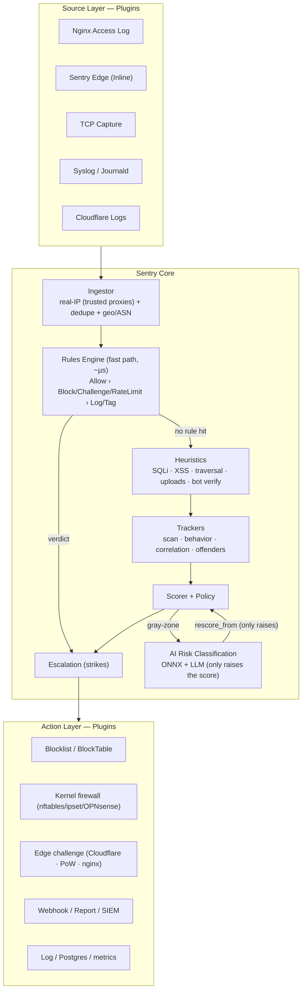
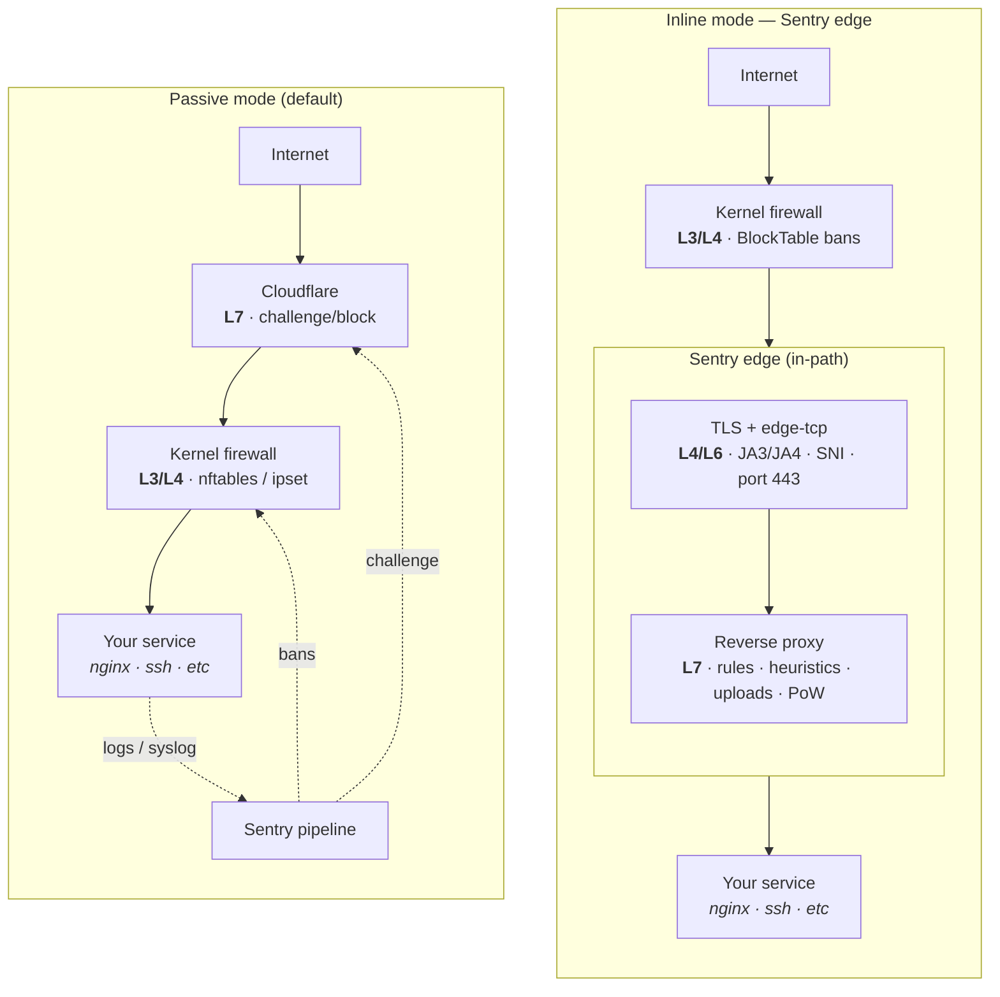
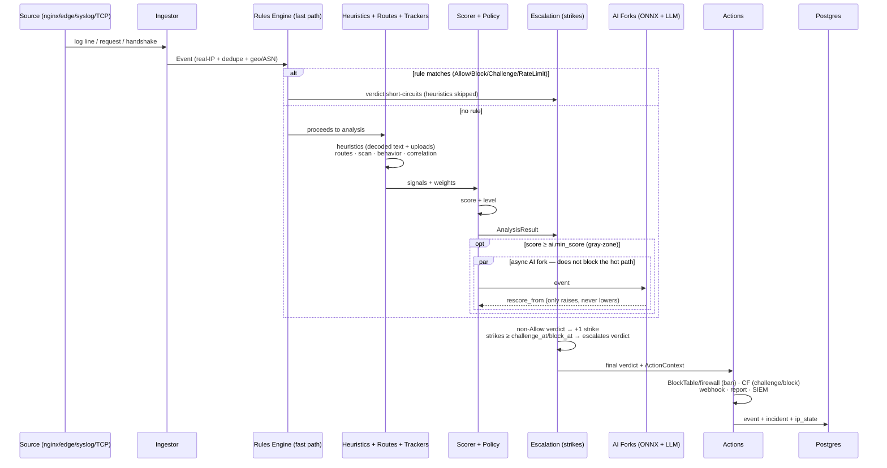
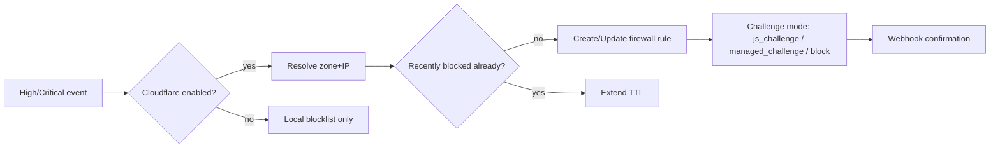
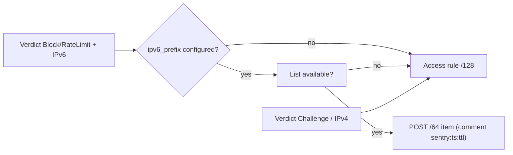
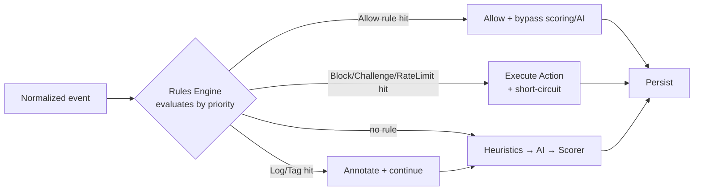
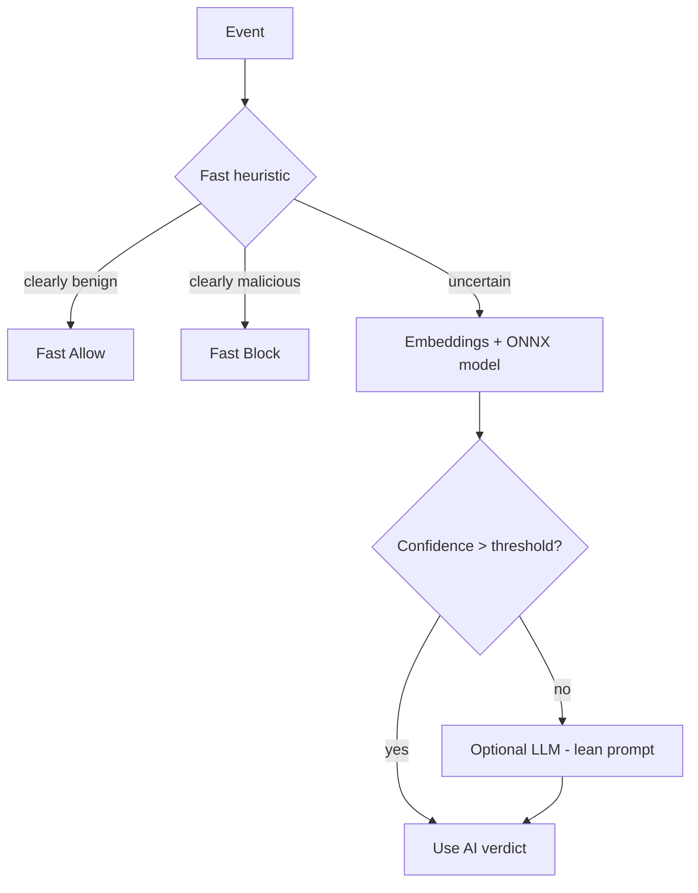
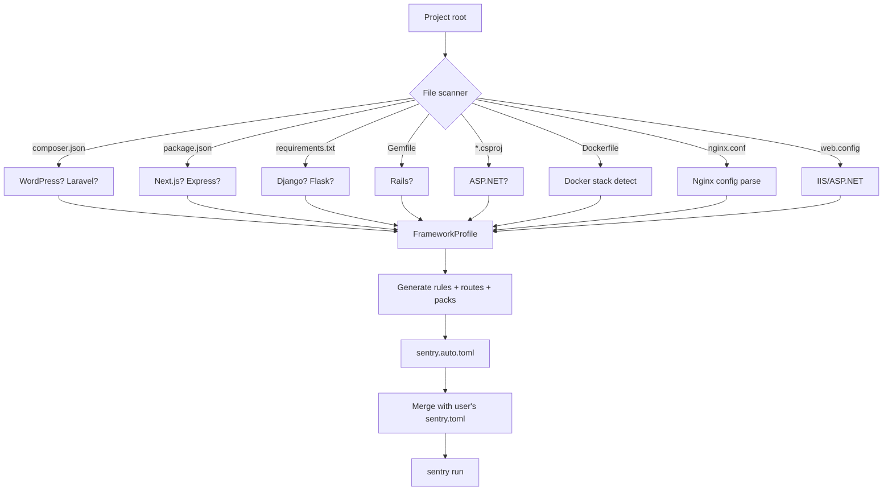

# Sentry — Access Monitor with AI Threat Detection

> Status: **Planning**
> Language: **Rust** (multi-platform: Linux, macOS, Windows, BSD)
> Current interface: **CLI** (web dashboard in the future)
> Repository: `C:\dev\rust\sentry`

---

## 1. Overview

**Sentry** is a real-time access observer for services exposed to the internet. It starts by monitoring **nginx** (via access logs) but is designed to scale to **any port/protocol** (HTTP, TCP, reverse proxies, packet capture, syslog). It uses AI + heuristics to detect malicious payloads, suspicious behavior and invalid routes, computing a **risk level** per request/IP. It integrates with **Cloudflare** for edge-layer challenge/block.

### 1.1 Goals

- **Total modularity**: each data origin (nginx, tcp, http-proxy) is a plugin behind a common trait.
- **Real time**: event stream, not batch.
- **Precision**: combine deterministic rules (fast, known zero false-positives) with AI (for the unknown).
- **Action**: not just detect — block, challenge, rate-limit.
- **Multi-platform**: a single Rust binary.
- **Operable**: rich CLI for live tail, reports, export, blocklist management.

### 1.2 Non-goals (current phase)

- Web dashboard (future phase, via Tauri or a separate HTTP backend).
- Replace a commercial WAF — it is complementary.
- Deep packet inspection of non-HTTP protocols in phase 1.

---

## 2. High-Level Architecture


```mermaid
flowchart TB
    subgraph Sources["Source Layer — Plugins"]
        N1["Nginx Access Log"]
        N2["Sentry Edge (Inline)"]
        N3["TCP Capture"]
        N4["Syslog / Journald"]
        N5["Cloudflare Logs"]
    end

    subgraph Core["Sentry Core"]
        ING["Ingestor<br/>real-IP (trusted proxies) + dedupe + geo/ASN"]
        FAST["Rules Engine (fast path, ~µs)<br/>Allow › Block/Challenge/RateLimit › Log/Tag"]
        HEUR["Heuristics<br/>SQLi · XSS · traversal · uploads · bot verify"]
        BEH["Trackers<br/>scan · behavior · correlation · offenders"]
        RISK["Scorer + Policy"]
        ESC["Escalation (strikes)"]
        AI["AI Risk Classification<br/>ONNX + LLM (only raises the score)"]
    end

    subgraph Actions["Action Layer — Plugins"]
        A1["Blocklist / BlockTable"]
        A2["Kernel firewall (nftables/ipset/OPNsense)"]
        A3["Edge challenge (Cloudflare · PoW · nginx)"]
        A4["Webhook / Report / SIEM"]
        A5["Log / Postgres / metrics"]
    end

    Sources --> ING --> FAST
    FAST -- "verdict" --> ESC --> Actions
    FAST -- "no rule hit" --> HEUR --> BEH --> RISK
    RISK -- "gray-zone" --> AI
    AI -- "rescore_from (only raises)" --> RISK
    RISK --> ESC
```

### 2.1 Network positioning (layers and modes)

Each layer is an independent barrier — whatever slips past one still hits the
next. The `[deployment] mode` chooses where Sentry sits:


```mermaid
flowchart LR
    subgraph passive["Passive mode (default)"]
        direction TB
        P1["Internet"] --> P2["Cloudflare<br/><b>L7</b> · challenge/block"]
        P2 --> P3["Kernel firewall<br/><b>L3/L4</b> · nftables / ipset"]
        P3 --> P4["Your service<br/><i>nginx · ssh · etc</i>"]

        MON["Sentry pipeline"]
        P4 -.->|"logs / syslog"| MON
        MON -.->|"challenge"| P2
        MON -.->|"bans"| P3
    end

    subgraph inline["Inline mode — Sentry edge"]
        direction TB
        I1["Internet"] --> I2["Kernel firewall<br/><b>L3/L4</b> · BlockTable bans"]
        I2 --> SEDGE

        subgraph SEDGE["Sentry edge (in-path)"]
            direction TB
            S1["TLS + edge-tcp<br/><b>L4/L6</b> · JA3/JA4 · SNI · port 443"]
            S2["Reverse proxy<br/><b>L7</b> · rules · heuristics · uploads · PoW"]
            S1 --> S2
        end

        SEDGE --> I5["Your service<br/><i>nginx · ssh · etc</i>"]
    end

    passive ~~~ inline
```

- **Passive**: Sentry off-path — ingests logs/syslog/pcap and enforces via
  providers (CF API, kernel bans, nginx includes, webhooks).
- **Inline**: traffic passes through the edge — 403/429/challenge decided
  before the upstream, `BlockTable` denies on the fast path before the
  pipeline runs.
- The modes **compose**: the CDN challenge filters first (cheapest), kernel
  bans stop everything below HTTP, and the inline proxy catches whatever
  reaches the host. Details on each variant in §8.3.

### 2.2 Design principles

1. **`Source` trait**: every plugin implements `fn stream_events(&self) -> impl Stream<Item = RawEvent>`. Adding nginx = implementing the trait.
2. **`Action` trait**: `fn execute(&self, decision: &Decision) -> Result<()>`. Block, Challenge, Alert, etc.
3. **Normalized event**: a single `struct Event` independent of the origin. The core never knows whether it came from nginx or TCP.
4. **Asynchronous pipeline**: `tokio` + channels. Each stage is an actor/fan-out.
5. **Declarative configuration**: `sentry.toml` defines active sources, active actions, thresholds.

---

## 3. Technical Stack

| Layer          | Crate / Technology                                                                                    | Rationale                                                                            |
| -------------- | ----------------------------------------------------------------------------------------------------- | ------------------------------------------------------------------------------------ |
| Async runtime  | `tokio`                                                                                               | De facto standard, multi-platform                                                    |
| CLI            | `clap` (derive) + `ratatui` for live TUI                                                              | Ergonomics, subcommands, live panel                                                  |
| Config         | `serde` + `toml` + `figment` (env+file merge)                                                         | Env var override in production                                                       |
| Logs/Tracing   | `tracing` + `tracing-subscriber`                                                                      | Structured logging, spans per request                                                |
| Nginx parser   | `nom` or `regex` + `serde`                                                                            | Custom-format access_log lines                                                       |
| HTTP client    | `reqwest` (rustls)                                                                                    | Cloudflare API, webhooks, geolookup                                                  |
| Local ML/AI    | `ort` (ONNX Runtime) + `candle` fallback                                                              | Local inference without depending on an external API                                 |
| LLM (optional) | trait `LlmProvider` + adapters: **OpenRouter** (route to any model), `async-openai`, `ollama-rs`      | Complex payload analysis on demand, provider-agnostic                                |
| Storage        | `sqlx` with **Postgres** default (sqlx migrations), optional SQLite via feature                       | Same schema, swapped by feature flag; Postgres supports HA and multiple nodes early on |
| Geolookup      | `maxminddb` (local DB)                                                                                | No external call per event                                                           |
| IPC/Embeddable | `core` as a lib crate (`sentry-core`)                                                                 | A future dashboard consumes the same lib                                             |
| Serialization  | `serde` + `serde_json`                                                                                | Events, export, future API                                                           |
| Errors         | `thiserror` (lib) + `color-eyre` (bin)                                                                | Ergonomics + readable backtraces                                                     |
| Testing        | `proptest` + `insta` (snapshots) + `wiremock`                                                         | Malicious payloads, log fixtures                                                     |
| Build/Release  | `cargo-dist` or `cross`                                                                               | Multi-OS binaries                                                                    |

---

## 4. Data Model

The `Event` is **modular by design**: fields common to any origin live at
the top level (`id`, `timestamp`, `source`, `transport`, `client_ip`,
geo/ASN, bytes, `raw`…); protocol-specific data lives in `ProtocolData`
(extensible enum): `Http` (nginx, edge, CF Logs), `Tcp` (pcap capture,
SYN→Data stages), `Udp`, `TlsHandshake` (SNI/JA3/JA4) and `Raw` (fallback).
The canonical reference is the code — `crates/sentry-core/src/event.rs` and
the types in `http_data.rs`/`tcp.rs` — and the user-facing description
lives in the [documentation](https://sentry.lucas-romero.com).

> **Golden rule**: no pipeline stage assumes `ProtocolData::Http`.
> Heuristics and rules pattern-match on `evt.http()` / `evt.tcp()` /
> `evt.tls()` and return `None` for variants they don't handle — so the
> same pipeline runs for nginx today and TCP/TLS capture tomorrow. New
> protocol = new `ProtocolData` variant + helper in `impl Event` +
> update `protocol_kind()`; **never** loose fields at the top level.

HTTP heuristics run over the **URL-decoded** form of the path/query
(`heuristics::http_text`), so `%27`/`+` cannot bypass them.

The pipeline output is an `AnalysisResult { risk_score: u8, risk_level:
Info..Critical, signals: Vec<Signal>, verdict: Verdict }` — see §5 and §6.

---

## 5. Flow of a Request


```mermaid
sequenceDiagram
    participant SRC as Source (nginx/edge/syslog/TCP)
    participant I as Ingestor
    participant F as Rules Engine (fast path)
    participant H as Heuristics + Routes + Trackers
    participant S as Scorer + Policy
    participant E as Escalation (strikes)
    participant AI as AI Forks (ONNX + LLM)
    participant A as Actions
    participant DB as Postgres

    SRC->>I: log line / request / handshake
    I->>F: Event (real-IP + dedupe + geo/ASN)
    alt rule matches (Allow/Block/Challenge/RateLimit)
        F->>E: verdict short-circuits (heuristics skipped)
    else no rule
        F->>H: proceeds to analysis
        H->>H: heuristics (decoded text + uploads)<br/>routes · scan · behavior · correlation
        H->>S: signals + weights
        S->>S: score + level
        S->>E: AnalysisResult
        opt score ≥ ai.min_score (gray-zone)
            par async AI fork — does not block the hot path
                S->>AI: event
                AI-->>S: rescore_from (only raises, never lowers)
            end
        end
    end
    E->>E: non-Allow verdict → +1 strike<br/>strikes ≥ challenge_at/block_at → escalates verdict
    E->>A: final verdict + ActionContext
    A->>A: BlockTable/firewall (ban) · CF (challenge/block)<br/>webhook · report · SIEM
    A->>DB: event + incident + ip_state
```

In **inline** mode the same `Arc<Pipeline>` runs inside the edge: the
`BlockTable` fast path denies banned IPs **before** the pipeline, and the
verdict becomes an HTTP response (403/429/challenge page) instead of an
API call. Details in §8.3 and §8.6.

### 5.1 Pipeline stages (fixed order, configurable knobs)

The hot path is **synchronous and deterministic**; AI scoring runs
alongside as a fork:

```
rules (fast path) → heuristics → routes → scan → behavior → correlation → scorer → policy → escalation
                                                                            └→ AI (fork/inline/shadow) → rescore_from
```

- **scan** (`[scan]`): sliding window per IP counting only 4xx responses.
  ≥ `distinct_paths` **distinct** paths → `RandomScan` (weight 25, cumulative —
  covers sweeps of `/.env*`, `/a1b2.php`…); ≥ `not_found` 4xx responses →
  `ScanBehavior` (weight 35). Unknown paths are **never** learned as routes
  (anti-poisoning — learning them would silence the signal itself); use
  `sentry report --unknown-paths` to promote legitimate routes into config.
- **correlation** (`[correlation]`, F3.10): sliding windows per /24 (v4),
  /64 (v6) and ASN. Scan signals (`RandomScan`/`ScanBehavior`/`TcpScanner` —
  SYNs from the `tcp` source feed the same window as HTTP sweeps) register
  the scanner; an attack signal from **another** IP on the same prefix
  (preferred) or ASN within `window_secs` (default 900 = 15 min) emits
  `ScanAttackCorrelation` (weight 20) — the honeypot "shot calling" pattern.
  Details in §8.5.
- **escalation** (`[escalation]`): each non-Allow verdict counts 1 strike
  per IP. `challenge_at` strikes → escalates to Challenge; `block_at` →
  Block (only escalates, never lowers; Allow doesn't count a strike).
  Strikes decay after `window_secs` (default 7d — survives the 24h TTL of
  edge rules) and are mirrored into the `ip_state` table
  (`strikes`/`total_violations`/`last_violation_at`) with pre-warm at
  startup: a repeat offender post-expiry is re-blocked on the first
  violating event. `sentry ip forgive <ip>` resets it.
- **AI** (`[ai]`): classic model (logistic regression over 25 features
  extracted in Rust — `sentry-ai/src/features.rs`) via ONNX
  (`--features onnx`). `mode = "fork"` (default, async with semaphore +
  cache per payload hash), `inline` (blocking before actions) or `shadow`
  (log only). `trigger` = `above_score|always|quarantine_only`. The result
  enters via `Pipeline::rescore_from`, which **only adds** (AI never
  lowers the score). Training: `sentry model export [--synthetic]` → CSV
  with the same inference features → `python tools/train_model.py` → ONNX.

---

## 6. Risk Levels and Verdicts

| Score  | Level    | Color    | Default verdict        |
| ------ | -------- | -------- | ---------------------- |
| 0–9    | Info     | gray     | Allow                  |
| 10–29  | Low      | blue     | Allow + observation    |
| 30–49  | Medium   | yellow   | Increasing rate-limit  |
| 50–74  | High     | orange   | Challenge (Cloudflare) |
| 75–100 | Critical | red      | Block IP + alert       |

Policy is configurable per route/IP-range/ASN. E.g.: `/admin/*` has a lower threshold.

On top of policy runs the **repeat-offender escalation** (`[escalation]`):
each non-Allow verdict adds 1 strike per IP; `challenge_at` strikes escalate
the verdict to Challenge and `block_at` to Block (defaults 3/5, 7d window,
persisted in `ip_state`). An IP that "always lands MED 48" is escalated after
a few repetitions instead of staying 2 points below the High threshold forever.

---

## 7. Modularity — Plugins

### 7.1 Source trait

```rust
// sentry-core/src/source.rs
#[async_trait]
pub trait Source: Send + Sync {
    fn name(&self) -> &'static str;
    async fn stream(&self) -> anyhow::Result<mpsc::Receiver<RawEvent>>;
}

// Implementations:
// sentry-source-nginx    -> tails access.log
// sentry-source-http     -> axum/actix middleware receiving a copy
// sentry-source-tcp      -> capture via `pnet`/`pcap` (libpcap)
// sentry-source-cloudflare -> pulls logs via polling API
```

### 7.2 Action trait

```rust
// sentry-core/src/action.rs
#[async_trait]
pub trait Action: Send + Sync {
    fn name(&self) -> &'static str;
    async fn execute(&self, evt: &Event, decision: &Decision) -> anyhow::Result<()>;
}

// Implementations:
// sentry-action-cloudflare  -> firewall rules, challenge
// sentry-action-blocklist   -> local state (for inline proxy)
// sentry-action-webhook     -> Discord/Slack/Telegram/email
// sentry-action-iptables    -> nftables/iptables (Linux)
// sentry-action-log         -> write to DB
```

### 7.3 Dynamic registration

Each plugin exposes `pub fn register(reg: &mut Registry)`. The binary enables plugins via Cargo feature flags + an entry in `sentry.toml`. **No recompiling to enable/disable** — config only.

---

## 8. Cloudflare Integration (Challenge Synergy)


```mermaid
flowchart LR
    EVT[High/Critical event] --> CF1{Cloudflare enabled?}
    CF1 -->|yes| CF2[Resolve zone+IP]
    CF2 --> CF3{Recently blocked already?}
    CF3 -->|no| CF4[Create/Update firewall rule]
    CF3 -->|yes| CF5[Extend TTL]
    CF4 --> CF6["Challenge mode: js_challenge / managed_challenge / block"]
    CF6 --> CF7[Webhook confirmation]
    CF1 -->|no| BL[Local blocklist only]
```

- Tokens via env (`SENTRY_CF_TOKEN`, `SENTRY_CF_ZONE`).
- Local cache of already-challenged IPs (configurable TTL) to avoid hammering the API.
- Modes: `block`, `js_challenge`, `managed_challenge`, `rate_limit`.
- **Important**: in phase 1 Sentry is **read-only + Cloudflare action**. There is no inline proxy. Inline is a future phase (`sentry-proxy`).

### 8.1 Real client IP (behind CDN/proxy)

Behind Cloudflare, `$remote_addr` in the nginx access log is the IP of the
CDN **edge**, not the client — blocking/scoring that IP would be useless.
Real-IP resolution is **automatic** in `sentry-source-nginx`, by fixed
precedence (first one that parses wins, regardless of `log_format` order):

1. `$http_cf_connecting_ip` (Cloudflare)
2. `$http_true_client_ip` (Cloudflare Enterprise / other CDNs)
3. `$http_x_real_ip`
4. `$http_x_forwarded_for` / `$proxy_add_x_forwarded_for` (first in the chain)
5. `$remote_addr` / `$remote_addr_v6`

Just include the header in the nginx `log_format` (and in the source `format`) —
e.g.: `... "$http_user_agent" "$http_cf_connecting_ip"`. When the header is
absent (direct traffic), nginx logs `-` and the parser falls back to the
next candidate. Additionally, **every captured `http_*` token** becomes a
header in `HttpData.headers` (e.g.: `http_cf_connecting_ip` →
`cf-connecting-ip`), enabling DSL rules `header.X` over logs. Geo/ASN,
dedupe, storage and actions consume the already-resolved IP automatically.

Example of recommended `log_format` behind Cloudflare:

```nginx
log_format sentry '$remote_addr - $remote_user [$time_local] "$request" '
                  '$status $body_bytes_sent "$http_referer" "$http_user_agent" '
                  '"$http_cf_connecting_ip"';
```

### 8.2 IPv6 /64 blocking via IP Lists (F2.14)

Cloudflare IP Access Rules accept **exact addresses** (`ip`/`ip6`) —
verified live on 2026-08-30: zone and account endpoints reject target
`ip6_range`, and `ip6` rejects CIDR. An IPv6 host with privacy extensions
rotates the interface ID within the /64 and escapes /128 rules. The
solution is an account-level **IP List** (accepts CIDR, incl. /64) fed by
Sentry + **one** custom rule on the zone:

```text
(ip.src in $sentry_blocks)  →  action: block
```

- **Opt-in**: `[action.options] ipv6_prefix = 64` (default 128 = exact
  access rules, previous behavior). `list_name` default `sentry_blocks`.
- **Account id**: automatically derived from `GET /zones/{zone}`
  (`result.account.id`); override via `SENTRY_CF_ACCOUNT`.
- **Verdict routing**: IPv6 `Block`/`RateLimit` → /64 item in the list
  (the rule action is `block`; `rate_limit` is not expressible per item —
  same fallback as access rules). IPv6 `Challenge` → /128 access rule
  (challenge is interactive/per-browser). IPv4 → access rules (unchanged).
- **TTL**: in each item's `comment`, same format as access-rule notes
  (`sentry:<ts>:<ttl>`) — reaper deletes expired, reconcile adopts live
  ones, item POST is idempotent (duplicate overwrites the comment).
- **Dedupe cache** keyed by the /64 network address (rotation collapses to
  the same key).
- **Graceful degradation**: without permissions (`Account Filter Lists:
  Edit`, `Zone Rulesets: Edit`) or on plan limits → soft-disable list mode
  with a warning, IPv6 falls back to exact access rules, reaper retries
  provisioning each cycle. List failures **do not** count against the main
  circuit breaker.
- **Plans**: IP Lists available on all (Free includes 1 list/10k items;
  Pro/Business 10 lists) — cf. Cloudflare WAF Lists docs.

Flow inside `apply()`:


```mermaid
flowchart LR
    V[Verdict Block/RateLimit + IPv6] --> P{ipv6_prefix configured?}
    P -->|no| AR[Access rule /128]
    P -->|yes| L[List available?]
    L -->|yes| IL["POST /64 item (comment sentry:ts:ttl)"]
    L -->|no| AR
    V2[Verdict Challenge / IPv4] --> AR
```

### 8.3 Deployment modes (F3.9)

`[deployment] mode` chooses where Sentry sits relative to the application:

```text
passive (default)   client → nginx → app        Sentry reads access.log / syslog /
                                                pcap and acts ex-post (webhook, CF API,
                                                blocklist). Zero path risk.

inline              client → sentry-edge → nginx → app
                    Sentry is the front: applies the verdict BEFORE the upstream
                    (Block→403 · RateLimit→429 · Challenge→challenge page ·
                    Allow→proxy). Verdict latency target: ≤50 ms.
```

- **`edge-http` (F3.9a, crate `sentry-edge`)**: inline reverse proxy.
  Startup requires **explicit opt-in** (`mode = "inline"`) **+ backend
  health check** — an edge in front of a dead backend becomes an outage.
  Decided events return to the daemon through the same fan-in
  (`Incoming::Processed`): persistence, actions and AI forks fire exactly
  once; the `Arc<Pipeline>` is shared, so rate-limiter/scan/behavior/
  offender **do not** double-count.
- **Response-phase feedback (F3.9.1)**: the pipeline runs at the request
  phase, before a response exists — `HttpData.status` is born `None` at
  the edge. Detectors that depend on status (ScanTracker, the
  BehaviorTracker 401/403/404 detectors, `RuleMatch::Status`) would be
  blind for all `[http_proxy]` traffic. The proxy therefore publishes the
  event **after** the response, with the real status (upstream, or
  403/429/301 from the edge itself), and calls
  `Pipeline::observe_response(ip, path, status, ua)`, which feeds the
  trackers with the status (the request-phase call with `None` is a
  no-op, so each request counts exactly once) and enqueues the generated
  signals into a per-IP queue (TTL 60s, cap 16) — drained on the
  **next** request from the same IP, passing through repetition,
  correlation, policy and escalation. A burst of distinct 404 paths now
  gets challenged from around the 9th request and reaches Block
  (BlockTable) via escalation. Limitation: `RuleMatch::Status` is
  evaluated at the request phase and still doesn't match for inline
  traffic (ScanTracker covers the same gap behaviorally); the built-in
  middleware (`sentry_middleware`) still publishes at the request phase —
  same treatment is a follow-up.
- **`sentry_middleware` (F3.1)**: the same runtime exposed as axum
  middleware (`from_fn_with_state(rt, sentry_edge::middleware::handler)`)
  in `Inline` mode (blocks before the handler) or `Shadow` mode (attaches
  the decision and continues) — for Rust apps embedding Sentry without a
  proxy hop.
- **`edge-tcp` (F3.9b)**: inline TCP listener for non-HTTP services —
  verdict at connect (Block/Quarantine closes the connection), then
  bidirectional pipe to the real backend. SYN fingerprinting doesn't
  exist in userspace-accept; the pipeline runs with a synthetic
  `Tcp(Syn)` event.
- **`passive-log` (F3.9d)**: access.log tail (F1, already shipped).
- **`passive-mirror`/`passive-tap` (F3.9e/f)**: SPAN/`iptables TEE`/
  promiscuous sniffer via `sentry-source-tcp` in capture mode (feature
  `pcap`).
- **`edge-sidecar` (F3.9c)**: same binary in a sidecar/DaemonSet container
  (`deploy/k8s/edge-sidecar.yaml`).
- **Verdict pages (`sentry-edge/src/pages.rs`)**: blocks and challenge
  fallbacks serve a single HTML page (PoW dark theme, embedded Sentry
  logo as data URI, Cloudflare-style copy — "403 - Forbidden" / "You are
  unable to access this website." — plus a **Trace ID** that can be
  traced: for pipeline decisions it is the persisted `event.id`; on the
  fast path (BlockTable, no event) a fresh UUID is generated, shown on
  the page, logged via `tracing::info!` and returned in the
  `x-sentry-trace-id` header). CF-like status codes: Block/Quarantine,
  fast-path, failed challenge and challenge without PoW → **403**;
  RateLimit → **429** (`retry-after: 60`); the PoW interstitial is also
  **403** (CF serves the managed challenge that way; `cache-control:
  no-store` prevents caching), no longer 503.
- **`challenge_backend` (`[edge]`)**: who executes the `Challenge`
  verdict — `sentry` (default) runs the local PoW (F7.8); `cloudflare`
  delegates to the CF provider: the verdict becomes a Cloudflare rule via
  API (`[[action]]` with `provider = "cloudflare"`) and the edge merely
  holds the current request with 403 + `retry-after` until the rule takes
  over at the next hop. The pages remain Sentry's — nothing from
  Cloudflare is imitated. Startup warning if `cloudflare` without a CF
  action configured.
- **Chain rule**: `client → sentry-edge → nginx → app` — Sentry is the
  threat-decision layer; nginx's app-level rate-limit/WAF remain nginx's
  (complementary, not substitutes).
- **Choice criterion**: inline when the service cannot tolerate the attack
  reaching the app (RCE/0-day); passive when the infrastructure cannot
  change path/SSL or the goal is observability. Default = passive.

### 8.4 Multi-node / HA (F4.7)

N daemons (or N pods of the same Deployment) share the same Postgres and
operate as an active-active cluster:

- **Cross-node dedupe**: the dedupe LRU is per-process — it cannot see
  events processed by another node. Each insert carries `payload_hash`
  (same key as local dedupe: IP+method+path for HTTP, IP+raw hash for the
  rest). The `INSERT` is conditional: if a sibling node persisted the
  same hash within the 10s window (same as the LRU TTL), the insert is
  skipped. `events_payload_hash_ts` (partial index) keeps the `NOT
  EXISTS` cheap.
- **Identity**: `[deployment] instance_id` (default = hostname) becomes
  the label of the `sentry_instance_info{instance}` gauge for
  differentiation in dashboards/alerts.
- **Shared state (Postgres/Redis)**: incidents, offender strikes,
  learned routes and rulesets live in the common database — all nodes see
  the same incidents and hot-reload (LISTEN/NOTIFY) propagates to all.
- **Rate-limit**: `backend = "redis"` shares the window across nodes; the
  in-memory backend is per-node (effective limit ≈ N× configured).
- **Documented limitation**: scan (`[scan]`) and behavior (`[behavior]`)
  trackers are per-node — a scanner distributed across nodes may take
  longer to cross the threshold on each individual node.
- **Idempotent background tasks**: the CF rule reaper (reconcile by
  `note` with timestamp), the route learner (deterministic merge) and
  feed refresh (atomic replace) can run concurrently without corruption;
  transient duplicated work is acceptable.
- **Edge/HA**: multiple `sentry-edge` behind an LB — the verdict is
  stateless per request (rate-limit shared via Redis; **blocks** shared
  via `ip_state` + NOTIFY `sentry_blocks_changed`, §8.6); the `[server]`
  HTTP must also sit behind the LB (F4.4 token auth is stateless; HMAC
  sessions are valid on any node sharing `SENTRY_SESSION_SECRET`).

### 8.5 Scan→attack cross-IP correlation (F3.10)

Honeypots observe the "shot calling" pattern: a host scans the internet
from a "clean" IP and, minutes later, exploits/brute-force arrive from
**another** IP on the same /24, /64 or ASN — the scanner finds the
targets, the operator (or a consumer of the published scan data) strikes.
Reference: Ken Webster, *There Is No Such Thing as a Benign Internet
Scanner*.

- **Tracker** (`crates/sentry-core/src/correlation.rs`):
  `CorrelationTracker` keeps sliding windows of recent scans under two
  keys — network prefix (/24 for IPv4, /64 for IPv6) and ASN (`evt.asn`,
  GeoLite2-ASN; without MMDB only prefix correlates). Limited history
  (64 scans/key, drop-oldest) and `prune()` every 60s in the daemon,
  like the other trackers. In-memory state, per-node.
- **Pipeline flow**: on every event that passes the rules phase, scan
  signals (`RandomScan`, `ScanBehavior`, `TcpScanner`) register the
  scanner (`record_scan`); if any **attack** signal fires (SQLi, XSS,
  traversal, LFI, Log4Shell, RCE, SensitivePath, AuthBruteForce,
  SuspiciousLoginSuccess, CredentialStuffing, DirectoryBruteForce,
  AnomalousPayload, LlmMalicious), `correlate` looks for a scan from a
  **different** IP on the same prefix (preferred) or ASN within
  `window_secs`. Hit → `ScanAttackCorrelation` (weight 20, override
  `[scorer.weights] scan_attack_correlation`) with detail
  `tcp-syn from 198.51.100.7 (same /24) 42s ago`.
- **Cross-source**: SYNs captured by the `tcp` source (F3.2) enter via
  the `TcpScanner` heuristic and feed the same window — a masscan that
  never generates an HTTP log still correlates with the neighboring HTTP
  exploit that comes after. Because the tracker receives the whole
  `&Event` (not just the HTTP tuple), non-HTTP events participate.
- **Config**: `[correlation] enabled = true, window_secs = 900`.
  Metric: `sentry_correlation_hits_total`.
- **Scanner taxonomy** (reputation tiers, F3.10): `ReputationTier` gains
  `Authorized` (contracted scanner — no signal; trust it via the DSL rule
  `reputation = "authorized"` → Allow) and `Promiscuous` (publishes recon
  to anyone — `PromiscuousScanner` signal weight 10; the data feeds
  attackers). Tiers parse in the DSL, in `[[rules.feeds]] tier = "…"` and
  in `sentry feeds check`.
- **Limitations**: in-memory per-node state (same limitation as the
  `[scan]`/`[behavior]` trackers, §8.4); events short-circuited by rules
  never reach the trackers (a scan blocked by a rule leaves no
  correlation memory); correlation is an **aggravator** — it never
  produces a verdict on its own, only adds weight to the attack that
  triggered it.

### 8.6 Persistent blocks (BlockTable) — real enforcement inline

Before the BlockTable, a block didn't "stick": the blocklist action was
write-only (state unreachable from the registry), dashboard/CLI wrote only
to `ip_state` and nothing reloaded — a blocked IP went back to being
proxied by the edge on the next request if the pipeline alone didn't
re-derive Block.

- **`BlockTable`** (`crates/sentry-core/src/blocks.rs`):
  shared (`Arc`) `HashMap<IpAddr, Option<Instant>>` — `None` =
  permanent (dashboard/CLI block without TTL), `Some(exp)` = TTL.
  Writers: blocklist action (Block verdict), DB pre-warm and NOTIFY
  hot-reload; readers: the edge fast path and the mirror guard.
- **Edge fast path** (`sentry_middleware`, `edge-http`, `edge-tcp`): the
  resolved client IP (§8.1) is checked **before** the pipeline — blocked →
  immediate 403 / `shutdown()`, without running the pipeline or generating
  an event (the incident already exists from when the block was decided;
  avoids per-request webhook spam). Counters: `sentry_edge_block_hits_total`
  and `sentry_block_table_size`.
- **Persistence**: pipeline Block verdicts are mirrored to
  `ip_state` (`status='blocked'`, `expires_at = now + ttl_secs` of the
  blocklist action, `reason` = first signal label) + `NOTIFY
  sentry_blocks_changed`; the `is_blocked` guard avoids rewriting the row
  on every violating event. Restart → pre-warm reads `ip_state.blocked(10_000)`
  with expired rows filtered in Rust.
- **Multi-node sync**: dashboard/CLI block/unblock and the daemon itself
  emit `NOTIFY sentry_blocks_changed`; each node runs a listener that
  reloads the table from the database (atomic reload) — a block decided
  on one node denies at the edge of all nodes in real time.
- **Full chain**: pipeline Block → table + DB + NOTIFY → edge of any
  node denies on the fast path; dashboard block → DB + NOTIFY →
  immediate effect; `sentry ip unblock` → DB delete + NOTIFY → table
  reloads and the IP flows again.

### 8.7 Real IP with trusted proxies, kernel bans and community reporting (F7)

**Trusted proxies + TRUSTED_IPS (F7.2)** — `[real_ip]`: the nginx parser
and the edge only honor header-borne IPs (`CF-Connecting-IP` >
`True-Client-IP` > `X-Real-IP` > XFF) when the `$remote_addr`/peer is a
**trusted proxy** — embedded Cloudflare ranges (constants + daily refresh
of cloudflare.com/ips-v4|ips-v6, task `spawn_cloudflare_refresh`) +
`trusted_proxies` from config. Without remote_addr in the log_format the
legacy behavior applies (whoever writes the log is the edge). This closes
`CF-Connecting-IP` spoofing for direct-to-origin traffic. `trusted_ips`
(the nginx-honeypot `TRUSTED_IPS` concept — "don't lock yourself out")
is never banned, blocked or reported: short-circuit to `Allow` in
`Pipeline::process`, guard on the edge fast path (`is_hard_blocked`),
final guard in the firewall provider, and `Authorized` reputation in the
enricher. State in `TrustSet`/`SharedTrustSet`
(`crates/sentry-core/src/trust.rs`). Embedded presets (`trusted_lists.rs`:
paypal, stripe, googlebot, bingbot — snapshots of the vendors' official
sources) enter the same never-ban when approved by name in
`[real_ip] trusted_lists = ["paypal", ...]`; catalog via
`sentry trusted list`.

**Kernel bans (F7.3)** — crate `sentry-action-firewall`, provider
`type = "challenge"`, `provider = "firewall"`: inherits the
Block/Challenge/RateLimit filter from `ChallengeAction`. Backends with
auto-detect (cached): **nftables** (recommended — table `sentry` + sets
`sentry_blocks_v4/_v6` with `flags timeout` + chain input `priority -1` drop;
ban = 1 netlink message with per-element timeout, no reaper),
legacy **ipset** (`hash:ip timeout` + `iptables -m set`, rule inserted only
after `-C`) and **firewalld** (runtime ipsets; no per-entry timeout —
expiration lives in the reconcile). The DB (`ip_state`) is the source of
truth: sync at startup (re-seed after restart) + reconcile every 60s
(covers manual multi-node unblock and expiration). Requires root or
`CAP_NET_ADMIN`; probe and set sizes in `sentry firewall status`.
Linux-only (elsewhere the provider is skipped with a warning, like the
cloudflare arm without a token).

**Community reporting (F7.4)** — crate `sentry-action-report`, action
`type = "report"`, `provider = "abuseipdb" | "reportedip"`: maps
`SignalKind` to each API's categories (SQLi→16, scans→14/61,
brute force→18, bad bot→19, …; Hacking fallback), per-IP dedupe with TTL
(1 report/IP/window — daily quotas), backoff on 429 and a 5-failure
circuit breaker (soft-disable until restart). Keys via env
(`SENTRY_ABUSEIPDB_KEY`, `SENTRY_REPORTEDIP_KEY`); authenticated feeds
via `headers_env` (header → env var) — e.g.: AbuseIPDB blacklist as a
`[[rules.feeds]]`.

**Gray-zone external lookup (F7.5)** — `[ip_lookup]` +
`sentry_ai::IpLookupProvider` (AbuseIPDB `/check`): async AI fork
(mirrors `AiFork`/`LlmFork`, runs **after** them) that queries IPs with
local score ≥ `trigger_above` (or carrying a signal from `on_signals`)
but verdict ≠ Block; the `abuseConfidenceScore` becomes the
`ExternalReputation` signal with scaled weight (25% ≈ +10 … 100% ≈ +40)
re-entering via `rescore_from` (only raises). Per-IP LRU cache with TTL +
`max_per_hour` quota (rolling hour). Trusted IPs are never queried.

**Datasets and shared lists (F7.1/F7.6)** —
`crates/sentry-core/src/lists.rs` is the single source of truth for
sensitive-path patterns (pack `sensitive_paths` + `SensitivePath`
heuristic + Aho-Corasick prefilter literals all derive from the same
table — impossible to desync); includes the honey.conf CVE probes
(Laravel `_ignition`, PHPUnit `eval-stdin`, Exchange
Autodiscover/ECP, MobileIron, Telerik, GPON, Fortinet, D-Link). Pack
`honeypot_paths` (shadow default) for patterns too broad to enforce
(`.aspx`, `cgi-bin`, `node_modules`, dotfiles). Pack `host_allowlist`
(off; `params.domains`) blocks Host headers outside the allowlist
(including requests with no Host — direct IP scanning); the nginx
parser now populates `HttpData.host`. Datasets: `[[rules.feeds]]` with
`kind = "user_agent" | "path"` compiles one-per-line lists into a
synthetic literal-alternation rule (the regex crate speeds it up with
Aho-Corasick internally); `action` default `log`. Pack params are
flattened to `<pack>__<param>` in the daemon (fixing `country_blocklist`'s
access to its own countries). Roadmap F7.7: DB-backed datasets with CLI
import and dynamic prefilter (BACKLOG.md §5.3).

**Bot verification via rDNS (F7.10)** — `[bot_verification]`
(opt-in, `enabled = false`): UAs claiming to be verified crawlers
(Googlebot, bingbot, Slurp, Baiduspider, YandexBot) go through the
engines' official method — the IP's PTR must end in the engine's domains
(`googlebot.com`/`google.com`, `search.msn.com`, `yahoo.com`,
`crawl.baidu.com`, `yandex.com|net|ru`) **and** the forward resolution of
the hostname must contain the source IP (kills PTR spoofing). DNS enters
injected via the `BotDnsResolver` trait (`crates/sentry-cli/src/botdns.rs`
with hickory-resolver; mock in tests) and runs **outside the hot path**:
the pipeline only reads the `BotVerifier` cache (`crates/sentry-core/src/
botverify.rs`; TTL 1h verified / 10 min failure; miss marks `Unknown` on
the event and enqueues `(ip, engine)` for the background worker — pending
grants neither bypass nor signal). Verified claim → JS challenge bypass
at the edge; spoofed claim → `SpoofedBot` signal (weight 35, override in
`[scorer.weights] spoofed_bot`; in the default LevelMap it becomes
Challenge); DNS outage → `Unknown` (never marks a genuine bot as spoofed —
an error is distinct from an empty answer via `DnsOutcome`). With
verification on, the `crawlers_good` pack splits into
`crawlers_good_verified` (requires the DSL condition
`bot_verified = "true"` — verified-only allowlist; the condition also
accepts `false`/`spoofed` and engine: `bot_verified = google`) and
`crawlers_good_unverified_ok` (UAs without possible verification keep
the UA allow). Diagnostic: `sentry bots check <ip> --ua
"Googlebot/2.1"`. Metric `sentry_bot_verifications_total{result=
verified|spoofed|error}`.

**Native JS challenge at the edge + nginx provider (F7.11)** — two
topologies for the `Challenge` verdict (`EdgeMode::JsChallenge` already
existed in the vocabulary; now it has execution):
(1) **Inline edge** (`[edge.challenge]`, opt-in; active in
`[deployment] mode = "inline"`): stateless SHA-256 proof-of-work
interstitial, in the style of the nginx js_challenge module —
`challenge_id = SHA-256(secret || ip || bucket)`; the browser searches
for a nonce with `SHA-256(challenge_id || ":" || nonce)` with `difficulty`
leading zero bits (default 16, clamp 8..=28; WebCrypto, solves in <1 s),
sets the cookie `sentry_ch=<bucket>:<nonce>` and reloads. The edge
validates by recomputing the PoW — stateless, multi-node with the same
`secret_env` (`SENTRY_EDGE_CHALLENGE_SECRET`, required when
`enabled`, minimum 16 bytes); default bucket 3600 s with grace from the
previous bucket; response 403 + `retry-after: 3` + `cache-control: no-store`
(Cloudflare status; was 503 until F8.1),
`Secure` on the cookie when HTTPS is present (`X-Forwarded-Proto`).
Clients without JS (curl, dumb bots) stay stuck at the interstitial
(403); verified bots (F7.10)
pass straight through (`ChallengeGate::Pass`, metric `bot_bypass`);
`Block`/`RateLimit` remain 403/429 — PoW never unlocks a hard block.
Embedded page (`CHALLENGE_HTML`), dark theme, zero CDN. Middleware and
reverse proxy share `EdgeRuntime::challenge_gate`; cookies now populate
`HttpData.cookies`. Metric
`sentry_edge_challenge_total{result=served|passed|bot_bypass|delegated|
failed}`. With `[edge] challenge_backend = "cloudflare"` the gate does
not run local PoW: the verdict becomes a CF rule via API and the edge
answers the 403 waiting page (`pages::delegated_challenge_page`); an
invalid cookie remains terminal 403 (`pages::challenge_failed_page`,
with Trace ID).
(2) **Nginx provider** (crate `sentry-action-nginx`,
`type = "challenge"`, `provider = "nginx"`; delivers F6.2): generates
includes with atomic writes (tmp+rename) into `conf_dir` —
`sentry-deny.conf` (`deny <ip>;` for Block; `rate_limit_deny` opt-in
for RateLimit), `sentry-challenge.conf` (geo map
`$sentry_challenge_ip` for Challenge) and `sentry-challenge-if.conf`
(server snippet: `if ($sentry_challenge_ip) { js_challenge on; }` +
optional `sentry-bots.conf` with `bot_verifier on;`) — for the
getpagespeed modules (`nginx-module-js-challenge`,
`nginx-module-bot-verifier` + Redis) on the host. Stamps
`# sentry:<ts>:<ttl>` (same convention as the Cloudflare note), worker
with debounced reload ≥1/s and `nginx -t` before it
(`validate = true`, a broken reload is skipped, never applied), IPv6 by
CIDR (`ipv6_prefix`, host bits masked), deny entries reconciled
against `ip_state` at startup and every 60 s (challenge entries are
ephemeral), never-ban guard (`[real_ip] trusted_ips` never enters an
include). Supported topologies: passive + nginx provider
(co-located, honeypot), native inline edge (F7.11.1) or Cloudflare —
all three share the same verdict/pipeline and the verified-bot
bypass.

---

### 8.8 Edge TLS — inline SSL/443 monitoring (F8)

In `inline` mode the edge keeps **two listeners** in the same process
and pipeline: plain HTTP (`[edge] listen`, default `0.0.0.0:80`) and
HTTPS (`[edge] tls_listen`, default `0.0.0.0:443`), enabled when
`tls_cert`+`tls_key` are configured and the binary was built with
`--features sentry-cli/edge-tls`. Both ports are **monitored and
enforced**: the block table denies IPs on either of them; the block table
is consulted *before* the TLS handshake (a blocked IP only sees the
connection drop — no handshake, no event).

**Termination + telemetry (F8.1)** — the TLS acceptor
(`sentry-edge/src/tls.rs`) peeks the ClientHello *before* the rustls
handshake (the bytes read are fed back via `PrefixedStream`, the
handshake sees the same octets), extracts SNI/JA3/JA4 and only then runs
the handshake (tokio-rustls, ring provider, ALPN `http/1.1`, 5s
anti-slowloris timeout). After the handshake, decrypted requests enter
the **same router** as the plain proxy (hyper-util auto-builder), with
`ConnectInfo<SocketAddr>` and `x-forwarded-proto: https` injected per
connection — the proxy handler and the challenge cookie (`Secure`
attribute) see the real IP and the correct scheme. Invalid cert/config
without the feature = startup error (no more "silently falling back to
plain HTTP"). `tls_redirect_https = true` answers 301 on the plain
listener **after** the pipeline — traffic on port 80 keeps being scored
and blocked. `listen = ""` turns the plain listener off (HTTPS-only).

**SSL-layer monitoring (F8.2)** — every emitted handshake generates a
`TlsHandshake` event (`SourceKind::EdgeTls`) with
`TlsData { sni, ja3, ja4, cipher, version, alpn }` into the same
pipeline (rules → reputation → scorer → policy; HTTP heuristics return
empty for the TLS variant). `ja3` is the canonical MD5 (wire order);
`ja4` follows the public FoxIO specification (highest offered version,
SNI marker `d/i/n`, cipher/extension counts — SNI and ALPN excluded,
ALPN tag, truncated SHA-256 of the sorted lists). The parser lives in
`sentry-edge/src/clienthello.rs` (pure, no I/O, tested against
ClientHellos synthesized from Chrome/curl/OpenSSL and hellos fragmented
across multiple records). New DSL conditions: `tls_ja3 = "…"`,
`tls_ja4 = "…"`, `tls_sni = "…"`. With `[edge] tls_allowed_hosts`
configured, a handshake with missing/unknown SNI gets the
`TlsSniMismatch` signal (weight 20, via `rescore_from` — never lowers,
never-ban respected): the signature of a scanner probing port 443 by IP
(honeypot behavior). A Block/Quarantine verdict post-handshake tears
down the whole connection.

**Observability** — `sentry_edge_tls_handshakes_total{version}`,
`sentry_edge_tls_handshake_failures_total` (malformed records, truncated
hellos, failed/expired handshakes),
`sentry_edge_tls_sni_mismatch_total`,
`sentry_edge_tls_cert_not_after` (unix-ts gauge of the PEM's notAfter,
recomputed daily, warn < 14 days). The `/api/events` (eventlog) carries
`tls: {sni, ja3, ja4, version, cipher, alpn}` with a stable key-set
(null when non-TLS) and `host = sni`.

## 9. Detection of Valid Routes

1. **Controlled discovery**: the user provides valid routes via config (allowlist) **or** Sentry learns in `learn` mode (baseline period without attacks).
2. Structure: trie of paths with allowed methods + expected parameters.
3. Derived signals:
   - Nonexistent route → +points (scan/directory brute-force).
   - Many 404s from the same IP in a window → scan behavior.
   - Hits on sensitive paths (`/.env`, `/wp-admin`, `/api/admin`) even if nonexistent → high weight.
4. Output: `sentry routes` report showing known vs. attempted routes.

---

## 10. Rules Engine — Blacklist/Allowlist (WAF-style)

Sentry has a **deterministic rules engine** that runs **before**
heuristics and AI — it is the "fast path". Inspired by Cloudflare Custom
Rules / WAF: each rule is a _match_ + _action_, evaluated in priority
order, with **short-circuit**. Rules are the first line of defense
(instant blocking of VPNs, crawlers, ASNs, countries) and also the
source of **allowlists** (trusted IPs/ASNs that bypass all scoring).

### 10.1 Model

```rust
// sentry-core/src/rules.rs
pub struct Rule {
    pub id: RuleId,
    pub name: String,
    pub priority: i32,              // lower = evaluated first
    pub enabled: bool,
    pub match_: RuleMatch,          // condition (combinable with AND/OR)
    pub action: RuleAction,
    pub ttl: Option<Duration>,      // dynamic rules expire (e.g. temporary block)
    pub source: RuleSource,         // Config | Db | CloudflareSync | AutoLearned
    pub tags: Vec<String>,          // e.g. "default", "vpn", "crawler"
}

pub enum RuleAction {
    Allow,                          // bypasses scoring + AI (absolute allowlist)
    Block,
    Challenge,                      // Cloudflare managed/js challenge
    RateLimit { req_per_sec: u32, window: Duration },
    Log,                            // records only, doesn't act (shadow mode)
    Tag(String),                    // annotates the event, continues pipeline
}

// Combinable expressions — same idea as CF matchers
pub enum RuleMatch {
    Ip(IpMatcher),                 // exact IP | CIDR | range
    Asn(u32),
    Country(IsoCode),
    Path(PathMatcher),             // exact | glob | regex
    Method(HttpMethod),
    Header { name: String, op: StrOp },
    UserAgent(StrOp),
    Query(StrOp),
    Body(StrOp),                   // when available
    Protocol(ProtocolKind),        // Http | Tcp | Tls...
    TlsFingerprint { ja3: Option<String>, ja4: Option<String> },
    Reputation(ReputationTier),    // Clean | Suspicious | Malicious | Datacenter | Vpn | Tor
    Status(u16),                   // e.g. status == 404
    Rate { count: u32, per: Duration, scope: RateScope },
    Time { window: TimeWindow },   // only active during business hours etc.
    All(Vec<RuleMatch>),           // AND
    Any(Vec<RuleMatch>),           // OR
    Not(Box<RuleMatch>),
}

pub enum IpMatcher { Single(IpAddr), Cidr(IpCidr), Range { from: IpAddr, to: IpAddr } }
pub enum StrOp { Equals(String), Contains(String), Regex(Regex), StartsWith(String), In(Vec<String>) }
```

### 10.2 Pipeline precedence


```mermaid
flowchart LR
    EVT[Normalized event] --> R{Rules Engine<br/>evaluates by priority}
    R -->|Allow rule hit| BY[Allow + bypass scoring/AI]
    R -->|Block/Challenge/RateLimit hit| ACT[Execute Action<br/>+ short-circuit]
    R -->|Log/Tag hit| AN[Annotate + continue]
    R -->|no rule| HEUR[Heuristics → AI → Scorer]
    BY --> PERSIST[Persist]
    ACT --> PERSIST
    AN --> HEUR
    HEUR --> PERSIST
```

Order: **Allowlist** (absolute trust) > **Explicit blocklist** >
**Reputation/VPN/Tor defaults** > **Crawler/UA defaults** > **sensitive
paths** > (falls through to heuristics+AI). Allowlist is the _escape
hatch_ to avoid false positives on your own IPs (healthchecks,
monitoring, CI).

### 10.3 Default Rule Packs (preconfigured, toggle via config)

Packs shipped with Sentry, activatable with one line. Each pack is a set of rules with `tags` for easy inspection/editing via CLI.

| Pack                | Default      | What it does                                                                                                                                    |
| ------------------- | ------------ | ----------------------------------------------------------------------------------------------------------------------------------------------- |
| `vpn_proxy`         | on           | Block/Challenge IPs classified as VPN/proxy (reputation = Vpn/Proxy)                                                                             |
| `tor`               | on           | Block Tor exit nodes (reputation = Tor)                                                                                                          |
| `datacenter_abuse`  | on           | Challenge datacenter ASNs outside the allowlist (DigitalOcean, OVH, Hetzner, etc. — bot targets)                                                 |
| `crawlers_bad`      | on           | Block scanner/attack-tool UAs: `sqlmap`, `nikto`, `nmap`, `masscan`, `zgrab`, suspicious `curl/8.*`, `python-requests` without context           |
| `crawlers_good`     | off          | **Allow** legitimate bots (Googlebot, Bingbot, etc.) — verification via reverse-DNS per Google's spec                                             |
| `empty_ua`          | on           | Challenge/block requests without User-Agent (rare in legitimate traffic)                                                                         |
| `sensitive_paths`   | on (enforce) | **Block** hits on sensitive files/dirs by default (see §10.3.1 for the full list)                                                                |
| `country_blocklist` | off          | Block non-served countries (configures an ISO list)                                                                                              |
| `country_allowlist` | off          | Allow only listed countries (more restrictive, opt-in mode)                                                                                      |
| `http_anomaly`      | on           | Block unused rare methods (`TRACE`, `CONNECT`), HTTP/0.9, malformed headers                                                                      |
| `rate_scan`         | on           | Rate-limit/Block IPs with >N 404s in a window (directory brute-force)                                                                            |

**Default `on` semantics**: packs ship active but in `Log` or `Challenge` mode (not straight `Block`) on first deploy — _shadow_ mode to validate before hardening. The user promotes to `Block` after confirming zero false-positives. Controlled by `mode = "shadow" | "enforce"` per pack. **Exception**: `sensitive_paths` ships in `enforce` by default (access to `.env`/`.git` is always malicious).

### 10.3.1 Pack `sensitive_paths` — full list (default enforce)

Files and directories whose access is **always blocked** by default. Coverage split into categories; each entry is a `path regex` → `Block` rule. The list is extensible via config/DB.

> **F7.1 — single source of truth**: the patterns actually compiled live
> in `crates/sentry-core/src/lists.rs` (`SENSITIVE_PATHS`) — pack,
> `SensitivePath` heuristic and the Aho-Corasick prefilter literals all
> derive from the same table (with a structural test + per-branch
> corpus). Beyond the categories below, the list embeds the CVE probes
> from [nginx-honeypot](https://github.com/dvershinin/nginx-honeypot)
> (`honey.conf`): Laravel `_ignition/execute-solution`, PHPUnit
> `eval-stdin.php`, Exchange `Autodiscover/Autodiscover.xml` + `/ecp/
> Current/exporttool`, MobileIron `/mifs/.;/services/LogService`, ManageEngine
> `/RestAPI/LogonCustomization`, Telerik `WebResource.axd`, GPON
> `/GponForm/diag_Form`, Fortinet `/remote/fgt_lang`, D-Link `/HNAP1` and
> `/wp-includes/*.php`. Patterns too broad to enforce (`.aspx`,
> `cgi-bin`, `node_modules`, `/actuator/health`, any dotfile) live in the
> `honeypot_paths` pack (shadow by default).

**Credentials & configuration:**

```
\.env(\.local|\.production|\.development)?$      # .env, .env.local, ...
\.env\.[a-z]+$                                    # qualquer variante .env.*
config\.(php|json|yml|yaml|ini|conf)              # app configs
secrets\.(json|yml|yaml)
credentials\.(json|csv)
\.htpasswd
wp-config\.php
local\.xml                                        # Magento
settings\.php                                     # Drupal
configuration\.php                                # Joomla
```

**SCM & directory metadata:**

```
/\.git/                                           # .git/, HEAD, config, index
/\.svn/
/\.hg/
/\.bzr/
/\.gitignore
/\.gitattributes
/\.dockerignore
```

**Cloud & infrastructure:**

```
/\.aws/                                           # credentials, config
/\.ssh/                                           # id_rsa, id_ed25519, authorized_keys
/\.gcp/
/\.azure/
/\.kube/                                          # kubeconfig
/\.docker/                                        # config.json with registry tokens
/\.terraform(\.tfstate)?
```

**Build files & artifacts:**

```
/(package-lock\.json|yarn\.lock|composer\.lock)   # optional: version info for recon
/(docker-compose\.yml|docker-compose\.yaml)       # exposes service topology
/(Dockerfile|Puppetfile|Vagrantfile)
/\.npmrc                                          # npm tokens
/\.pypirc                                         # pypi tokens
/\.netrc                                          # HTTP creds
```

**Admin panels & known tools:**

```
/(wp-admin|wp-login\.php)                         # WordPress
/(phpmyadmin|pma|phpMyAdmin)                      # phpMyAdmin
/(adminer|adminer\.php)
/(wp-content/uploads/phpmailer)                   # common exploit
/manager/                                         # Tomcat manager
/server-status                                    # Apache mod_status
/server-info
/nginx-status
/fpm-status
/actuator(/env|/heapdump|/threaddump)?            # sensitive Spring Boot actuator
/health(/.*)?                                     # optional (may be legitimate)
```

**Backups & dumps:**

```
/\.(sql|bak|backup|old|swp|tmp|orig|save|copy)$
/(dump|backup|db)\.(sql|tar|gz|zip|tgz)
/www\.(zip|tar|gz|rar|7z)                         # full-site dumps
```

**System & dangerous exposures:**

```
/\.well-known/security\.txt$        # ALLOW (legitimate — RFC 9116) → explicit allowlist
/\.DS_Store
/Thumbs\.db
/(etc/passwd|etc/shadow)             # path traversal via decode
/(proc/self/environ|proc/self/fd/.*)
```

**Technical implementation:**

- Each category is an individually toggleable _sub-pack_ (`sentry rules packs list` shows granular state).
- The internal allowlist **always** allows `/.well-known/security.txt` (RFC 9116 — public responsible-disclosure document) even with the pack active.
- Case-insensitive matching (`.ENV` == `.env`) to avoid trivial bypass.
- Considers encodings: `%2e` (`.`), `%2f` (`/`), `..;/` (path traversal smuggling), double-encoding — normalization pre-match.
- Routes explicitly allowlisted by the user (`[[rules.custom]] action = "allow"`) take priority over the pack, allowing `/admin/` to be exposed if the app really needs it.

**Why `enforce` and not `shadow` from the start**: accesses to `.git/`, `.env`, `.ssh/` are statistically 100% malicious in web apps (there is no legitimate reason for a browser to fetch them). The cost of a false positive here is null vs. the risk of leaking credentials.

### 10.4 Rule sources

1. **Config (`sentry.toml`)** — static rules, versioned with the app.
2. **Postgres (`rules` table)** — dynamic rules created via CLI/dashboard, hot-reload without restarting.
3. **Cloudflare sync** — imports CF Custom Rules/WAF as local (mirror) rules for local decision in future inline mode.
4. **Auto-learned** — IPs confirmed malicious by the decider become dynamic `Block` rules with TTL (feedback loop).
5. **Reputation feeds** (F3.7, implemented) — public blocklists (Tor exit nodes, Spamhaus DROP, FireHOL, …) synced by the `sentry-reputation` crate (`refresh_hours`, SSRF guard on fetch, 10 MB cap). Entries become **enrichment** (`Event.reputation`) consulted by `RuleMatch::Reputation` and by the `tor`/`vpn_proxy` packs; a feed with `action` configured generates a synthetic rule tagged `feed:<name>`.

Hot-reload: the daemon watches the `rules` table (Postgres `LISTEN/NOTIFY`) and updates an in-memory `Arc<RwLock<RuleSet>>` without restart. Evaluation is indexed by IP-hash/ASN/country to avoid iterating all rules per event.

### 10.5 CLI — rule management

```
sentry rules list [--tag vpn] [--enabled] [--source db|config|feed]
sentry rules show <id>
sentry rules add --name "block admin from RU" \
    --match 'country=RU AND path=/admin/*' --action block --priority 10
sentry rules allow <ip> [--ttl 24h] [--note "monitoring agent"]
sentry rules block <ip> [--ttl 24h] [--note "scan"]
sentry rules allow-asn <asn> [--note "our DC"]
sentry rules block-asn <asn>
sentry rules enable <id>
sentry rules disable <id>
sentry rules delete <id>
sentry feeds list                   # configured feeds (name/tier/refresh)
sentry feeds refresh                # fetch all once and show entries
sentry feeds check <ip>             # query an IP against the feeds
sentry rules packs list                # show packs and state (shadow/enforce/off)
sentry rules packs enable vpn_proxy --mode enforce
sentry rules packs disable crawlers_good
sentry rules test <ip>                 # simulate: which rules would hit this IP now
sentry rules test --path /admin --ua "sqlmap/1.0" --ip 1.2.3.4
```

### 10.6 Config (`sentry.toml`)

```toml
[rules]
# default packs — toggle and per-pack mode
[[rules.pack]]
name = "vpn_proxy"
mode  = "shadow"          # shadow | enforce | off

[[rules.pack]]
name = "tor"
mode  = "enforce"

[[rules.pack]]
name = "crawlers_bad"
mode  = "enforce"

[[rules.pack]]
name = "crawlers_good"
mode  = "enforce"         # allows Googlebot etc.

[[rules.pack]]
name = "sensitive_paths"
mode  = "enforce"         # default: blocks .env, .git, .ssh, etc. (see §10.3.1)

[[rules.pack]]
name = "country_blocklist"
mode  = "enforce"
countries = ["RU","CN","KP"]   # ISO codes

# static inline rules (on top of DB rules)
[[rules.custom]]
name = "allow internal monitoring"
priority = 1
match = 'ip=10.0.0.0/8'
action = "allow"

[[rules.custom]]
name = "challenge datacenter ASN outside business hours"
priority = 20
match = 'asn=14061 AND time outside(09:00-18:00 America/Sao_Paulo)'
action = "challenge"

# reputation feeds (F3.7) — fetched periodically by sentry-reputation;
# tier tags the entries, optional action generates one rule per feed
[[rules.feeds]]
name = "spamhaus_drop"
url  = "https://www.spamhaus.org/drop/drop.txt"
tier = "malicious"
refresh_hours = 24
action = "block"
```

> **`match` DSL**: a small declarative language for config/CLI (`ip=`, `asn=`, `country=`, `path=`, `path regex=`, `ua=`, `header.X=`, `method=`, `protocol=`, `reputation=`, `time=`, combinable with `AND`/`OR`/`NOT` and parentheses). Parsed into `RuleMatch` at runtime. Same syntax as the CLI `--match` and `rules test`.


```mermaid
flowchart TB
    E[Event] --> L0{Fast heuristic}
    L0 -->|clearly benign| OK[Fast Allow]
    L0 -->|clearly malicious| BLK[Fast Block]
    L0 -->|uncertain| L1[Embeddings + ONNX model]
    L1 --> L2{Confidence > threshold?}
    L2 -->|yes| DEC[Use AI verdict]
    L2 -->|no| L3[Optional LLM - lean prompt]
    L3 --> DEC
```

- **Layer 0 — Heuristics** (always runs, ~µs): SQLi/XSS/path traversal regexes, ASN allowlist, local IP reputation.
- **Layer 1 — Local ONNX model**: classifier trained on malicious payloads (SQLi, XSS, RCE, log4shell). Offline training, model versioned in `models/`.
- **Layer 2 — On-demand LLM** (optional, high cost): only for Medium events with no clear verdict; short prompt with path+headers+truncated payload. Structured response via JSON schema.
- **Retraining**: offline pipeline consumes confirmed incidents → new model → `sentry model reload`.

### 10.1 LLM abstraction — trait `LlmProvider`

Sentry is **provider-agnostic**: it never calls an LLM API directly, always via the trait. This allows swapping model/provider without code changes — config only. The **OpenRouter** adapter is recommended as default because a single endpoint routes to any model (Claude, GPT, Gemini, Qwen, Llama, DeepSeek...), useful for experimenting with cost×quality.

```rust
// sentry-ai/src/llm.rs
#[async_trait]
pub trait LlmProvider: Send + Sync {
    fn name(&self) -> &'static str;            // "openrouter" | "ollama" | "openai" | "anthropic"...
    fn model_id(&self) -> &str;                // e.g. "anthropic/claude-3.5-sonnet"
    async fn classify(&self, req: ClassifyRequest) -> anyhow::Result<ClassifyResponse>;
    async fn explain(&self, req: ExplainRequest) -> anyhow::Result<String>;
}

pub struct ClassifyRequest {
    pub protocol: ProtocolData,    // works for Http, Tcp, etc.
    pub context: String,           // truncated summary: path, key headers, payload preview
    pub schema: JsonSchema,        // mandatory structured response
}
pub struct ClassifyResponse {
    pub verdict: Verdict,
    pub risk_score: u8,
    pub signals: Vec<String>,
    pub confidence: f32,           // 0.0–1.0
}

// Adapters (each in its own module/feature):
// - OpenRouterProvider  -> POST https://openrouter.ai/api/v1/chat/completions
// -                       header: Authorization: Bearer $SENTRY_LLM_KEY
// -                       body: { model, messages, response_format: json_schema }
// - OllamaProvider      -> http://localhost:11434/api/chat (local, keyless)
// - OpenAiProvider      -> api.openai.com (async-openai)
// - AnthropicProvider   -> api.anthropic.com (messages API)
// - MockProvider        -> for deterministic tests
```

**Selection via config**: `llm_provider = "openrouter"`, `llm_model = "anthropic/claude-3.5-sonnet"`. Switching to Ollama = changing 2 lines. Caching verdicts by payload hash avoids re-calling the LLM for identical payloads in a short window.

---

## 11. CLI — Interface

```
sentry                          # starts the monitor (foreground daemon)
sentry daemon start|stop|status # service mode (optional)
sentry tail                     # live tail of events + colored risk
sentry tail --only High,Critical
sentry incidents list           # lists incidents
sentry incidents show <id>
sentry ip info <ip>             # history, score, ASN, geo
sentry ip block <ip> [--ttl 24h]
sentry ip unblock <ip>
sentry routes list              # known routes
sentry routes learn             # baseline mode
sentry report --from 24h        # aggregated report
sentry report --export json|csv
sentry config validate
sentry config show
sentry model status             # model version, acc
sentry model reload
sentry test detect "<payload>"  # runs the pipeline on an isolated string
sentry cloudflare status        # syncs state
sentry cloudflare pull          # imports existing logs
```

### 11.1 Interactive TUI (`ratatui`)

The CLI has **two `tail` modes**:

- `sentry tail` (or `sentry tail --tui`) → opens a **fullscreen interactive TUI** with `ratatui` + `crossterm`. Default mode when the terminal is a TTY.
- `sentry tail --stream` → **non-interactive** mode, one line per event (JSON or colored text). Ideal for pipes (`| jq`, `| grep`), structured logs or redirection. Automatically activated when stdin/stdout is not a TTY (detected via `std::io::IsTerminal`).

**Fullscreen TUI** — 3-zone layout:

```
┌──────────────────────── Sentry — live ────────────────────────┐
│ req/s 412 ▁▂▃▅▇▆▄▂   Info 9.8k  Low 142  Med 31  High 7  Crit 1│  ← header/sparkline
├────────────────────────────────────────────────────────────────┤
│ CRIT 1.2.3.4   POST /api/login   SQLi:' OR 1=1--               │  ← colored stream
│ HIGH 5.6.7.8   GET  /.env         UnknownRoute+sensitive        │     (scroll, filter)
│ MED  9.0.1.2   GET  /wp-admin     ScanBehavior (12x404/60s)     │
│ ...                                                            │
├────────────────────────────────────────────────────────────────┤
│ Top suspicious IPs        │ Top attacked paths   │ ASN/Geo      │  ← aggregate footer
│ 1.2.3.4    18  CRIT       │ /admin     22        │ AS1234  41%  │
│ 5.6.7.8    11  HIGH       │ /.env      9         │ Tor     3%   │
└────────────────────────────────────────────────────────────────┘
 [f]ilter [b]lock [c]hallenge [i]p info [r]outes [q]uit
```

- **Interactivity**: navigate with arrows/`j`/`k`, Enter opens event details (headers, payload, signals, AI verdict), `b` blocks the selected IP (asks for confirmation), `c` triggers a Cloudflare challenge, `i` shows the IP's full history, `f` opens a filter (by level/IP/path/ASN), `r` opens the routes panel, `/` text search.
- **Responsive render**: terminal resizing supported; footer columns switch with width.
- **Pause mode**: `Space` freezes the stream to inspect without losing events (buffered).
- **Themes**: `--theme dark|light|mono` (accessibility / colorless terminals).

---

## 12. Configuration (`sentry.toml`)

```toml
[core]
data_dir = "/var/lib/sentry"
storage  = "sqlite"        # sqlite | postgres

[storage.postgres]
url = "postgres://..."

[[source]]
type   = "nginx"
path   = "/var/log/nginx/access.log"
format = "$remote_addr - $remote_user [$time_local] \"$request\" $status $body_bytes_sent \"$http_referer\" \"$http_user_agent\""

[[source]]
type = "cloudflare"
zone = "example.com"
poll_secs = 30

[analysis]
risk_threshold_challenge = 50
risk_threshold_block     = 75
learn_unknown_routes     = true

[analysis.ai]
onnx_model = "models/sentry-payload-v1.onnx"
llm_provider = "ollama"      # none | openai | ollama
llm_model = "qwen2.5:7b"
llm_only_above = 30

[routes]
known = [
  { path = "/", methods = ["GET"] },
  { path = "/api/users", methods = ["GET","POST"] },
  { path = "/admin/*", methods = ["GET"], auth_required = true },
]

[[action]]
type = "cloudflare"
mode = "managed_challenge"
ttl_hours = 24

[[action]]
type = "webhook"
url = "https://discord.com/api/webhooks/..."
on_levels = ["High","Critical"]

[[action]]
type = "log"   # always
```

---

## 13. Crate Structure (workspace)

```
sentry/
├── Cargo.toml                    # workspace
├── crates/
│   ├── sentry-core/              # lib: Event, traits, pipeline, scoring
│   ├── sentry-source-nginx/      # Source plugin: nginx log tail
│   ├── sentry-source-http/       # Source plugin: proxy middleware (future)
│   ├── sentry-source-tcp/        # Source plugin: pcap (future)
│   ├── sentry-source-cloudflare/ # Source plugin: CF log pull
│   ├── sentry-ai/                # ONNX + LLM provider trait
│   ├── sentry-action-cloudflare/ # Action plugin
│   ├── sentry-action-webhook/    # Action plugin
│   ├── sentry-action-blocklist/  # Action plugin
│   ├── sentry-storage/           # sqlx SQLite/Postgres
│   ├── sentry-geo/               # maxminddb wrapper
│   └── sentry-cli/               # binary: clap + ratatui + entrypoint
├── models/                       # versioned ONNX models
├── config/sentry.example.toml
├── tests/                        # integration tests
└── docs/
    ├── ARCHITECTURE.md
    ├── THREAT_MODELS.md          # payload/signal catalog
    └── PLUGIN_DEV.md             # how to create a plugin
```

---

## 14. Daemon Lifecycle Flowchart


```mermaid
stateDiagram-v2
    [*] --> LoadingConfig
    LoadingConfig --> ValidatingConfig
    ValidatingConfig --> StartingSources: ok
    ValidatingConfig --> [*]: fatal error
    StartingSources --> Streaming
    Streaming --> Analyzing: raw event
    Analyzing --> Deciding
    Deciding --> ExecutingActions: verdict != Allow
    Deciding --> Streaming: Allow
    ExecutingActions --> Persisting
    Persisting --> Streaming
    Streaming --> GracefulShutdown: SIGINT/SIGTERM
    GracefulShutdown --> [*]
```

---

## 16. Risk Model — Initial Weights (reference)

| Signal                                            | Weight | Cumulative? |                        |
| ------------------------------------------------- | ------ | ----------- | ---------------------- |
| SQLi (regex)                                      | 60     | no          |                        |
| XSS (regex)                                       | 45     | no          |                        |
| Path traversal (`../`, `%2e`)                     | 40     | yes         |                        |
| Log4Shell (`${jndi:`)                             | 80     | no          |                        |
| RCE/cmd injection                                 | 70     | no          |                        |
| Nonexistent route                                 | 8      | yes         |                        |
| >10 404s/IP in 60s (`ScanBehavior`, `[scan]`)     | 35     | yes         |                        |
| Empty/suspicious user-agent                       | 10     | yes         |                        |
| Random-filename scan (`RandomScan`, `[scan]`)     | 25     | yes         | ≥8 distinct 4xx paths/IP in 60s |
| Tor exit node                                     | 15     | —           |                        |
| IP on a reputation feed                           | 50     | —           | feed with `malicious` tier; `KnownBadIp` |
| VPN/proxy/datacenter (feed)                       | 20     | —           | `VpnProxy`, `vpn`/`datacenter` tier |
| Promiscuous scanner (feed tier `promiscuous`)     | 10     | —           | `PromiscuousScanner`; scanner publishing recon to anyone (F3.10) |
| Scan→attack cross-IP (`ScanAttackCorrelation`)    | 20     | yes         | `[correlation]`; scan from another IP on the same /24, /64 or ASN < `window_secs` (F3.10) |
| Successful login post-brute-force                 | 45     | no          | `SuspiciousLoginSuccess`, `[behavior] suspicious_success_min_failures` |
| ONNX anomaly (`AnomalousPayload`, `[ai]`)         | 25     | no          | default threshold 0.70; weight via `[scorer.weights] anomalous_payload` |
| Sensitive path access                             | 30     | yes         |                        |

Weights combine (sum with cap 100), with a bonus for repetition in a window. **All adjustable in config.**

---

## 17. Open Decisions (to be validated)

1. **Inline vs. read-only in F1**: recommended **read-only** (no risk of breaking production); inline only in F3.
2. **Default LLM**: recommended **local Ollama** (no cost, no data leakage). OpenAI opt-in.
3. **ONNX model v1**: train from scratch or fine-tune on a public dataset (CSIC-2010, HTTP DATASET CSIC)?
4. **Default storage**: SQLite (zero-config) → Postgres when >1 node.
5. **TUI vs. plain CLI**: keep **both** — `tail --tui` opens the panel, `tail --stream` prints lines only (pipe-friendly).
6. **Geolookup**: local MMDB (MaxMind GeoLite2, free with license) — downloaded automatically in `sentry init`.

---

## 18. Roadmap and Backlog

The visual roadmap, per-phase done criteria, the `sentry auto` backlog and the
upcoming roadmap (advanced F5, F6 integrations, remaining F7 datasets) live in
[`BACKLOG.md`](./BACKLOG.md).

---

## 19. `sentry auto` — Framework Detection and Automatic Rule Generation

Subproject that makes Sentry "zero-config" for common apps: running
`sentry auto` at the root of a site/project, Sentry **detects the
framework/stack** and **generates tailored rules, known routes and
recommended packs**. Instead of starting from a generic config, Sentry
understands what is running and protects what matters.

### 20.1 Flow


```mermaid
flowchart TB
    ROOT[Project root] --> SCAN{File scanner}
    SCAN -->|composer.json| WP[WordPress? Laravel?]
    SCAN -->|package.json| NODE[Next.js? Express?]
    SCAN -->|requirements.txt| PY[Django? Flask?]
    SCAN -->|Gemfile| RB[Rails?]
    SCAN -->|*.csproj| DOTNET[ASP.NET?]
    SCAN -->|Dockerfile| DOCK[Docker stack detect]
    SCAN -->|nginx.conf| NGINX[Nginx config parse]
    SCAN -->|web.config| IIS[IIS/ASP.NET]
    WP --> DETECT[FrameworkProfile]
    NODE --> DETECT
    PY --> DETECT
    RB --> DETECT
    DOTNET --> DETECT
    DOCK --> DETECT
    NGINX --> DETECT
    IIS --> DETECT
    DETECT --> GEN[Generate rules + routes + packs]
    GEN --> OUT[sentry.auto.toml]
    OUT --> MERGE[Merge with user's sentry.toml]
    MERGE --> RUN[sentry run]
```

### 20.2 Framework Profiles (`FrameworkProfile`)

Each profile is a "preset" that knows the framework's structure and generates specific rules. Profiles are **plugins** (`sentry-profile-*`) that register a detector and a rule generator.

| Framework      | Detection (signals)                                | Generated rules                                                                                                                           |
| -------------- | -------------------------------------------------- | ----------------------------------------------------------------------------------------------------------------------------------------- |
| **WordPress**  | `wp-config.php`, `wp-login.php`, `wp-admin/`       | Block `wp-login.php` brute-force rate-limit, allowlist `/wp-admin/admin-ajax.php`, protect `wp-content/uploads`, block `xmlrpc.php` abuse |
| **Laravel**    | `artisan`, `composer.json` with `laravel/framework`| Protect `/.env`, block `storage/logs`, allowlist `/storage/app/public`, rate-limit `/login`                                               |
| **Next.js**    | `next.config.js`, `package.json` with `next`       | Allowlist `/_next/static/*` (CDN assets), protect `/api/admin/*`, block `/.next/`                                                         |
| **Django**     | `manage.py`, `wsgi.py`, `settings.py`              | Protect `settings.py`, block `admin/` brute-force, allowlist `/static/`                                                                   |
| **Flask**      | `requirements.txt` with `flask`, `app.py`          | Detect routes via `@app.route` (AST scan), protect `/.env`                                                                                |
| **Rails**      | `Gemfile` with `rails`, `config/routes.rb`         | Parse `routes.rb` for valid routes, protect `/admin/*`                                                                                    |
| **Express**    | `package.json` with `express`                      | Detect routes via AST of `app.js`/`routes/`                                                                                               |
| **ASP.NET**    | `*.csproj` with `Microsoft.AspNetCore`             | Protect `web.config`, allowlist `/wwwroot/*`                                                                                              |
| **Nginx conf** | `nginx.conf` or `sites-enabled/*`                  | Parse `location` blocks → exact known routes                                                                                              |
| **Docker**     | `docker-compose.yml`, `Dockerfile`                 | Detect exposed ports, internal services, generate a monitor per port                                                                      |

### 20.3 Detection (Scanner)

The scanner reads the project root and identifies the framework(s) via:

1. **Anchor files**: `wp-config.php` → WordPress, `artisan` → Laravel, `manage.py` → Django.
2. **Manifests**: `composer.json` (PHP), `package.json` (Node), `requirements.txt`/`pyproject.toml` (Python), `Gemfile` (Ruby), `*.csproj` (.NET).
3. **AST parsing** (optional, deep): parse `routes.rb` (Rails), `urls.py` (Django), `app.js` (Express) to extract **exact** routes — not just patterns.
4. **Server config**: `nginx.conf` parse → `location` blocks become known routes.
5. **Multiple frameworks**: if more than one is detected (e.g. nginx + WordPress), profiles are combined.

```rust
// sentry-auto/src/detect.rs
pub trait FrameworkDetector: Send + Sync {
    fn name(&self) -> &'static str;
    fn detect(&self, root: &Path) -> Option<FrameworkProfile>;
}

pub struct FrameworkProfile {
    pub framework: String,
    pub version: Option<String>,
    pub routes: Vec<RouteDef>,       // exact detected routes
    pub sensitive_paths: Vec<String>, // framework-specific
    pub admin_paths: Vec<String],
    pub recommended_packs: Vec<String>,
    pub recommended_rules: Vec<RuleDef>,
}
```

### 20.4 Rule Generation

From the `FrameworkProfile`, the generator produces:

1. **Known routes** (`[[routes.known]]`): for the route validator — a 404 on an unlisted route becomes an `UnknownRoute` signal.
2. **Framework-specific rules**:
   - WordPress: `wp-login.php` rate-limit (5 attempts/min), `xmlrpc.php` block by default.
   - Laravel: `storage/logs` block, `.env` block (already in `sensitive_paths` pack but reinforced).
   - Django: `admin/login/` rate-limit.
3. **Smart allowlists**: static assets (`/static/`, `/_next/static/`, `/wp-content/uploads/`) must not trigger rate-limit even at high volume.
4. **Recommended packs**: enables `sensitive_paths` in enforce, `crawlers_bad` in enforce, `rate_scan` in enforce for admin paths.

### 20.5 CLI

```
sentry auto                    # detects the framework in cwd, generates sentry.auto.toml
sentry auto --root /var/www    # specifies the project root
sentry auto --merge            # merges with existing sentry.toml
sentry auto --dry-run          # only shows what it would detect, doesn't write
sentry auto --profile wordpress # force a profile (skip detection)
sentry auto --deep             # AST route scan (slow, accurate)
sentry auto list-profiles      # lists supported profiles
```

**Output**: `sentry.auto.toml` (or merged into `sentry.toml`) containing routes + rules + packs. The user reviews, adjusts, and done. `sentry run` loads both.

### 20.6 Subproject architecture

```
crates/
├── sentry-auto/                # crate for the `auto` command
│   ├── src/
│   │   ├── lib.rs               # FrameworkDetector trait, FrameworkProfile
│   │   ├── detect.rs            # file scanner
│   │   ├── generate.rs          # profile → rules/routes config
│   │   └── profiles/
│   │       ├── wordpress.rs
│   │       ├── laravel.rs
│   │       ├── nextjs.rs
│   │       ├── django.rs
│   │       ├── rails.rs
│   │       ├── express.rs
│   │       ├── aspnet.rs
│   │       └── nginx.rs         # nginx.conf parser
│   └── tests/                   # fixtures of real projects per framework
└── sentry-cli/                 # adds the `sentry auto` subcommand
```

### 20.7 Route detection via AST (`--deep` mode)

For frameworks where routes live in code (Rails, Django, Express, Flask), `--deep` does **AST parsing** with `syn` (not Rust — needs language-specific parsers):

| Framework | File               | Parser                   |
| --------- | ------------------ | ------------------------ |
| Rails     | `config/routes.rb` | `tree-sitter-ruby`       |
| Django    | `urls.py`          | `tree-sitter-python`     |
| Express   | `routes/*.js`      | `tree-sitter-javascript` |
| Flask     | `app.py`           | `tree-sitter-python`     |
| Laravel   | `routes/web.php`   | `tree-sitter-php`        |

`tree-sitter` is the choice: fast incremental parsers, multi-language, a single `tree-sitter` crate with bindings. Extracting `@app.route("/foo")` or `get "/bar"` → `RouteDef { path: "/foo", methods: ["GET"] }`.

## 22. Performance (F5 — practical part, delivered)

Criterion benchmarks in `crates/sentry-core/benches/perf.rs`
(`cargo bench -p sentry-core`; 5 scenarios, 40 samples, 3 s). Environment:
Windows 11, MSVC, stable-x86_64, release (codegen-units=1, thin LTO).

| Benchmark (1 event) | Before | After | Gain |
| --- | --- | --- | --- |
| heuristics/clean | 1.90 µs | 0.48 µs | 4.0× |
| heuristics/attack | 2.94 µs | 1.59 µs | 1.8× |
| rules/clean | **3.37 ms** | 2.47 µs | **~1,360×** |
| pipeline/clean (end-to-end) | **3.49 ms** | 4.36 µs | **~800×** |
| pipeline/attack (end-to-end) | 3.27 ms | 5.79 µs | ~565× |

Where the time was and what changed:

1. **Regex compiled per rule per event** (`rules.rs`): this was the dominant
   bottleneck — each `Path regex`/`Header regex` recompiled the `Regex`
   (hundreds of µs each) per event. Now a global `REGEX_CACHE`
   (`HashMap<String, Option<Arc<Regex>>>`, `LazyLock`) compiles once per
   pattern per process; invalid patterns are cached too (no re-parsing per
   event). Input is always config/DB — never attacker data — so the cache
   is bounded by the ruleset size.
2. **`IpNet`/IP parsed per rule per event**: `IP_CACHE` with the same
   shape (`IpSpec` = Net | Single | Range) for the CIDR-dense packs
   (vpn_proxy, tor, country_blocklist).
3. **`url_decode` per path condition**: the path was decoded for each rule
   with `Path`; now it's decoded **once per evaluation**
   (`EvalCtx.decoded_path`) and shared across the `All`/`Any`/`Not` tree.
4. **Heuristics — Aho-Corasick prefilter** (`heuristics.rs`): a single
   automaton (SIMD via memchr, `ascii_case_insensitive`) over ~90 literal
   tokens required by the 8 regex families runs **one pass** per event
   over decoded path+query, UA, referer and headers; families whose
   trigger is absent never execute regex. On clean traffic, zero regex.
   `find_overlapping_iter` is mandatory: triggers from different families
   overlap (`/.` × `../`) and non-overlapping semantics would make the
   first trigger kill the other family's bit (covered by gated×ungated
   equivalence tests + a proptest for trigger literalness).
5. **Decode-once in heuristics**: path/query were URL-decoded per detector
   (up to 6× per event); now `DecodedHttp` is built once and shared via
   the `Heuristic::analyze(evt, text)` trait.
6. **Trackers with bounded history** (`RepetitionTracker`,
   `BehaviorTracker` auth/wordlist): per-IP windows grew without bound —
   a sustained bruteforcer made every event O(entire window) and
   reallocated a HashSet per event (amplifying exactly when under
   attack). Caps: repetition 128 entries/IP, auth/wordlist 64 hits/IP
   (same pattern as `ScanTracker`'s `max_hits`).
7. **Allocation-free dedupe** (`daemon.rs`): the LRU key became `u64`
   (`dedup_hash`, streaming into the hasher — no intermediate `String`);
   sweep of expired entries at most 1×/TTL instead of `retain` per event
   (which was O(n) in cache size on every event). The same hash serves as
   `payload_hash` for cross-node dedupe (F4.7).
8. **Batched ingest** (`daemon.rs`): `recv_many(64)` on the fan-in drains
   up to 64 ready events per wakeup (trickle load = `recv` semantics).

Honest limits: microbenchmark numbers (warm cache, 1 synthetic IP); real
throughput is dominated by source I/O and Postgres latency. The
scan/behavior/repetition trackers remain per-IP in memory — multi-node
scale doesn't change that (see §8.4).

## 24. F9 — Protocol Schemas (`sentry-protocol`) — protocol description DSL

> Describe custom protocols (non-standard ports, game servers, binary
> services) in YAML and validate frames with confidence — faster than
> regex on the default path. The format uses JSON Schema as its mental
> core (types/constraints) but is its own DSL oriented to binary and
> textual wire formats; reading macros are **defined per protocol** in
> the schema itself (the crate ships only universal atoms).

### 24.1 Schema format (`*.protocol.yaml`)

- `transport`: `protocol: tcp|udp|ws`, `ports`, socket `flags`.
- `mode`: `shadow` (default — signals only) | `enforce` (the host closes
  the connection on the 1st violation).
- `on_message.run`: atom pipeline per frame — `check_len!`
  (length-prefixed framing with offset/size/endian/counts/max args) and
  `parse_header!` (produces the dispatch variable, default `header`);
  the `|` pipe is list sugar.
- `types`: reading macros customized per protocol, two forms:
  - one-liner sugar: `LPStr: {prefix: u16, decode: utf8, max_len: 4096}`;
  - step body (mini register machine):

    ```yaml
    VLInt:
      body:
        - b0: "read u8"
        - n: "(b0 and 0x38) >> 3"
        - acc: "b0 and 0x03"
        - while min!(n, 4):
            - bi: "read u8"
            - check_mask!(bi, 0xC0, 0x40)
            - acc: "(acc << 6) or (bi and 0x3F)"
        - sign: "b0 and 0x04"
        - if sign:
            - acc: "-acc"
        - return acc
    ```

    Assignment accepts an **infix expression** (word ops `and/or/xor/shl/
    shr/add/sub/mul/not` with symbolic sugar `& | ^ << >> + - *`, unary
    `-`, C-like precedence) or an I/O atom call
    (`read`/`decode`/`peek`). `while` requires a bound provable at
    compile-time — constant or `min!(expr, cap)`; iterations
    clamp to the cap. `if <expr>:` runs the block when ≠ 0 (forward-only
    branch; `return` inside `if` works). Checks are
    body statement macros — `check_mask!(reg, bits, value)`,
    `check_range!(reg, min, max)`, `check_len!(reg, min, max)`
    (separate namespace from the `run:` atoms). Registers cannot
    use reserved words (operators/atoms). Compiles by inlining
    into the same instruction table (zero runtime cost vs native
    macro). VL-style integers are read here.
- `policies`: named severity (`default` required; `weight`,
  `on_repeat {count, window, escalate}`); violations cite the policy by
  name (`sentry_protocol_violations_total{schema, policy}`).
- `messages`: dispatch **mandatory** via the `when` map (macro variable
  → scalar; list = OR; union of the `when`s = implicit allowlist;
  overlap = load error), `after: [msg]` (sequence precondition,
  formerly "gate"), `keepalive: true|{cadence, rate_limit}` (resets TTL,
  flood becomes a violation), per-field `validate` one-liners:
  `field: TYPE >n <n len>n len<n regex '…' b64 b64url hex alnum digits
  printable in 'a','b' not_in <dataset> req` (in numeric values
  `>n/<n` compare the value; in strings/bytes the length).

### 24.2 Runtime: compiled + VM (instruction table)

- Schema loaded once, compiled to `Compiled { protocols, by_port }`;
  each message becomes a linear `Vec<Instr>` program executed by a
  tight loop with a byte cursor and registers `[Value; 16]` — no
  regex on the default path (the `regex` op only runs on the field that
  declared it, `Arc<Regex>` compiled at load; the crate is linear-time).
- `ProtocolEngine` = `ArcSwap<Compiled>`: hot-reload is a pointer
  swap, no downtime; `ConnectionState` per connection (no locks):
  seen-message set (`after`), keepalive timers, `on_repeat`
  counters for escalation.
- **SIMD (feature `simd`)**: terminator scan via `memchr` and
  UTF-8 validation via `simdutf8`; scalar fallbacks when off.
- Compilation with DoS guards: ≤16 registers, ≤512 instructions per
  message, `while` with a cap provable at compile-time (`if` compiles to
  a forward-only branch — programs always terminate), nesting ≤8
  (schemas are shareable).

### 24.3 Integration

- Edge-tcp: after the sticky-block, if a schema guards the local port and
  declares framing, client→server goes through a validated pump (frame
  split by `check_len!`, validated, and forwarded); `enforce`
  closes on violation, `shadow` forwards and signals (1 event per
  connection via `rescore_from` + `SignalKind::ProtocolViolation`,
  weight = the policy weight, `escalated` doubles it).
- Hot-reload: `notify` v6 watcher (500ms debounce, coalescing events)
  + full rescan by fingerprint (mtime+size) + 60s safety poll; a failed
  compile keeps the previous set (all-or-nothing).
- CLI: `sentry protocol validate|list|check <schema> --hex <bytes>`;
  `config validate` compiles the schemas when `[protocol] enabled`.
- Metrics: `sentry_protocol_violations_total{schema, policy}`,
  `sentry_protocol_frames_total{schema}`; `sentry_signal_kinds_total`
  gains `protocol_violation` for free.

### 24.4 Numbers (§22, Win11/MSVC/release, `game-relay` fixtures)

| Bench | Time |
| --- | --- |
| `protocol/frame_sso` (compiled VM) | ~0.74 µs |
| `regex/frame_sso_baseline` (100% equivalent regex validation) | ~24.6 µs (**~33×**) |
| `protocol/dispatch_unknown_header` | ~0.50 µs |
| `protocol/stream_100_frames` | ~66 µs (~0.66 µs/frame) |
| `compile_game_schema` (one-time) | ~190 µs |
| `simd_vs_scalar/read_until` (4 KiB) | memchr 27 ns vs scalar 1.22 µs (**~45×**) |
| `simd_vs_scalar/utf8_validate` (4 KiB) | simdutf8 32 ns vs std 75 ns (~2.3×) |

The ≥5× criterion vs the regex baseline: met (~33×). v1 limitations: only
the client→server direction; UDP/WS declared in the format but the
validated pump currently covers edge-tcp (ws/udp left for BACKLOG.md §5); no conditional
branch in the macro body (design decision — auditability).

## 25. F10 — Upload and request-body inspection (inline edge)

> Until F9 the pipeline saw path/query/headers/TLS — the request
> **body** was captured (`[edge] body_capture_kb`) but never analyzed
> (only the `body` DSL condition). F10 makes the inline edge inspect
> uploads (multipart), forms (urlencoded) and JSON bodies: SQLi/XSS/injection
> in filenames and fields, polyglot images, disguised executables and
> volume flood — all byte-level, no ML and no external AV, decided
> **before** the upstream receives the request.

### 25.1 Scope and limits

- **Inline only** (`[deployment] mode = "inline"`): passive sources
  (access.log tail, syslog, CF Logs) carry no body — `[uploads] enabled`
  outside inline logs a warning at startup and is a no-op.
- **Capture ≠ inspection**: the pipeline analyzes the `inspect_kb` prefix of the
  body, but `HttpData.body` (persistence) still obeys
  `body_capture_kb` — restored after `process` in the proxy and the
  middleware. With `body_capture_kb = 0` (default) nothing of the body persists.
- **Memory**: while `[uploads]` is active, the inspection cap IS the body
  cap (larger body = 413, checked by content-length before
  buffering); the memory ceiling becomes ~concurrent requests ×
  `inspect_kb` (default 4 MiB).
- **Non-goals**: `features.rs` of sentry-ai untouched (training/
  inference parity with the committed ONNX); no ClamAV/external AV; no vision ML;
  `serde_json` does not enter the core (JSON is scanned as text).

### 25.2 Layers (all in `sentry-core`, pure)

1. **Parser** (`multipart.rs`): `parse_multipart` RFC 7578 (CRLF-tolerant,
   `filename*` RFC 5987, nesting rejected, part cap),
   `parse_urlencoded`, `looks_like_json`, `is_scannable_text`.
2. **Classification** (`uploads.rs`): `sniff_kind` by magic bytes
   (PNG/JPEG/GIF/WebP/BMP → Image; ZIP/gzip/bzip2 → Archive; PDF; MZ/ELF/
   Mach-O/shebang → Executable; decodable text → Text).
3. **Polyglots** (`hidden_payload_markers`): executable markers
   (`<?php`, `<script`, `system(`, `shell_exec(`, `eval(base64_decode`,
   `/etc/passwd`, …) in the head (8 KiB) and tail (4 KiB) of
   Image/Archive/Pdf parts — text (SVG/HTML) is covered by the content scan
   (no signal double-counting).
4. **Heuristics** (`heuristics.rs`, `gate_bit() = None` — early-return
   without body; the Aho-Corasick u8 prefilter stays untouched):
   - `UploadFilename` — attack-text regexes on the (decoded) filename
     + `\0`/`../` + blocked extension (including double: `shell.php.jpg`).
   - `UploadContent` — the same regexes over textual parts (form
     fields, SVG/HTML/JSON), urlencoded values and JSON body (when
     `[uploads] scan_json`); 512 KiB/part cap.
   - `UploadImage` — declared×real mismatch (an image that is ZIP/EXE/PDF),
     pure executable, polyglot; also covers direct binary uploads
     (PUT/POST `image/*`|`octet-stream` without multipart).
5. **Volume** (`UploadTracker`): per-IP sliding window of files and
   bytes (`[uploads.flood]`) → `UploadFlood`; 60 s prune in the daemon.

### 25.3 Signals and weights

| Signal | Default weight | Trigger |
| --- | --- | --- |
| `upload_type_mismatch` | 30 | magic bytes ≠ declared content-type/extension (an image that is ZIP/EXE/PDF) |
| `upload_polyglot` | 60 | executable payload hidden in image/archive/PDF |
| `upload_executable` | 50 | MZ/ELF/shebang or blocked extension (`blocked_extensions`) |
| `upload_flood` | 25 | `[uploads.flood]` files/MiB per IP in the window |

Injection in filename/field/body **re-emits** the existing signals
(`sql_injection`, `xss`, `log4shell`, `rce`, `lfi`, `path_traversal`) with
the same weights and a prefixed `detail` (`upload filename …`, `form field …`,
`json body`) — dashboards, `[scorer.weights]` and escalation work without
changes. In `mode = "shadow"` (default) **every upload-origin signal is born
with weight 0**: detects, logs and metricizes, but does not block; `enforce`
applies the full weights and the verdict comes before the proxy.

### 25.4 Config and operation

```toml
[uploads]
enabled = false            # opt-in; warning outside inline
mode = "shadow"            # shadow | enforce
inspect_kb = 4096          # inspection cap/request (also the 413 limit)
max_files = 16             # multipart parts per request
scan_json = true           # textual scan of JSON bodies
blocked_extensions = ["php", "phtml", "jsp", "asp", "aspx", "exe", …]
[uploads.flood]
window_secs = 60
max_uploads = 30
max_total_mb = 50
```

- DSL: `upload_filename contains ".php"` (`RuleMatch::UploadFilename`) —
  composes with the other conditions (e.g. restrict to `/api/upload`).
- Event: `HttpData.uploads` (metadata only: `field_name`, `filename`,
  `content_type`, `size`, `kind`); the eventlog exposes `uploads` with a stable
  key-set (`null` when absent).
- Metrics: `sentry_edge_uploads_inspected_total`; the signals enter
  `sentry_signal_kinds_total` for free.

## 26. F11 — Web security posture advisories (inline edge)

> Browser security checklists (PageSpeed/Lighthouse "assurance & security")
> grade the *site*, not any single visitor: CSP effectiveness, HSTS, COOP,
> frame protection, Trusted Types, HTTPS. Since F3.9 the inline edge sits in
> front of the origin and sees every response — the natural place to compute
> the same grades continuously. F11 turns those observations into
> **advisories**: weight-0 signals on the events that observed the response,
> startup warnings for the site-level HTTPS items, and a `sentry posture`
> report. Nothing is ever blocked, rewritten or re-scored: the findings
> describe the protected origin, so enforcement against the visitor would be
> both wrong and useless. Header injection (`mode = "enforce"`) is
> deliberately roadmap (BACKLOG.md §5.4) — an auto-generated CSP without
> per-site knowledge (domains, nonces, framing needs) breaks pages.

### 26.1 Scope and limits

- **Inline edge only** (`[deployment] mode = "inline"`): passive sources
  (log tails) never see response headers. `[posture] enabled` outside inline
  logs a startup warning and stays silent.
- Only **upstream responses** are graded: `serve_allow` marks proxied
  responses with an internal `UpstreamServed` extension, so edge-generated
  pages (403/429/challenge/301) and upstream 5xx never produce findings.
- **Shadow always**: the signal weight is pinned to 0 in
  `Pipeline::weight_for`/`weight_for_signal` — even a
  `[scorer.weights] posture_advisory` override cannot turn it into
  enforcement.
- Forge-proofing: findings are keyed by the request's `Host` header, so the
  tracker caps distinct hosts (64) and `[posture] hosts` can pin the
  allowlist; the `host` metric label inherits the same cap.

### 26.2 Layers

1. **Checks** (`sentry-core/src/posture.rs`, pure): `inspect_response`
   grades a `(name, value)` header map — no `http` crate dependency, fully
   unit-tested (present/absent/weak per check).
2. **Dedup** (`PostureTracker`): one advisory per (host, check) per
   `[posture] dedupe_ttl_secs` (default 1 h), internally locked, pruned by
   the daemon's 60 s task.
3. **Edge hook** (`proxy.rs`): after the status is stamped and before the
   decided event is published, findings become
   `Signal { kind: posture_advisory, weight: 0, detail: "<check>: …" }`
   appended to `analysis.signals` — the verdict stands.
4. **Startup advisories** (`daemon.rs`): no `[edge] tls_cert` → "site is
   served over plain HTTP"; TLS configured with
   `tls_redirect_https = false` → "HTTP traffic is not redirected";
   `[posture] mode = "enforce"` → config load error (not implemented).

### 26.3 Checks and signals

Single signal kind, per-check detail and metric label:

| Check id | Fires when | Detail example |
| --- | --- | --- |
| `csp` | header missing, or no `script-src`/`default-src`, or `'unsafe-inline'` in the effective source list | `csp: not restrictive (unsafe-inline in script-src)` |
| `hsts` | TLS connection only: header missing, unparsable or `max-age` < `hsts_min_max_age` | `hsts: max-age 86400 below 31536000` |
| `coop` | `cross-origin-opener-policy` missing or `unsafe-none` | `coop: missing cross-origin-opener-policy` |
| `clickjacking` | no `X-Frame-Options` (DENY/SAMEORIGIN) and no CSP `frame-ancestors` (or `frame-ancestors *`) | `clickjacking: no x-frame-options or csp frame-ancestors` |
| `trusted_types` | CSP without `require-trusted-types-for 'script'` | `trusted_types: csp has no require-trusted-types-for 'script'` |
| `nosniff` | `x-content-type-options` missing or ≠ `nosniff` | `nosniff: missing x-content-type-options` |
| `referrer_policy` | `referrer-policy` missing, `unsafe-url` or `no-referrer-when-downgrade` | `referrer_policy: unsafe referrer-policy (unsafe-url)` |

`SignalKind::PostureAdvisory`, `POSTURE_ADVISORY_WEIGHT = 0`. Config
`checks = [...]` selects the enabled ids (empty = all).

### 26.4 Config and operation

```toml
[posture]
enabled = true             # advisory only; zero enforcement impact
mode = "shadow"            # shadow | enforce (reserved — rejected at load)
dedupe_ttl_secs = 3600     # re-report per host after this idle period
hsts_min_max_age = 31536000
# checks = ["csp", "hsts", "coop", "clickjacking", "trusted_types", "nosniff", "referrer_policy"]
# hosts = []               # empty = any host (capped at 64)
```

- CLI: `sentry posture [--from 24h]` — part 1 grades the local config
  (HTTPS + redirect checklist), part 2 aggregates the persisted advisories
  from Postgres (host × detail, via a `jsonb_array_elements(signals)` query)
  with a remediation hint per line. No migration: `signals`/`protocol` are
  already JSONB.
- Metrics: `sentry_posture_findings_total{check, host}`; the signal kind
  also enters `sentry_signal_kinds_total` and the eventlog `signals` list
  for free.
- TUI: `posture_advisory` renders as `Posture (+0)` with the detail in the
  event popup.
- Webhook: unaffected by design — weight-0 never raises a level, so
  advisories never fire actions.
