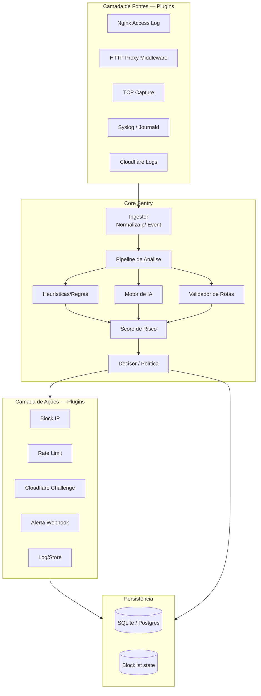
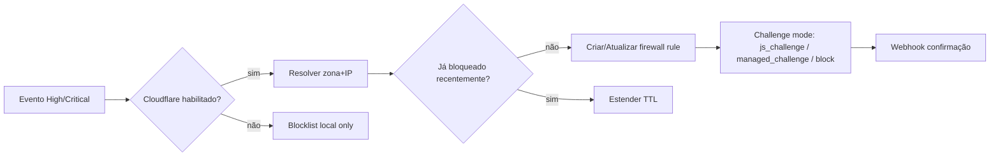
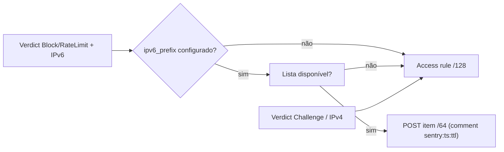
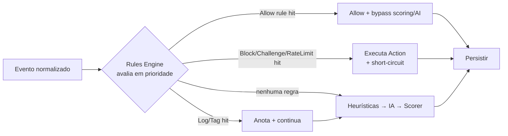
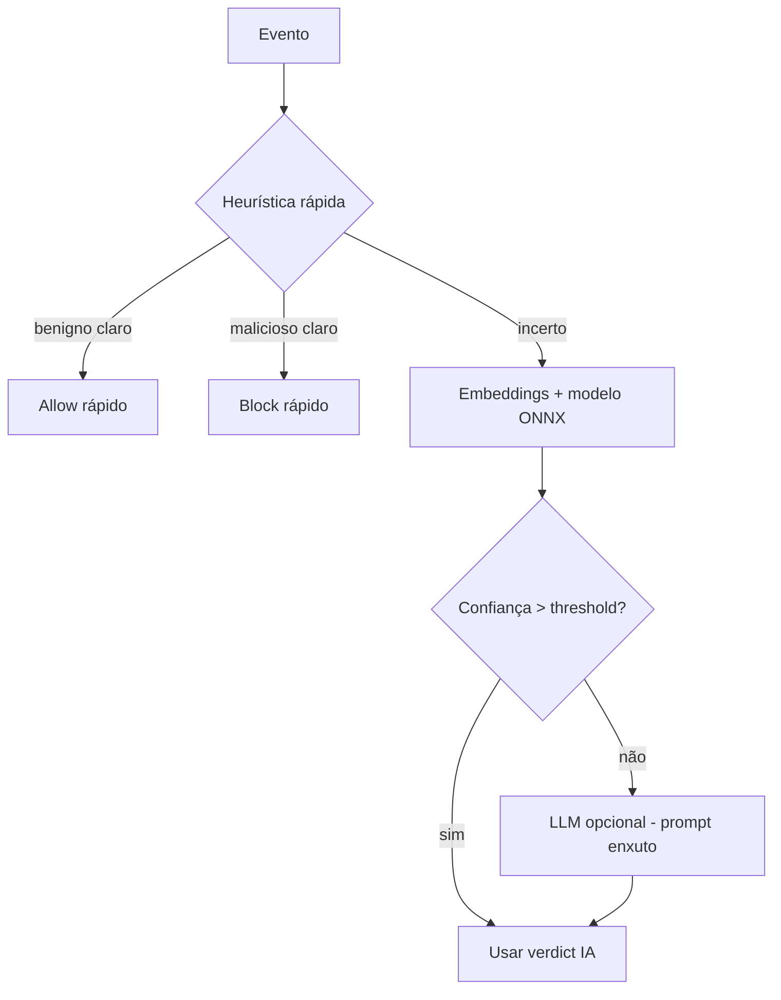
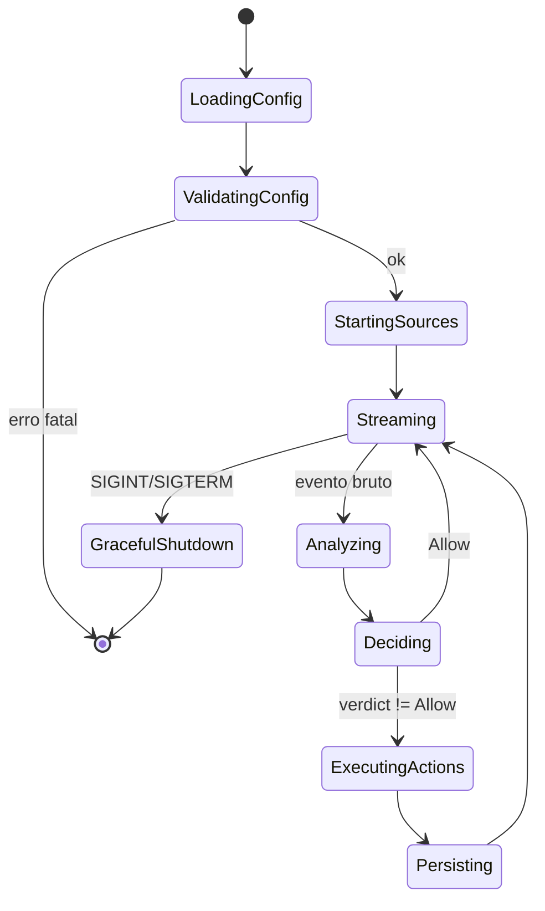
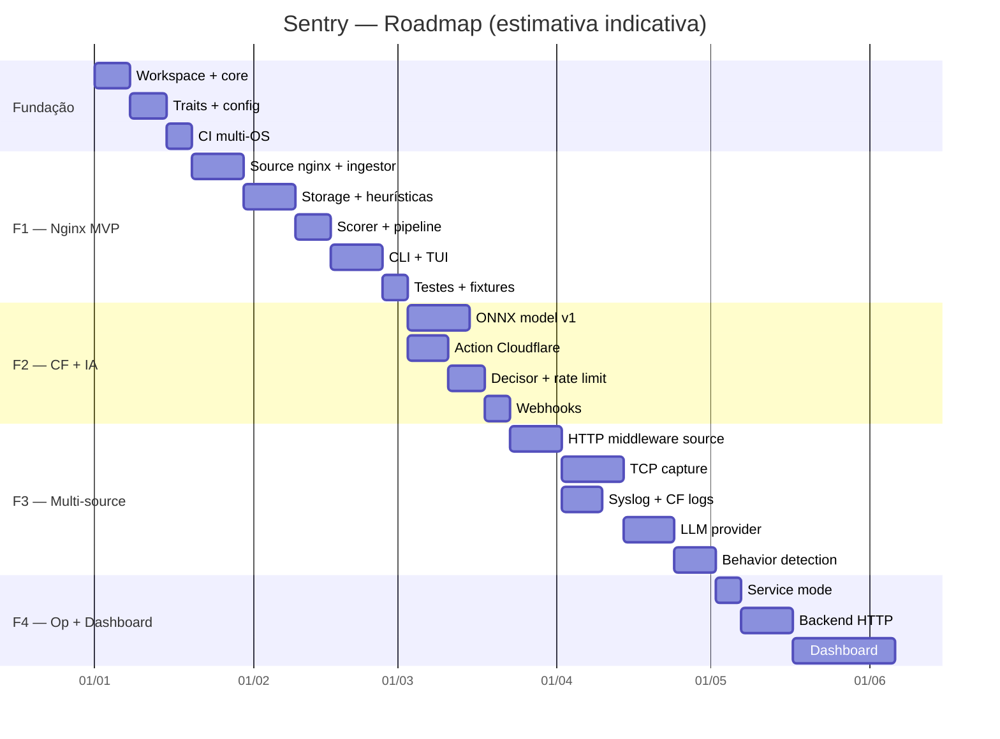
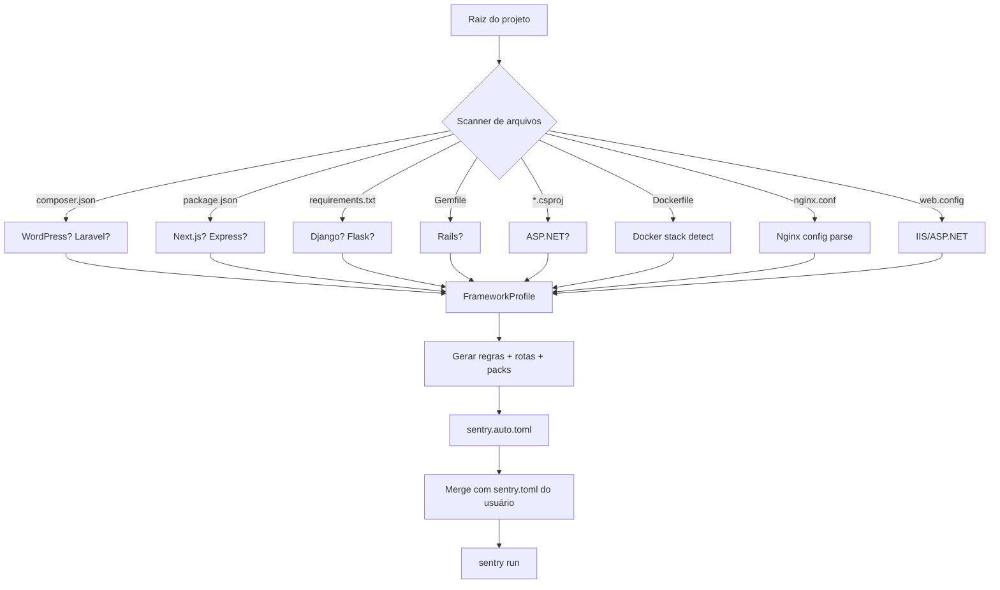

# Sentry — Monitor de Acessos com Detecção de Ameaças por IA

> Status: **Planejamento**
> Linguagem: **Rust** (multi-plataforma: Linux, macOS, Windows, BSD)
> Interface atual: **CLI** (dashboard web futuramente)
> Repositório: `C:\dev\rust\sentry`

---

## 1. Visão Geral

O **Sentry** é um observador de acessos em tempo real para serviços expostos à internet. Começa monitorando o **nginx** (via access logs), mas é desenhado para escalar para **qualquer porta/protocolo** (HTTP, TCP, proxies reversos, packet capture, syslog). Usa IA + heurísticas para detectar payloads maliciosos, comportamento suspeito, rotas inválidas e calcula um **nível de risco** por requisição/IP. Integra-se com **Cloudflare** para challenge/block em camada de edge.

### 1.1 Objetivos

- **Modularidade total**: cada origem de dados (nginx, tcp, http-proxy) é um plugin por trás de um trait comum.
- **Tempo real**: stream de eventos, não batch.
- **Precisão**: combinar regras determinísticas (rápidas, zero falso-positivo conhecido) com IA (para o desconhecido).
- **Ação**: não apenas detectar — bloquear, desafiar, rate-limitar.
- **Multi-plataforma**: um único binário em Rust.
- **Operável**: CLI rica para tail ao vivo, relatórios, export, gestão de blocklist.

### 1.2 Não-objetivos (fase atual)

- Dashboard web (fase futura, via Tauri ou backend HTTP separado).
- Substituir um WAF comercial — é complementar.
- Deep packet inspection de protocolos não-HTTP na fase 1.

---

## 2. Arquitetura de Alto Nível


```mermaid
flowchart TB
    subgraph Sources[Camada de Fontes — Plugins]
        N1[Nginx Access Log]
        N2[HTTP Proxy Middleware]
        N3[TCP Capture]
        N4[Syslog / Journald]
        N5[Cloudflare Logs]
    end

    subgraph Core[Core Sentry]
        ING[Ingestor<br/>Normaliza p/ Event]
        PIPE[Pipeline de Análise]
        AI[Motor de IA]
        HEUR[Heurísticas/Regras]
        ROUTE[Validador de Rotas]
        RISK[Score de Risco]
        DECID[Decisor / Política]
    end

    subgraph Actions[Camada de Ações — Plugins]
        A1[Block IP]
        A2[Rate Limit]
        A3[Cloudflare Challenge]
        A4[Alerta Webhook]
        A5[Log/Store]
    end

    subgraph Storage[Persistência]
        DB[(SQLite / Postgres)]
        BL[(Blocklist state)]
    end

    Sources --> ING
    ING --> PIPE
    PIPE --> HEUR
    PIPE --> AI
    PIPE --> ROUTE
    HEUR --> RISK
    AI --> RISK
    ROUTE --> RISK
    RISK --> DECID
    DECID --> Actions
    Actions --> Storage
    DECID --> Storage
```

### 2.1 Princípios de design

1. **Trait `Source`**: todo plugin implementa `fn stream_events(&self) -> impl Stream<Item = RawEvent>`. Adicionar nginx = implementar o trait.
2. **Trait `Action`**: `fn execute(&self, decision: &Decision) -> Result<()>`. Block, Challenge, Alert etc.
3. **Event normalizado**: um único `struct Event` independente da origem. O core nunca sabe se veio do nginx ou do TCP.
4. **Pipeline assíncrono**: `tokio` + canais. Cada estágio é um actor/fan-out.
5. **Configuração declarativa**: `sentry.toml` define fontes ativas, ações ativas, thresholds.

---

## 3. Stack Técnica

| Camada         | Crate / Tecnologia                                                                                    | Justificativa                                                                        |
| -------------- | ----------------------------------------------------------------------------------------------------- | ------------------------------------------------------------------------------------ |
| Async runtime  | `tokio`                                                                                               | Padrão de facto, multi-plataforma                                                    |
| CLI            | `clap` (derive) + `ratatui` para TUI live                                                             | Ergonomia, subcomandos, painel ao vivo                                               |
| Config         | `serde` + `toml` + `figment` (env+file merge)                                                         | Override por env var em prod                                                         |
| Logs/Tracing   | `tracing` + `tracing-subscriber`                                                                      | Structured logging, spans por requisição                                             |
| Parser nginx   | `nom` ou `regex` + `serde`                                                                            | Linhas de log access_log custom format                                               |
| HTTP client    | `reqwest` (rustls)                                                                                    | Cloudflare API, webhooks, geolookup                                                  |
| ML/IA local    | `ort` (ONNX Runtime) + `candle` fallback                                                              | Inferência local sem depender de API externa                                         |
| LLM (opcional) | trait `LlmProvider` + adapters: **OpenRouter** (rota p/ qualquer modelo), `async-openai`, `ollama-rs` | Análise de payload complexa sob demanda, provider-agnostic                           |
| Storage        | `sqlx` com **Postgres** default (migrations sqlx), SQLite opcional via feature                        | Mesmo schema, troca por feature flag; Postgres suporta HA e múltiplos nós desde cedo |
| Geolookup      | `maxminddb` (DB local)                                                                                | Sem chamada externa por evento                                                       |
| IPC/Embeddable | `core` como lib crate (`sentry-core`)                                                                 | Futuro dashboard consome a mesma lib                                                 |
| Serialização   | `serde` + `serde_json`                                                                                | Eventos, export, API futura                                                          |
| Erros          | `thiserror` (lib) + `color-eyre` (bin)                                                                | Ergonomia + backtraces legíveis                                                      |
| Testes         | `proptest` + `insta` (snapshots) + `wiremock`                                                         | Payloads maliciosos, fixtures de log                                                 |
| Build/Release  | `cargo-dist` ou `cross`                                                                               | Binários multi-OS                                                                    |

---

## 4. Modelo de Dados

O `Event` é **modular por design**: campos comuns a qualquer origem vivem no top-level; o que é específico de protocolo fica em `ProtocolData` (enum extensível). Hoje `Http` cobre nginx; amanhã `Tcp`, `Udp`, `Tls` etc. entram sem mudar o core — basta a source popular a variante correspondente. As heurísticas e o scorer operam sobre o `Event` e fazem _pattern matching_ em `protocol`, ignorando campos ausentes.

```rust
// sentry-core/src/event.rs
pub struct Event {
    // --- comuns a qualquer protocolo ---
    pub id: Uuid,
    pub timestamp: DateTime<Utc>,
    pub source: SourceKind,          // Nginx, Tcp, HttpProxy, CloudflareLogs...
    pub transport: Transport,        // Tcp | Udp | Tls | Internal
    pub client_ip: IpAddr,
    pub client_port: Option<u16>,
    pub server_port: Option<u16>,    // porta exposta observada
    pub geo: Option<GeoInfo>,
    pub asn: Option<u32>,
    pub direction: Direction,        // Inbound | Outbound
    pub bytes_in: Option<u64>,
    pub bytes_out: Option<u64>,
    pub duration_ms: Option<u64>,
    pub raw: Option<String>,         // registro original p/ auditoria

    // --- específico do protocolo ---
    pub protocol: ProtocolData,
}

pub enum ProtocolData {
    Http(HttpData),
    Tcp(TcpData),
    Udp(UdpData),
    TlsHandshake(TlsData),
    Raw(RawData),                    // fallback: bytes + nota
    // futuras variantes entram aqui sem quebrar consumidores
}

pub struct HttpData {
    pub method: HttpMethod,
    pub scheme: Option<String>,      // http | https
    pub host: Option<String>,
    pub path: String,
    pub query: Option<String>,
    pub fragment: Option<String>,
    pub status: Option<u16>,
    pub user_agent: Option<String>,
    pub referer: Option<String>,
    pub headers: HashMap<String, String>,
    pub body: Option<Vec<u8>>,       // quando disponível (proxy/middleware)
    pub cookies: Option<HashMap<String, String>>,
}

pub struct TcpData {
    pub flags: TcpFlags,             // syn/fin/rst/ack...
    pub payload: Option<Vec<u8>>,    // bytes do stream reconstruído (quando capturável)
    pub stream_id: Option<u64>,      // p/ correlacionar segmentos
    pub stage: TcpStage,             // Syn | SynAck | Data | Fin | Reset
}

pub struct UdpData {
    pub payload: Option<Vec<u8>>,
    pub dns_query: Option<String>,   // se for DNS reconhecido
}

pub struct TlsData {
    pub sni: Option<String>,
    pub ja3: Option<String>,         // fingerprint TLS
    pub ja4: Option<String>,
    pub cipher: Option<String>,
    pub version: Option<String>,
}

pub struct RawData {
    pub note: String,
    pub bytes: Vec<u8>,
}

// Helpers de ergonomia: e.kind_http() -> Option<&HttpData> etc.
impl Event {
    pub fn http(&self)  -> Option<&HttpData>  { match &self.protocol { ProtocolData::Http(d) => Some(d), _ => None } }
    pub fn tcp(&self)   -> Option<&TcpData>   { match &self.protocol { ProtocolData::Tcp(d) => Some(d), _ => None } }
    pub fn tls(&self)   -> Option<&TlsData>   { match &self.protocol { ProtocolData::TlsHandshake(d) => Some(d), _ => None } }
    pub fn is_http(&self) -> bool { matches!(self.protocol, ProtocolData::Http(_)) }
}
```

> **Regra**: nenhum estágio do pipeline pode assumir `ProtocolData::Http`. Heurísticas HTTP verificam `evt.http()` e retornam `None` para outras variantes; heurísticas TCP fazem o análogo. Assim o mesmo pipeline roda para nginx hoje e para captura TCP amanhã.

pub struct AnalysisResult {
pub risk_score: u8, // 0..=100
pub risk_level: RiskLevel, // Info|Low|Medium|High|Critical
pub signals: Vec<Signal>, // o que disparou
pub verdict: Verdict, // Allow|Challenge|Block|Quarantine
}

pub enum Signal {
PathTraversal, SqlInjection, Xss, CmdInjection,
UnknownRoute, ScanBehavior, AbnormalRate,
SuspiciousUA, TorExitNode, KnownBadIp,
AnomalousPayload(/_ modelo _/),
Custom(String),
}

````

---

## 5. Fluxo de uma Requisição

```mermaid
sequenceDiagram
    participant N as Nginx (log)
    participant I as Ingestor
    participant P as Pipeline
    participant H as Heurísticas
    participant R as Rotas
    participant SC as Scan trackers
    participant S as Scorer
    participant D as Decisor (policy)
    participant E as Escalonamento (strikes)
    participant AI as IA (ONNX, fork)
    participant CF as Cloudflare API
    participant DB as Postgres

    N->>I: linha de access_log
    I->>P: Event (dedupe + geo)
    P->>H: regex/sigs (SQLi, XSS, LFI...)
    P->>R: path existe? método permitido?
    P->>SC: janela 4xx por IP
    H-->>S: signals + pesos
    R-->>S: UnknownRoute / MethodNotAllowed
    SC-->>S: RandomScan / ScanBehavior
    S->>S: score + level (bônus de repetição)
    S->>D: AnalysisResult
    D->>E: verdict não-Allow → +1 strike
    E->>E: strikes ≥ challenge_at/block_at → eleva verdict
    par fork assíncrono (não bloqueia o hot path)
        D->>AI: se score ≥ ai.min_score
        AI-->>D: AnomalousPayload → rescore_from (só eleva)
    end
    alt Block/Challenge/RateLimit
        D->>CF: access rule (block/challenge)
        D->>DB: evento + strike persistido
    else Allow
        D->>DB: métricas only
    end
    D-->>N: (não interfere no nginx; modo inline no futuro)
```

### 5.1 Estágios do pipeline (ordem fixa, knobs configuráveis)

O hot path é **síncrono e determinístico**; a IA roda ao lado, como fork:

```
rules (fast path) → heurísticas → rotas → scan → behavior → correlation → scorer → policy → escalation
                                                                            └→ IA (fork/inline/shadow) → rescore_from
```

- **scan** (`[scan]`): janela deslizante por IP contando apenas respostas 4xx.
  ≥ `distinct_paths` paths **distintos** → `RandomScan` (peso 25, acumulativo —
  cobre sweeps de `/.env*`, `/a1b2.php`…); ≥ `not_found` respostas 4xx →
  `ScanBehavior` (peso 35). Paths unknown **nunca** são aprendidos como rota
  (anti-poisoning — aprender silenciaria o próprio sinal); use
  `sentry report --unknown-paths` para promover rotas legítimas à config.
- **correlation** (`[correlation]`, F3.10): janelas deslizantes por /24 (v4),
  /64 (v6) e ASN. Sinais de scan (`RandomScan`/`ScanBehavior`/`TcpScanner` —
  SYNs do source `tcp` alimentam a mesma janela que sweeps HTTP) registram o
  scanner; um sinal de ataque de **outro** IP no mesmo prefixo (preferido) ou
  ASN dentro de `window_secs` (default 900 = 15 min) emite
  `ScanAttackCorrelation` (peso 20) — o padrão "shot calling" de honeypots.
  Detalhes em §8.5.
- **escalation** (`[escalation]`): cada verdict não-Allow conta 1 strike por
  IP. `challenge_at` strikes → eleva p/ Challenge; `block_at` → Block (só
  eleva, nunca rebaixa; Allow não conta strike). Strikes decaem após
  `window_secs` (default 7d — sobrevive ao TTL de edge rules de 24h) e são
  espelhados na tabela `ip_state` (`strikes`/`total_violations`/
  `last_violation_at`) com pre-warm no startup: reincidente pós-expiração é
  re-bloqueado no primeiro evento violador. `sentry ip forgive <ip>` reseta.
- **IA** (`[ai]`): modelo clássico (regressão logística sobre 25 features
  extraídas em Rust — `sentry-ai/src/features.rs`) via ONNX (`--features
  onnx`). `mode = "fork"` (default, assíncrono com semaphore + cache por
  hash de payload), `inline` (bloqueante antes das actions) ou `shadow`
  (só loga). `trigger` = `above_score|always|quarantine_only`. O resultado
  entra por `Pipeline::rescore_from`, que **só soma** (a IA nunca reduz o
  score). Treino: `sentry model export [--synthetic]` → CSV com as mesmas
  features da inferência → `python tools/train_model.py` → ONNX.

---

## 6. Níveis de Risco e Vereditos

| Score  | Level    | Cor      | Veredito padrão        |
| ------ | -------- | -------- | ---------------------- |
| 0–9    | Info     | cinza    | Allow                  |
| 10–29  | Low      | azul     | Allow + observação     |
| 30–49  | Medium   | amarelo  | Rate-limit crescente   |
| 50–74  | High     | laranja  | Challenge (Cloudflare) |
| 75–100 | Critical | vermelho | Block IP + alerta      |

Política configurável por rota/IP-range/ASN. Ex: `/admin/*` tem threshold mais baixo.

Acima da política roda o **escalonamento de reincidentes** (`[escalation]`): cada
verdict não-Allow soma 1 strike por IP; `challenge_at` strikes elevam o verdict
para Challenge e `block_at` para Block (defaults 3/5, janela de 7d, persistido
em `ip_state`). Um IP que "sempre dá MED 48" é escalado após algumas repetições
em vez de ficar para sempre 2 pontos abaixo do threshold de High.

---

## 7. Modularidade — Plugins

### 7.1 Trait de Source

```rust
// sentry-core/src/source.rs
#[async_trait]
pub trait Source: Send + Sync {
    fn name(&self) -> &'static str;
    async fn stream(&self) -> anyhow::Result<mpsc::Receiver<RawEvent>>;
}

// Implementações:
// sentry-source-nginx    -> tail do access.log
// sentry-source-http     -> middleware axum/actix que recebe cópia
// sentry-source-tcp      -> captura via `pnet`/`pcap` (libpcap)
// sentry-source-cloudflare -> pull de logs via API em polling
```

### 7.2 Trait de Action

```rust
// sentry-core/src/action.rs
#[async_trait]
pub trait Action: Send + Sync {
    fn name(&self) -> &'static str;
    async fn execute(&self, evt: &Event, decision: &Decision) -> anyhow::Result<()>;
}

// Implementações:
// sentry-action-cloudflare  -> regras de firewall, challenge
// sentry-action-blocklist   -> estado local (para inline proxy)
// sentry-action-webhook     -> Discord/Slack/Telegram/email
// sentry-action-iptables    -> nftables/iptables (Linux)
// sentry-action-log         -> registrar em DB
```

### 7.3 Registro dinâmico

Cada plugin expõe `pub fn register(reg: &mut Registry)`. O binário habilita plugins via feature flags Cargo + entry em `sentry.toml`. **Sem recompilar para ativar/desativar** — só config.

---

## 8. Integração Cloudflare (Sinergia de Challenge)


```mermaid
flowchart LR
    EVT[Evento High/Critical] --> CF1{Cloudflare habilitado?}
    CF1 -->|sim| CF2[Resolver zona+IP]
    CF2 --> CF3{Já bloqueado recentemente?}
    CF3 -->|não| CF4[Criar/Atualizar firewall rule]
    CF3 -->|sim| CF5[Estender TTL]
    CF4 --> CF6["Challenge mode: js_challenge / managed_challenge / block"]
    CF6 --> CF7[Webhook confirmação]
    CF1 -->|não| BL[Blocklist local only]
```

- Tokens via env (`SENTRY_CF_TOKEN`, `SENTRY_CF_ZONE`).
- Cache local de IPs já desafiados (TTL configurável) para não bombardear a API.
- Modos: `block`, `js_challenge`, `managed_challenge`, `rate_limit`.
- **Importante**: na fase 1 o Sentry é **read-only + Cloudflare action**. Não há inline proxy. Inline é fase futura (`sentry-proxy`).

### 8.1 IP real do cliente (atrás de CDN/proxy)

Atrás da Cloudflare, `$remote_addr` no access log do nginx é o IP do **edge** da
CDN, não do cliente — bloquear/ranquear esse IP seria inútil. A resolução do IP
real é **automática** no `sentry-source-nginx`, por precedência fixa (o
primeiro que parseia vence, independente da ordem no `log_format`):

1. `$http_cf_connecting_ip` (Cloudflare)
2. `$http_true_client_ip` (Cloudflare Enterprise / outros CDNs)
3. `$http_x_real_ip`
4. `$http_x_forwarded_for` / `$proxy_add_x_forwarded_for` (primeiro da cadeia)
5. `$remote_addr` / `$remote_addr_v6`

Basta incluir o header no `log_format` do nginx (e no `format` do source) —
ex.: `... "$http_user_agent" "$http_cf_connecting_ip"`. Quando o header está
ausente (tráfego direto), o nginx loga `-` e o parser cai para o próximo
candidato. Além disso, **todo token `http_*` capturado** vira um header no
`HttpData.headers` do evento (ex.: `http_cf_connecting_ip` →
`cf-connecting-ip`), habilitando regras DSL `header.X` sobre logs. Geo/ASN,
dedupe, storage e actions consomem o IP já resolvido automaticamente.

Exemplo de `log_format` recomendado atrás da Cloudflare:

```nginx
log_format sentry '$remote_addr - $remote_user [$time_local] "$request" '
                  '$status $body_bytes_sent "$http_referer" "$http_user_agent" '
                  '"$http_cf_connecting_ip"';
```

### 8.2 Bloqueio /64 IPv6 via IP Lists (F2.14)

IP Access Rules da Cloudflare aceitam **endereços exatos** (`ip`/`ip6`) —
verificado ao vivo em 2026-08-30: zone e account endpoints rejeitam target
`ip6_range`, e `ip6` rejeita CIDR. Um host IPv6 com privacy extensions
rotaciona o interface ID dentro do /64 e escapa de regras /128. A solução é
um **IP List** account-level (aceita CIDR, incl. /64) alimentado pelo Sentry
+ **uma** custom rule na zona:

```text
(ip.src in $sentry_blocks)  →  action: block
```

- **Opt-in**: `[action.options] ipv6_prefix = 64` (default 128 = access
  rules exatas, comportamento anterior). `list_name` default `sentry_blocks`.
- **Account id**: derivado automaticamente do `GET /zones/{zone}`
  (`result.account.id`); override via `SENTRY_CF_ACCOUNT`.
- **Roteamento de verdict**: IPv6 `Block`/`RateLimit` → item /64 na lista
  (action da rule é `block`; `rate_limit` não é expressível por item — mesmo
  fallback dos access rules). IPv6 `Challenge` → access rule /128 (desafio é
  interativo/per-browser). IPv4 → access rules (inalterado).
- **TTL**: no `comment` de cada item, mesmo formato dos notes de access
  rules (`sentry:<ts>:<ttl>`) — reaper deleta expirados, reconcile adota
  vivos, POST de item é idempotente (duplicata sobrescreve o comment).
- **Dedupe cache** keyed pelo endereço de rede do /64 (rotação colapsa na
  mesma chave).
- **Degradação suave**: sem permissões (`Account Filter Lists: Edit`,
  `Zone Rulesets: Edit`) ou limite de plano → modo lista soft-disable com
  warning, IPv6 cai para access rules exatas, reaper re-tenta provisioning a
  cada ciclo. Falhas de lista **não** contam no circuit breaker principal.
- **Planos**: IP Lists disponíveis em todos (Free inclui 1 lista/10k itens;
  Pro/Business 10 listas) — cf. docs Cloudflare WAF Lists.

Fluxo no `apply()`:


```mermaid
flowchart LR
    V[Verdict Block/RateLimit + IPv6] --> P{ipv6_prefix configurado?}
    P -->|não| AR[Access rule /128]
    P -->|sim| L[Lista disponível?]
    L -->|sim| IL["POST item /64 (comment sentry:ts:ttl)"]
    L -->|não| AR
    V2[Verdict Challenge / IPv4] --> AR
```

### 8.3 Modos de deployment (F3.9)

`[deployment] mode` escolhe onde o Sentry senta em relação à aplicação:

```text
passive (default)   client → nginx → app        Sentry lê access.log / syslog /
                                                pcap e age ex-post (webhook, CF API,
                                                blocklist). Zero risco de path.

inline              client → sentry-edge → nginx → app
                    Sentry é o front: aplica o verdict ANTES do upstream
                    (Block→403 · RateLimit→429 · Challenge→challenge page ·
                    Allow→proxy). Alvo de latência de verdict: ≤50 ms.
```

- **`edge-http` (F3.9a, crate `sentry-edge`)**: reverse proxy inline. O
  startup exige **opt-in explícito** (`mode = "inline"`) **+ health check do
  backend** — edge sobre backend morto vira outage. Eventos decididos
  retornam ao daemon pelo mesmo fan-in (`Incoming::Processed`): persistência,
  actions e forks disparam uma única vez; o `Arc<Pipeline>` é compartilhado,
  então rate-limiter/scan/behavior/offender **não** contam em dobro.
- **`sentry_middleware` (F3.1)**: o mesmo runtime exposto como middleware
  axum (`from_fn_with_state(rt, sentry_edge::middleware::handler)`) em modos
  `Inline` (bloqueia antes do handler) ou `Shadow` (anexa a decisão e
  segue) — para apps Rust que embutem o Sentry sem proxy hop.
- **`edge-tcp` (F3.9b)**: listener TCP inline para serviços não-HTTP —
  verdict no connect (Block/Quarantine fecha a conexão), depois pipe
  bidirecional para o backend real. Fingerprint SYN não existe em
  userspace-accept; o pipeline roda com evento `Tcp(Syn)` sintético.
- **`passive-log` (F3.9d)**: tail de access.log (F1, já entregue).
- **`passive-mirror`/`passive-tap` (F3.9e/f)**: SPAN/`iptables TEE`/sniffer
  promíscuo via `sentry-source-tcp` em capture mode (feature `pcap`).
- **`edge-sidecar` (F3.9c)**: mesmo binário em container sidecar/DaemonSet
  (`deploy/k8s/edge-sidecar.yaml`).
- **Páginas de verdict (`sentry-edge/src/pages.rs`)**: os bloqueios e
  fallbacks de challenge servem uma página HTML única (tema dark do PoW,
  logo do Sentry embutido como data URI, copy estilo Cloudflare —
  "403 - Forbidden" / "You are unable to access this website." — e um
  **Trace ID** rastreável: nas decisões do pipeline é o `event.id`
  persistido; no fast-path (BlockTable, sem evento) um UUID novo é gerado,
  exibido na página, logado em `tracing::info!` e devolvido no header
  `x-sentry-trace-id`). Status codes CF-like: Block/Quarantine,
  fast-path, challenge falhado e challenge sem PoW → **403**;
  RateLimit → **429** (`retry-after: 60`); o interstitial PoW também é
  **403** (CF serve o managed challenge assim; `cache-control: no-store`
  evita caches), não mais 503.
- **`challenge_backend` (`[edge]`)**: quem executa o `Challenge` verdict —
  `sentry` (default) roda o PoW local (F7.8); `cloudflare` delega ao
  provider CF: o verdict vira regra no Cloudflare via API
  (`[[action]]` com `provider = "cloudflare"`) e a edge só segura a
  requisição atual com 403 + `retry-after` até a regra assumir no hop
  seguinte. As páginas continuam sendo do Sentry — nada do Cloudflare é
  imitado. Warning no startup se `cloudflare` sem action CF configurada.
- **Regra de cadeia**: `client → sentry-edge → nginx → app` — o Sentry é a
  camada de decisão de ameaça; rate-limit/WAF de app do nginx continuam
  sendo do nginx (complementares, não substitutos).
- **Critério de escolha**: inline quando o serviço não pode tolerar o
  ataque chegar na app (RCE/0-day); passive quando a infra não pode mudar
  de path/SSL ou o objetivo é observabilidade. Default = passive.

### 8.4 Multi-node / HA (F4.7)

N daemons (ou N pods do mesmo Deployment) compartilham o mesmo Postgres e
operam como um cluster ativo-ativo:

- **Dedupe cross-node**: o LRU de dedupe é por-processo — não enxerga
  eventos processados por outro nó. Cada insert carrega `payload_hash`
  (mesma chave do dedupe local: IP+método+path para HTTP, IP+hash do raw
  para os demais). O `INSERT` é condicional: se um nó irmão persistiu o
  mesmo hash na janela de 10s (igual ao TTL do LRU), o insert é pulado.
  `events_payload_hash_ts` (índice parcial) mantém o `NOT EXISTS` barato.
- **Identidade**: `[deployment] instance_id` (default = hostname) vira
  label do gauge `sentry_instance_info{instance}` para diferenciação em
  dashboards/alertas.
- **Estado compartilhado (Postgres/Redis)**: incidentes, offender strikes,
  rotas aprendidas e rulesets vivem no banco comum — todos os nós enxergam
  os mesmos incidentes e hot-reload (LISTEN/NOTIFY) é propagado a todos.
- **Rate-limit**: `backend = "redis"` compartilha a janela entre nós; o
  backend in-memory é por-node (limite efetivo ≈ N× o configurado).
- **Limitação documentada**: trackers de scan (`[scan]`) e behavior
  (`[behavior]`) são por-node — um scanner distribuído entre os nós pode
  demorar mais para cruzar o limiar em cada nó individual.
- **Tasks de background idempotentes**: reaper de regras CF (reconcile por
  `note` com timestamp), learner de rotas (merge determinístico) e refresh
  de feeds (replace atômico) podem rodar simultaneamente sem corrupção;
  duplicação transitória de trabalho é aceitável.
- **Edge/HA**: múltiplos `sentry-edge` atrás de um LB — o verdict é
  stateless por request (rate-limit compartilhado via Redis; **bloqueios**
  compartilhados via `ip_state` + NOTIFY `sentry_blocks_changed`, §8.6); o
  `[server]` HTTP deve ficar atrás do LB também (F4.4 auth por token é
  stateless; sessões HMAC são válidas em qualquer nó que compartilhe
  `SENTRY_SESSION_SECRET`).

### 8.5 Correlação scan→ataque cross-IP (F3.10)

Honeypots observam o padrão "shot calling": um host varre a internet de um IP
"limpo" e, minutos depois, exploits/brute-force chegam de um **outro** IP do
mesmo /24, /64 ou ASN — o scanner acha os alvos, o operador (ou um consumidor
dos dados de scan publicados) bate. Referência: Ken Webster, *There Is No Such
Thing as a Benign Internet Scanner*.

- **Tracker** (`crates/sentry-core/src/correlation.rs`):
  `CorrelationTracker` mantém janelas deslizantes de scans recentes com duas
  chaves — prefixo de rede (/24 para IPv4, /64 para IPv6) e ASN (`evt.asn`,
  GeoLite2-ASN; sem MMDB só prefixo correlaciona). História limitada
  (64 scans/chave, drop-oldest) e `prune()` a cada 60s no daemon, como os
  demais trackers. Estado em memória, por-node.
- **Fluxo no pipeline**: em todo evento que passa da fase de regras, sinais
  de scan (`RandomScan`, `ScanBehavior`, `TcpScanner`) registram o scanner
  (`record_scan`); se algum sinal de **ataque** dispara (SQLi, XSS,
  traversal, LFI, Log4Shell, RCE, SensitivePath, AuthBruteForce,
  SuspiciousLoginSuccess, CredentialStuffing, DirectoryBruteForce,
  AnomalousPayload, LlmMalicious), `correlate` procura um scan de IP
  **diferente** no mesmo prefixo (preferido) ou ASN dentro de `window_secs`.
  Hit → `ScanAttackCorrelation` (peso 20, override
  `[scorer.weights] scan_attack_correlation`) com detail
  `tcp-syn from 198.51.100.7 (same /24) 42s ago`.
- **Cross-source**: SYNs capturados pelo source `tcp` (F3.2) entram pela
  heurística `TcpScanner` e alimentam a mesma janela — um masscan que nunca
  gera log HTTP ainda correlaciona com o exploit HTTP vizinho que vem
  depois. Como o tracker recebe o `&Event` inteiro (não só o tuple HTTP),
  eventos não-HTTP participam.
- **Config**: `[correlation] enabled = true, window_secs = 900`.
  Métrica: `sentry_correlation_hits_total`.
- **Taxonomia de scanners** (tiers de reputação, F3.10): `ReputationTier`
  ganha `Authorized` (scanner contratado — sem sinal; confie via regra DSL
  `reputation = "authorized"` → Allow) e `Promiscuous` (publica recon para
  qualquer um — sinal `PromiscuousScanner` peso 10; a data alimenta
  atacantes). Tiers parseam no DSL, em `[[rules.feeds]] tier = "…"` e em
  `sentry feeds check`.
- **Limitações**: estado em memória por-node (mesma limitação dos trackers
  `[scan]`/`[behavior]`, §8.4); eventos que short-circuitam em regras não
  passam pelos trackers (um scan bloqueado por regra não registra memória de
  correlação); correlação é **agravador** — nunca gera verdict sozinho, só
  soma peso ao ataque que a disparou.

### 8.6 Bloqueios persistentes (BlockTable) — enforcement real no inline

Antes do BlockTable, um bloqueio não "grudava": a blocklist action era
escreva-só (estado inalcançável no registry), o dashboard/CLI gravavam só no
`ip_state` e nada recarregava — um IP bloqueado voltava a ser proxyado pela
edge no request seguinte se o pipeline sozinho não re-derivasse Block.

- **`BlockTable`** (`crates/sentry-core/src/blocks.rs`):
  `HashMap<IpAddr, Option<Instant>>` compartilhado (`Arc`) — `None` =
  permanente (bloqueio de dashboard/CLI sem TTL), `Some(exp)` = TTL.
  Writers: blocklist action (verdict Block), pre-warm do DB e hot-reload
  NOTIFY; readers: o fast-path da edge e o guard do mirror.
- **Fast-path na edge** (`sentry_middleware`, `edge-http`, `edge-tcp`): o IP
  do cliente resolvido (§8.1) é checado **antes** do pipeline — bloqueado →
  403 / `shutdown()` imediatos, sem rodar pipeline nem gerar evento (o
  incidente já existe de quando o bloco foi decidido; evita spam de webhook
  por request). Contadores: `sentry_edge_block_hits_total` e
  `sentry_block_table_size`.
- **Persistência**: vereditos Block do pipeline são espelhados para
  `ip_state` (`status='blocked'`, `expires_at = now + ttl_secs` da blocklist
  action, `reason` = label do primeiro sinal) + `NOTIFY
  sentry_blocks_changed`; o guard `is_blocked` evita regravar o row a cada
  evento violador. Restart → pre-warm lê `ip_state.blocked(10_000)` com
  expirados filtrados no Rust.
- **Sync multi-node**: dashboard/CLI block/unblock e o próprio daemon emitem
  `NOTIFY sentry_blocks_changed`; cada nó roda um listener que recarrega a
  tabela do banco (reload atômico) — um bloqueio decidido num nó passa a
  negar na edge de todos os nós em tempo real.
- **Cadeia completa**: pipeline Block → tabela + DB + NOTIFY → edge de
  qualquer nó nega no fast-path; dashboard block → DB + NOTIFY → efeito
  imediato; `sentry ip unblock` → delete no DB + NOTIFY → tabela recarrega e
  o IP volta a passar.

### 8.7 IP real com trusted proxies, bans de kernel e report comunitário (F7)

**Trusted proxies + TRUSTED_IPS (F7.2)** — `[real_ip]`: o parser nginx e a
edge só honram IPs vindos de header (`CF-Connecting-IP` > `True-Client-IP` >
`X-Real-IP` > XFF) quando o `$remote_addr`/peer é um **trusted proxy** —
ranges Cloudflare embutidos (constants + refresh diário de
cloudflare.com/ips-v4|ips-v6, task `spawn_cloudflare_refresh`) +
`trusted_proxies` de config. Sem remote_addr no log_format vale o
comportamento legado (quem escreve o log é o edge). Isso fecha o spoof de
`CF-Connecting-IP` em tráfego direto-to-origin. `trusted_ips` (o conceito
`TRUSTED_IPS` do nginx-honeypot — "não se trancar fora") nunca é banido,
bloqueado ou reportado: short-circuit para `Allow` no `Pipeline::process`,
guard no fast-path da edge (`is_hard_blocked`), guard final no provider de
firewall, e reputação `Authorized` no enricher. Estado em
`TrustSet`/`SharedTrustSet` (`crates/sentry-core/src/trust.rs`). Presets
embutidos (`trusted_lists.rs`: paypal, stripe, googlebot, bingbot — snapshots
das fontes oficiais dos vendors) entram no mesmo never-ban quando aprovados
por nome em `[real_ip] trusted_lists = ["paypal", ...]`; catálogo via
`sentry trusted list`.

**Bans de kernel (F7.3)** — crate `sentry-action-firewall`, provider
`type = "challenge"`, `provider = "firewall"`: herda o filtro
Block/Challenge/RateLimit do `ChallengeAction`. Backends com auto-detect
(cacheado): **nftables** (recomendado — table `sentry` + sets
`sentry_blocks_v4/_v6` com `flags timeout` + chain input `priority -1` drop;
ban = 1 mensagem netlink com timeout por elemento, sem reaper),
**ipset** legacy (`hash:ip timeout` + `iptables -m set`, regra inserida só
após `-C`) e **firewalld** (ipsets runtime; sem timeout por entrada — a
expiração fica no reconcile). O DB (`ip_state`) é a fonte da verdade:
sync no startup (re-seed pós-restart) + reconcile a cada 60s (cobre unblock
manual multi-node e expiração). Requer root ou `CAP_NET_ADMIN`; probe e
tamanho dos sets em `sentry firewall status`. Linux-only (fora dele o
provider é pulado com warning, padrão do braço cloudflare sem token).

**Report comunitário (F7.4)** — crate `sentry-action-report`, action
`type = "report"`, `provider = "abuseipdb" | "reportedip"`: mapeia os
`SignalKind` para as categorias de cada API (SQLi→16, scans→14/61,
brute force→18, bad bot→19, …; fallback Hacking), dedupe por IP com TTL
(1 report/IP/janela — quotas diárias), backoff em 429 e circuit breaker de
5 falhas (soft-disable até restart). Chaves por env (`SENTRY_ABUSEIPDB_KEY`,
`SENTRY_REPORTEDIP_KEY`); feeds autenticadas via `headers_env`
(header → env var) — ex.: blacklist do AbuseIPDB como `[[rules.feeds]]`.

**Lookup externo da banda cinza (F7.5)** — `[ip_lookup]` +
`sentry_ai::IpLookupProvider` (AbuseIPDB `/check`): fork assíncrono
(espelha `AiFork`/`LlmFork`, roda **depois** deles) que consulta IPs com
score local ≥ `trigger_above` (ou portando um sinal de `on_signals`) mas
verdict ≠ Block; o `abuseConfidenceScore` vira o sinal
`ExternalReputation` com peso escalado (25% ≈ +10 … 100% ≈ +40) re-entrando
por `rescore_from` (só eleva). Cache LRU por IP com TTL + quota
`max_per_hour` (rolling hour). IPs confiáveis nunca são consultados.

**Datasets e listas compartilhadas (F7.1/F7.6)** —
`crates/sentry-core/src/lists.rs` é a fonte única dos padrões de path
sensível (pack `sensitive_paths` + heurística `SensitivePath` + literais do
prefilter Aho-Corasick derivam da mesma tabela — impossível dessincronizar);
inclui os probes de CVE do honey.conf (Laravel `_ignition`, PHPUnit
`eval-stdin`, Exchange Autodiscover/ECP, MobileIron, Telerik, GPON,
Fortinet, D-Link). Pack `honeypot_paths` (shadow default) para os padrões
largos demais para enforce (`.aspx`, `cgi-bin`, `node_modules`, dotfiles).
Pack `host_allowlist` (off; `params.domains`) bloqueia Host header fora da
allowlist (inclusive requests sem Host — scan por IP direto); o parser
nginx agora popula `HttpData.host`. Datasets: `[[rules.feeds]]` com
`kind = "user_agent" | "path"` compila listas uma-por-linha em uma regra
sintética de alternation literal (o crate regex acelera com Aho-Corasick
internamente); `action` default `log`. Params de packs são achatados para
`<pack>__<param>` no daemon (corrigindo o acesso de `country_blocklist` aos
próprios countries). Roadmap F7.7: datasets DB-backed com import CLI e
prefilter dinâmico (§23.3).

**Verificação de bots via rDNS (F7.10)** — `[bot_verification]`
(opt-in, `enabled = false`): UAs que alegam ser crawler verificado
(Googlebot, bingbot, Slurp, Baiduspider, YandexBot) passam pelo método
oficial dos engines — o PTR do IP tem de terminar nos domínios do engine
(`googlebot.com`/`google.com`, `search.msn.com`, `yahoo.com`,
`crawl.baidu.com`, `yandex.com|net|ru`) **e** a resolução direta do
hostname tem de conter o IP de origem (mata spoof de PTR). DNS entra
injetado via trait `BotDnsResolver` (`crates/sentry-cli/src/botdns.rs`
com hickory-resolver; mock nos testes) e roda **fora do hot path**: o
pipeline só lê o cache `BotVerifier` (`crates/sentry-core/src/
botverify.rs`; TTL 1h verificado / 10 min falha; miss marca `Unknown` no
evento e enfileira `(ip, engine)` para o worker em background — pendente
não concede bypass nem sinal). Claim verificado → bypass do JS challenge
na edge; claim falsificado → sinal `SpoofedBot` (peso 35, override em
`[scorer.weights] spoofed_bot`; no LevelMap default vira Challenge);
outage de DNS → `Unknown` (nunca marca bot verdadeiro como spoof — erro
é distinto de resposta vazia via `DnsOutcome`). Com a verificação ligada,
o pack `crawlers_good` divide-se em `crawlers_good_verified`
(exige a condição DSL `bot_verified = "true"` — allowlist verified-only;
a condição também aceita `false`/`spoofed` e engine: `bot_verified =
google`) e `crawlers_good_unverified_ok` (UAs sem verificação possível
mantêm o allow por UA). Diagnóstico: `sentry bots check <ip> --ua
"Googlebot/2.1"`. Métrica `sentry_bot_verifications_total{result=
verified|spoofed|error}`.

**JS challenge nativo na edge + provider nginx (F7.11)** — duas
topologias para o verdict `Challenge` (`EdgeMode::JsChallenge` já
existia no vocabulário; agora tem execução):
(1) **Edge inline** (`[edge.challenge]`, opt-in; ativa em
`[deployment] mode = "inline"`): interstitial proof-of-work SHA-256 sem
estado, no estilo do módulo nginx js_challenge —
`challenge_id = SHA-256(secret || ip || bucket)`; o browser procura um
nonce com `SHA-256(challenge_id || ":" || nonce)` com `difficulty` bits
zero à esquerda (default 16, clamp 8..=28; WebCrypto, resolve em <1 s),
seta o cookie `sentry_ch=<bucket>:<nonce>` e dá reload. A edge valida
recomputando o PoW — stateless, multi-node com o mesmo
`secret_env` (`SENTRY_EDGE_CHALLENGE_SECRET`, obrigatório quando
`enabled`, mínimo 16 bytes); bucket default 3600 s com graça do bucket
anterior; resposta 403 + `retry-after: 3` + `cache-control: no-store`
(status Cloudflare; era 503 até F8.1),
`Secure` no cookie quando há HTTPS (`X-Forwarded-Proto`). Clientes sem
JS (curl, bots burros) ficam presos no interstitial (403); bots
verificados (F7.10)
passam direto (`ChallengeGate::Pass`, métrica `bot_bypass`);
`Block`/`RateLimit` continuam 403/429 — PoW nunca destrava block hard.
Página embutida (`CHALLENGE_HTML`), tema escuro, zero CDN. Middleware e
reverse proxy compartilham `EdgeRuntime::challenge_gate`; cookies agora
populam `HttpData.cookies`. Métrica
`sentry_edge_challenge_total{result=served|passed|bot_bypass|delegated|
failed}`. Com `[edge] challenge_backend = "cloudflare"` o gate não roda
PoW local: o verdict vira regra CF via API e a edge responde a página
de espera 403 (`pages::delegated_challenge_page`); cookie inválido
continua terminal 403 (`pages::challenge_failed_page`, com Trace ID).
(2) **Provider nginx** (crate `sentry-action-nginx`,
`type = "challenge"`, `provider = "nginx"`; entrega o F6.2): gera
includes com escrita atômica (tmp+rename) em `conf_dir` —
`sentry-deny.conf` (`deny <ip>;` para Block; `rate_limit_deny` opt-in
para RateLimit), `sentry-challenge.conf` (geo map
`$sentry_challenge_ip` para Challenge) e `sentry-challenge-if.conf`
(snippet de server: `if ($sentry_challenge_ip) { js_challenge on; }` +
`sentry-bots.conf` opcional com `bot_verifier on;`) — para os módulos
getpagespeed (`nginx-module-js-challenge`, `nginx-module-bot-verifier`
+ Redis) no host. Stamps `# sentry:<ts>:<ttl>` (mesma convenção do note
do Cloudflare), worker com reload com debounce ≥1/s e `nginx -t` antes
(`validate = true`, reload quebrado é pulado, nunca aplicado), IPv6 por
CIDR (`ipv6_prefix`, host bits mascarados), deny entries reconciliadas
com o `ip_state` no startup e a cada 60 s (entries de challenge são
efêmeras), guard never-ban (`[real_ip] trusted_ips` nunca entra em
include). Topologias suportadas: passivo + provider nginx
(co-localizado, honeypot), edge inline nativa (F7.11.1) ou Cloudflare —
as três compartilham o mesmo verdict/pipeline e o bypass de bot
verificado.

---

### 8.8 Edge TLS — monitoramento SSL/443 inline (F8)

No modo `inline` a edge passa a manter **dois listeners** no mesmo processo
e pipeline: o HTTP plain (`[edge] listen`, default `0.0.0.0:80`) e o HTTPS
(`[edge] tls_listen`, default `0.0.0.0:443`), habilitado quando
`tls_cert`+`tls_key` estão configurados e o binário foi compilado com
`--features sentry-cli/edge-tls`. Ambos os portos são **monitorados e
enforçados**: block table nega IP em qualquer um deles; a block table é
consultada *antes* do handshake TLS (o IP bloqueado só vê a conexão cair,
sem handshake, sem evento).

**Terminação + telemetria (F8.1)** — o acceptor TLS (`sentry-edge/src/tls.rs`)
faz peek do ClientHello *antes* do handshake rustls (os bytes lidos são
realimentados via `PrefixedStream`, o handshake vê os mesmos octetos),
extrai SNI/JA3/JA4 e só então roda o handshake (tokio-rustls, provider
ring, ALPN `http/1.1`, timeout 5s anti-slowloris). Após o handshake os
requests decryptados entram no **mesmo router** do proxy plain
(hyper-util auto-builder), com `ConnectInfo<SocketAddr>` e
`x-forwarded-proto: https` injetados por conexão — o handler de proxy e o
cookie do challenge ( atributo `Secure`) veem o IP real e o scheme correto.
Cert/config inválidos sem a feature = erro de startup (nunca mais "caiu
silenciosamente para HTTP plain"). `tls_redirect_https = true` responde 301
no listener plain **depois** do pipeline — tráfego na porta 80 continua
sendo pontuado e bloqueado. `listen = ""` desliga o listener plain
(HTTPS-only).

**Monitoramento da camada SSL (F8.2)** — cada handshake emitido gera um
evento `TlsHandshake` (`SourceKind::EdgeTls`) com
`TlsData { sni, ja3, ja4, cipher, version, alpn }` no mesmo pipeline
(regras → reputação → scorer → policy; heurísticas HTTP devolvem vazio
para variante TLS). `ja3` é o MD5 canônico (ordem de wire); `ja4` segue a
especificação pública FoxIO (versão ofertada mais alta, marcador SNI
`d/i/n`, contagens de ciphers/extensions — SNI e ALPN excluídos, ALPN
tag, SHA-256 truncado das listas ordenadas). O parser vive em
`sentry-edge/src/clienthello.rs` (puro, sem I/O, testado contra ClientHellos
sintetizados de Chrome/curl/OpenSSL e hellos fragmentados em múltiplos
records). Condições DSL novas: `tls_ja3 = "…"`, `tls_ja4 = "…"`,
`tls_sni = "…"`. Com `[edge] tls_allowed_hosts` configurado, handshake com
SNI ausente/desconhecido ganha o sinal `TlsSniMismatch` (peso 20, via
`rescore_from` — nunca rebaixa, never-ban respeitado): assinatura de
scanner sondando a porta 443 por IP (comportamento honeypot). Veredito
Block/Quarantine pós-handshake derruba a conexão inteira.

**Observabilidade** — `sentry_edge_tls_handshakes_total{version}`,
`sentry_edge_tls_handshake_failures_total` (records malformados, hellos
truncados, handshakes falhos/expirados),
`sentry_edge_tls_sni_mismatch_total`,
`sentry_edge_tls_cert_not_after` (gauge unix-ts do notAfter do PEM,
recomputado diariamente, warn < 14 dias). O `/api/events` (eventlog)
carrega `tls: {sni, ja3, ja4, version, cipher, alpn}` com key-set estável
(null quando não-TLS) e `host = sni`.

## 9. Detecção de Rotas Válidas

1. **Discovery controlado**: o usuário fornece rotas válidas via config (allowlist) **ou** o Sentry aprende em modo `learn` (período de baseline sem ataques).
2. Estrutura: trie de paths com métodos permitidos + parâmetros esperados.
3. Sinais derivados:
   - Rota inexistente → +pontos (scan/directory brute-force).
   - Muitos 404 do mesmo IP em janela → scan behavior.
   - Hits em paths sensíveis (`/.env`, `/wp-admin`, `/api/admin`) mesmo inexistentes → peso alto.
4. Saída: relatório `sentry routes` mostrando rotas conhecidas vs. tentadas.

---

## 10. Rules Engine — Blacklist/Allowlist (WAF-style)

O Sentry tem um **motor de regras determinístico** que roda **antes** das heurísticas e da IA — é o "fast path". Inspirado nas Custom Rules / WAF da Cloudflare: cada regra é um _match_ + _action_, avaliada em ordem de prioridade, com **short-circuit**. Regras são a primeira linha de defesa (bloqueio instantâneo de VPNs, crawlers, ASNs, países) e também a fonte de **allowlists** (IPs/ASNs confiáveis que bypassam todo o scoring).

### 10.1 Modelo

```rust
// sentry-core/src/rules.rs
pub struct Rule {
    pub id: RuleId,
    pub name: String,
    pub priority: i32,              // menor = avalia primeiro
    pub enabled: bool,
    pub match_: RuleMatch,          // condição (combinável com AND/OR)
    pub action: RuleAction,
    pub ttl: Option<Duration>,      // regras dinâmicas expiram (ex: block temporário)
    pub source: RuleSource,         // Config | Db | CloudflareSync | AutoLearned
    pub tags: Vec<String>,          // ex: "default", "vpn", "crawler"
}

pub enum RuleAction {
    Allow,                          // bypassa scoring + AI (allowlist absoluta)
    Block,
    Challenge,                      // Cloudflare managed/js challenge
    RateLimit { req_per_sec: u32, window: Duration },
    Log,                            // só registra, não age (modo shadow)
    Tag(String),                    // anota o evento, continua pipeline
}

// Expressões combináveis — mesma ideia de matchers da CF
pub enum RuleMatch {
    Ip(IpMatcher),                 // IP exato | CIDR | range
    Asn(u32),
    Country(IsoCode),
    Path(PathMatcher),             // exato | glob | regex
    Method(HttpMethod),
    Header { name: String, op: StrOp },
    UserAgent(StrOp),
    Query(StrOp),
    Body(StrOp),                   // quando disponível
    Protocol(ProtocolKind),        // Http | Tcp | Tls...
    TlsFingerprint { ja3: Option<String>, ja4: Option<String> },
    Reputation(ReputationTier),    // Clean | Suspicious | Malicious | Datacenter | Vpn | Tor
    Status(u16),                   // ex: status == 404
    Rate { count: u32, per: Duration, scope: RateScope },
    Time { window: TimeWindow },   // só ativa em horário comercial etc.
    All(Vec<RuleMatch>),           // AND
    Any(Vec<RuleMatch>),           // OR
    Not(Box<RuleMatch>),
}

pub enum IpMatcher { Single(IpAddr), Cidr(IpCidr), Range { from: IpAddr, to: IpAddr } }
pub enum StrOp { Equals(String), Contains(String), Regex(Regex), StartsWith(String), In(Vec<String>) }
```

### 10.2 Precedência no pipeline


```mermaid
flowchart LR
    EVT[Evento normalizado] --> R{Rules Engine<br/>avalia em prioridade}
    R -->|Allow rule hit| BY[Allow + bypass scoring/AI]
    R -->|Block/Challenge/RateLimit hit| ACT[Executa Action<br/>+ short-circuit]
    R -->|Log/Tag hit| AN[Anota + continua]
    R -->|nenhuma regra| HEUR[Heurísticas → IA → Scorer]
    BY --> PERSIST[Persistir]
    ACT --> PERSIST
    AN --> HEUR
    HEUR --> PERSIST
```

Ordem: **Allowlist** (trust absoluto) > **Blocklist explícita** > **Reputation/VPN/Tor defaults** > **Crawler/UA defaults** > **path sensíveis** > (cai para heurísticas+IA). Allowlist é o _escape hatch_ para evitar falso-positivo em IPs próprios (healthchecks, monitoring, CI).

### 10.3 Default Rule Packs (pré-configurados, ligar/desligar por config)

Packs shipados com o Sentry, ativáveis com uma linha. Cada pack é um conjunto de regras com `tags` para fácil inspeção/edição via CLI.

| Pack                | Default      | O que faz                                                                                                                                       |
| ------------------- | ------------ | ----------------------------------------------------------------------------------------------------------------------------------------------- |
| `vpn_proxy`         | on           | Block/Challenge IPs classificados como VPN/proxy (reputation = Vpn/Proxy)                                                                       |
| `tor`               | on           | Block exit nodes Tor (reputation = Tor)                                                                                                         |
| `datacenter_abuse`  | on           | Challenge ASNs de datacenter fora de allowlist (DigitalOcean, OVH, Hetzner, etc. — alvos de bots)                                               |
| `crawlers_bad`      | on           | Block UAs de scanners/ferramentas de ataque: `sqlmap`, `nikto`, `nmap`, `masscan`, `zgrab`, `curl/8.*` suspeito, `python-requests` sem contexto |
| `crawlers_good`     | off          | **Allow** bots legítimos (Googlebot, Bingbot, etc.) — verificação via reverse-DNS conforme spec do Google                                       |
| `empty_ua`          | on           | Challenge/block requisições sem User-Agent (raro em tráfego legítimo)                                                                           |
| `sensitive_paths`   | on (enforce) | **Block** hits em arquivos/dirs sensíveis por default (ver §10.3.1 para lista completa)                                                         |
| `country_blocklist` | off          | Block países não atendidos (configura lista ISO)                                                                                                |
| `country_allowlist` | off          | Allow só países da lista (mais restritivo, modo opt-in)                                                                                         |
| `http_anomaly`      | on           | Block métodos raros não usados (`TRACE`, `CONNECT`), HTTP/0.9, headers malformados                                                              |
| `rate_scan`         | on           | Rate-limit/Block IP com >N 404 em janela (directory brute-force)                                                                                |

**Semântica de default `on`**: packs vêm ativos mas em modo `Log` ou `Challenge` (não `Block` direto) no primeiro deploy — modo _shadow_ para validar antes de endurecer. Usuário promove para `Block` após confirmar zero falso-positivo. Controlado por `mode = "shadow" | "enforce"` por pack. **Exceção**: `sensitive_paths` já vem em `enforce` por default (acesso a `.env`/`.git` é sempre malicioso).

### 10.3.1 Pack `sensitive_paths` — lista completa (default enforce)

Arquivos e diretórios cujo acesso é **sempre bloqueado** por default. Cobertura dividida em categorias; cada entrada é uma regra `path regex` → `Block`. A lista é extensível via config/DB.

> **F7.1 — fonte única de verdade**: os padrões efetivamente compilados
> vivem em `crates/sentry-core/src/lists.rs` (`SENSITIVE_PATHS`) — pack,
> heurística `SensitivePath` e as literais do prefilter Aho-Corasick
> derivam todos da mesma tabela (com teste estrutural + corpus por ramo).
> Além das categorias abaixo, a lista embute os probes de CVE do
> [nginx-honeypot](https://github.com/dvershinin/nginx-honeypot)
> (`honey.conf`): Laravel `_ignition/execute-solution`, PHPUnit
> `eval-stdin.php`, Exchange `Autodiscover/Autodiscover.xml` + `/ecp/
> Current/exporttool`, MobileIron `/mifs/.;/services/LogService`, ManageEngine
> `/RestAPI/LogonCustomization`, Telerik `WebResource.axd`, GPON
> `/GponForm/diag_Form`, Fortinet `/remote/fgt_lang`, D-Link `/HNAP1` e
> `/wp-includes/*.php`. Os padrões largos demais para enforce (`.aspx`,
> `cgi-bin`, `node_modules`, `/actuator/health`, qualquer dotfile) ficam no
> pack `honeypot_paths` (shadow por padrão).

**Credenciais & configuração:**

```
\.env(\.local|\.production|\.development)?$      # .env, .env.local, ...
\.env\.[a-z]+$                                    # qualquer variante .env.*
config\.(php|json|yml|yaml|ini|conf)              # configs de app
secrets\.(json|yml|yaml)
credentials\.(json|csv)
\.htpasswd
wp-config\.php
local\.xml                                        # Magento
settings\.php                                     # Drupal
configuration\.php                                # Joomla
```

**SCM & metadata de diretório:**

```
/\.git/                                           # .git/, HEAD, config, index
/\.svn/
/\.hg/
/\.bzr/
/\.gitignore
/\.gitattributes
/\.dockerignore
```

**Cloud & infraestrutura:**

```
/\.aws/                                           # credentials, config
/\.ssh/                                           # id_rsa, id_ed25519, authorized_keys
/\.gcp/
/\.azure/
/\.kube/                                          # kubeconfig
/\.docker/                                        # config.json com tokens de registry
/\.terraform(\.tfstate)?
```

**Arquivos de build & artefatos:**

```
/(package-lock\.json|yarn\.lock|composer\.lock)   # opcional: info de versão p/ recon
/(docker-compose\.yml|docker-compose\.yaml)       # expõe topologia de serviços
/(Dockerfile|Puppetfile|Vagrantfile)
/\.npmrc                                          # tokens npm
/\.pypirc                                         # tokens pypi
/\.netrc                                          # creds HTTP
```

**Painéis admin & ferramentas conhecidas:**

```
/(wp-admin|wp-login\.php)                         # WordPress
/(phpmyadmin|pma|phpMyAdmin)                      # phpMyAdmin
/(adminer|adminer\.php)
/(wp-content/uploads/phpmailer)                   # exploit comum
/manager/                                         # Tomcat manager
/server-status                                    # Apache mod_status
/server-info
/nginx-status
/fpm-status
/actuator(/env|/heapdump|/threaddump)?            # Spring Boot actuator sensível
/health(/.*)?                                     # opcional (pode ser legit)
```

**Backup & dump:**

```
/\.(sql|bak|backup|old|swp|tmp|orig|save|copy)$
/(dump|backup|db)\.(sql|tar|gz|zip|tgz)
/www\.(zip|tar|gz|rar|7z)                         # full-site dumps
```

**Sistema & expostos perigosos:**

```
/\.well-known/security\.txt$        # ALLOW (legítimo — RFC 9116) → allowlist explícita
/\.DS_Store
/Thumbs\.db
/(etc/passwd|etc/shadow)             # path traversal via decode
/(proc/self/environ|proc/self/fd/.*)
```

**Implementação técnica:**

- Cada categoria é um _sub-pack_ toggleável individualmente (`sentry rules packs list` mostra estado granular).
- A allowlist interna **sempre** permite `/.well-known/security.txt` (RFC 9116 — documento público de divulgação responsável) mesmo com o pack ativo.
- Match case-insensitive (`.ENV` == `.env`) para evitar bypass trivial.
- Considera encodings: `%2e` (`.`), `%2f` (`/`), `..;/` (path traversal smuggling), double-encoding — normalização pré-match.
- Rotas explicitamente allowlistadas pelo usuário (`[[rules.custom]] action = "allow"`) têm prioridade sobre o pack, permitindo expor `/admin/` se a app realmente precisar.

**Por que `enforce` e não `shadow` desde o início**: acessos a `.git/`, `.env`, `.ssh/` são estatisticamente 100% maliciosos em apps web (não há motivo legítimo para um browser acessar isso). O custo de um falso-positivo aqui é nulo vs. o risco de vazar credenciais.

### 10.4 Fontes de regras

1. **Config (`sentry.toml`)** — regras estáticas, versionadas com o app.
2. **Postgres (`rules` table)** — regras dinâmicas criadas via CLI/dashboard, hot-reload sem reiniciar.
3. **Cloudflare sync** — importa Custom Rules/WAF da CF como regras locais (espelho) para decisão local em modo inline futuro.
4. **Auto-learned** — IPs confirmados como maliciosos pelo decisor viram regra dinâmica `Block` com TTL (feedback loop).
5. **Reputation feeds** (F3.7, implementado) — blocklists públicas (Tor exit nodes, Spamhaus DROP, FireHOL, …) sincronizadas pela crate `sentry-reputation` (`refresh_hours`, guarda SSRF no fetch, cap de 10 MB). Entradas viram **enriquecimento** (`Event.reputation`) consultado por `RuleMatch::Reputation` e pelos packs `tor`/`vpn_proxy`; uma feed com `action` configurada gera uma regra sintética tagada `feed:<name>`.

Hot-reload: o daemon observa a tabela `rules` (Postgres `LISTEN/NOTIFY`) e atualiza um `Arc<RwLock<RuleSet>>` em memória sem restart. Avaliação é indexada por IP-hash/ASN/country para não iterar todas as regras por evento.

### 10.5 CLI — gestão de regras

```
sentry rules list [--tag vpn] [--enabled] [--source db|config|feed]
sentry rules show <id>
sentry rules add --name "block admin from RU" \
    --match 'country=RU AND path=/admin/*' --action block --priority 10
sentry rules allow <ip> [--ttl 24h] [--note "monitoring agent"]
sentry rules block <ip> [--ttl 24h] [--note "scan"]
sentry rules allow-asn <asn> [--note "our DC"]
sentry rules block-asn <asn>
sentry rules enable <id>
sentry rules disable <id>
sentry rules delete <id>
sentry feeds list                   # feeds configuradas (nome/tier/refresh)
sentry feeds refresh                # busca todas uma vez e mostra entradas
sentry feeds check <ip>             # consulta um IP contra as feeds
sentry rules packs list                # mostra packs e estado (shadow/enforce/off)
sentry rules packs enable vpn_proxy --mode enforce
sentry rules packs disable crawlers_good
sentry rules test <ip>                 # simula: quais regras bateriam neste IP agora
sentry rules test --path /admin --ua "sqlmap/1.0" --ip 1.2.3.4
```

### 10.6 Config (`sentry.toml`)

```toml
[rules]
# packs default — ligar/desligar e modo por pack
[[rules.pack]]
name = "vpn_proxy"
mode  = "shadow"          # shadow | enforce | off

[[rules.pack]]
name = "tor"
mode  = "enforce"

[[rules.pack]]
name = "crawlers_bad"
mode  = "enforce"

[[rules.pack]]
name = "crawlers_good"
mode  = "enforce"         # allow Googlebot etc.

[[rules.pack]]
name = "sensitive_paths"
mode  = "enforce"         # default: bloqueia .env, .git, .ssh, etc. (ver §10.3.1)

[[rules.pack]]
name = "country_blocklist"
mode  = "enforce"
countries = ["RU","CN","KP"]   # ISO codes

# regras estáticas inline (além das do DB)
[[rules.custom]]
name = "allow internal monitoring"
priority = 1
match = 'ip=10.0.0.0/8'
action = "allow"

[[rules.custom]]
name = "challenge datacenter ASN outside business hours"
priority = 20
match = 'asn=14061 AND time outside(09:00-18:00 America/Sao_Paulo)'
action = "challenge"

# reputation feeds (F3.7) — fetched periodically by sentry-reputation;
# tier tags the entries, optional action generates one rule per feed
[[rules.feeds]]
name = "spamhaus_drop"
url  = "https://www.spamhaus.org/drop/drop.txt"
tier = "malicious"
refresh_hours = 24
action = "block"
```

> **DSL de `match`**: mini-linguagem declarativa para config/CLI (`ip=`, `asn=`, `country=`, `path=`, `path regex=`, `ua=`, `header.X=`, `method=`, `protocol=`, `reputation=`, `time=`, combináveis com `AND`/`OR`/`NOT` e parênteses). Parseada para `RuleMatch` em runtime. Mesma sintaxe da CLI `--match` e do `rules test`.


```mermaid
flowchart TB
    E[Evento] --> L0{Heurística rápida}
    L0 -->|benigno claro| OK[Allow rápido]
    L0 -->|malicioso claro| BLK[Block rápido]
    L0 -->|incerto| L1[Embeddings + modelo ONNX]
    L1 --> L2{Confiança > threshold?}
    L2 -->|sim| DEC[Usar verdict IA]
    L2 -->|não| L3[LLM opcional - prompt enxuto]
    L3 --> DEC
```

- **Camada 0 — Heurísticas** (sempre roda, ~µs): regex de SQLi/XSS/path traversal, allowlist de ASN, reputation IP local.
- **Camada 1 — Modelo ONNX local**: classificador treinado em payloads maliciosos (SQLi, XSS, RCE, log4shell). Treinamento offline, modelo versionado em `models/`.
- **Camada 2 — LLM sob demanda** (opcional, custo alto): só para eventos Medium sem verdict claro; prompt curto com path+headers+payload truncado. Resposta estruturada via JSON schema.
- **Retreinamento**: pipeline offline consome incidentes confirmados → novo modelo → `sentry model reload`.

### 10.1 Abstração de LLM — trait `LlmProvider`

O Sentry é **provider-agnostic**: nunca chama uma API de LLM diretamente, sempre via trait. Isso permite trocar modelo/provider sem mudar código — só config. O adapter **OpenRouter** é o recomendado como default porque um único endpoint roteia para qualquer modelo (Claude, GPT, Gemini, Qwen, Llama, DeepSeek...), útil para experimentar custo×qualidade.

```rust
// sentry-ai/src/llm.rs
#[async_trait]
pub trait LlmProvider: Send + Sync {
    fn name(&self) -> &'static str;            // "openrouter" | "ollama" | "openai" | "anthropic"...
    fn model_id(&self) -> &str;                // ex: "anthropic/claude-3.5-sonnet"
    async fn classify(&self, req: ClassifyRequest) -> anyhow::Result<ClassifyResponse>;
    async fn explain(&self, req: ExplainRequest) -> anyhow::Result<String>;
}

pub struct ClassifyRequest {
    pub protocol: ProtocolData,    // funciona p/ Http, Tcp, etc.
    pub context: String,           // resumo truncado: path, headers-chave, payload preview
    pub schema: JsonSchema,        // resposta estruturada obrigatória
}
pub struct ClassifyResponse {
    pub verdict: Verdict,
    pub risk_score: u8,
    pub signals: Vec<String>,
    pub confidence: f32,           // 0.0–1.0
}

// Adapters (cada um em seu módulo/feature):
// - OpenRouterProvider  -> POST https://openrouter.ai/api/v1/chat/completions
// -                       header: Authorization: Bearer $SENTRY_LLM_KEY
// -                       body: { model, messages, response_format: json_schema }
// - OllamaProvider      -> http://localhost:11434/api/chat (local, sem chave)
// - OpenAiProvider      -> api.openai.com (async-openai)
// - AnthropicProvider   -> api.anthropic.com (messages API)
// - MockProvider        -> para testes determinísticos
```

**Seleção por config**: `llm_provider = "openrouter"`, `llm_model = "anthropic/claude-3.5-sonnet"`. Trocar para Ollama = mudar 2 linhas. Cache de verdicts por hash do payload evita re-chamar o LLM para payloads idênticos em janela curta.

---

## 11. CLI — Interface

```
sentry                          # inicia o monitor (daemon foreground)
sentry daemon start|stop|status # modo service (opcional)
sentry tail                     # live tail de eventos + risk colorido
sentry tail --only High,Critical
sentry incidents list           # lista incidentes
sentry incidents show <id>
sentry ip info <ip>             # histórico, score, ASN, geo
sentry ip block <ip> [--ttl 24h]
sentry ip unblock <ip>
sentry routes list              # rotas conhecidas
sentry routes learn             # modo baseline
sentry report --from 24h        # relatório agregado
sentry report --export json|csv
sentry config validate
sentry config show
sentry model status             # versão do modelo, acc
sentry model reload
sentry test detect "<payload>"  # roda pipeline em string isolada
sentry cloudflare status        # sincroniza estado
sentry cloudflare pull          # importa logs existentes
```

### 11.1 Interface interativa TUI (`ratatui`)

A CLI tem **dois modos de `tail`**:

- `sentry tail` (ou `sentry tail --tui`) → abre **TUI interativa fullscreen** com `ratatui` + `crossterm`. Modo default quando o terminal é TTY.
- `sentry tail --stream` → modo **não-interativo**, uma linha por evento (JSON ou texto colorido). Ideal para pipe (`| jq`, `| grep`), logs estruturados ou redirecionamento. Ativado automaticamente quando stdin/stdout não é TTY (detecção via `std::io::IsTerminal`).

**TUI fullscreen** — layout de 3 zonas:

```
┌──────────────────────── Sentry — live ────────────────────────┐
│ req/s 412 ▁▂▃▅▇▆▄▂   Info 9.8k  Low 142  Med 31  High 7  Crit 1│  ← header/sparkline
├────────────────────────────────────────────────────────────────┤
│ CRIT 1.2.3.4   POST /api/login   SQLi:' OR 1=1--               │  ← stream colorido
│ HIGH 5.6.7.8   GET  /.env         UnknownRoute+sensitive        │     (scroll, filtro)
│ MED  9.0.1.2   GET  /wp-admin     ScanBehavior (12x404/60s)     │
│ ...                                                            │
├────────────────────────────────────────────────────────────────┤
│ Top IPs suspeitos        │ Top paths atacados   │ ASN/Geo      │  ← rodapé agregado
│ 1.2.3.4    18  CRIT      │ /admin     22        │ AS1234  41%  │
│ 5.6.7.8    11  HIGH      │ /.env      9         │ Tor     3%   │
└────────────────────────────────────────────────────────────────┘
 [f]iltrar [b]loquear [c]hallenge [i]nfo IP [r]otas [q]sair
```

- **Interatividade**: navegar com setas/`j`/`k`, Enter abre detalhe do evento (headers, payload, signals, verdict IA), `b` bloqueia IP selecionado (pede confirmação), `c` dispara challenge Cloudflare, `i` mostra histórico completo do IP, `f` abre filtro (por level/IP/path/ASN), `r` abre painel de rotas, `/` busca textual.
- **Render responsivo**: redimensionamento de terminal suportado; alterna colunas do rodapé conforme largura.
- **Modo pausa**: `Space` congela o stream para inspecionar sem perder eventos (bufferizado).
- **Themes**: `--theme dark|light|mono` (acessibilidade / terminais sem cor).

---

## 12. Configuração (`sentry.toml`)

```toml
[core]
data_dir = "/var/lib/sentry"
storage  = "sqlite"        # sqlite | postgres

[storage.postgres]
url = "postgres://..."

[[source]]
type   = "nginx"
path   = "/var/log/nginx/access.log"
format = "$remote_addr - $remote_user [$time_local] \"$request\" $status $body_bytes_sent \"$http_referer\" \"$http_user_agent\""

[[source]]
type = "cloudflare"
zone = "example.com"
poll_secs = 30

[analysis]
risk_threshold_challenge = 50
risk_threshold_block     = 75
learn_unknown_routes     = true

[analysis.ai]
onnx_model = "models/sentry-payload-v1.onnx"
llm_provider = "ollama"      # none | openai | ollama
llm_model = "qwen2.5:7b"
llm_only_above = 30

[routes]
known = [
  { path = "/", methods = ["GET"] },
  { path = "/api/users", methods = ["GET","POST"] },
  { path = "/admin/*", methods = ["GET"], auth_required = true },
]

[[action]]
type = "cloudflare"
mode = "managed_challenge"
ttl_hours = 24

[[action]]
type = "webhook"
url = "https://discord.com/api/webhooks/..."
on_levels = ["High","Critical"]

[[action]]
type = "log"   # sempre
```

---

## 13. Estrutura de Crates (workspace)

```
sentry/
├── Cargo.toml                    # workspace
├── crates/
│   ├── sentry-core/              # lib: Event, traits, pipeline, scoring
│   ├── sentry-source-nginx/      # plugin Source: nginx log tail
│   ├── sentry-source-http/       # plugin Source: middleware proxy (futuro)
│   ├── sentry-source-tcp/        # plugin Source: pcap (futuro)
│   ├── sentry-source-cloudflare/ # plugin Source: pull logs CF
│   ├── sentry-ai/                # ONNX + LLM provider trait
│   ├── sentry-action-cloudflare/ # plugin Action
│   ├── sentry-action-webhook/    # plugin Action
│   ├── sentry-action-blocklist/  # plugin Action
│   ├── sentry-storage/           # sqlx SQLite/Postgres
│   ├── sentry-geo/               # maxminddb wrapper
│   └── sentry-cli/               # binário: clap + ratatui + entrypoint
├── models/                       # modelos ONNX versionados
├── config/sentry.example.toml
├── tests/                        # integration tests
└── docs/
    ├── ARCHITECTURE.md
    ├── THREAT_MODELS.md          # catálogo de payloads/sinais
    └── PLUGIN_DEV.md             # como criar um plugin
```

---

## 14. Fluxograma do Ciclo de Vida do Daemon


```mermaid
stateDiagram-v2
    [*] --> LoadingConfig
    LoadingConfig --> ValidatingConfig
    ValidatingConfig --> StartingSources: ok
    ValidatingConfig --> [*]: erro fatal
    StartingSources --> Streaming
    Streaming --> Analyzing: evento bruto
    Analyzing --> Deciding
    Deciding --> ExecutingActions: verdict != Allow
    Deciding --> Streaming: Allow
    ExecutingActions --> Persisting
    Persisting --> Streaming
    Streaming --> GracefulShutdown: SIGINT/SIGTERM
    GracefulShutdown --> [*]
```

---

## 16. Modelo de Risco — Pesos Iniciais (referência)

| Sinal                                             | Peso | Acumula? |                        |
| ------------------------------------------------- | ---- | -------- | ---------------------- |
| SQLi (regex)                                      | 60   | não      |                        |
| XSS (regex)                                       | 45   | não      |                        |
| Path traversal (`../`, `%2e`)                     | 40   | sim      |                        |
| Log4Shell (`${jndi:`)                             | 80   | não      |                        |
| RCE/cmd injection                                 | 70   | não      |                        |
| Rota inexistente                                  | 8    | sim      |                        |
| >10 404/IP em 60s (`ScanBehavior`, `[scan]`)      | 35   | sim      |                        |
| User-agent vazio/suspeito                         | 10   | sim      |                        |
| Random-filename scan (`RandomScan`, `[scan]`)     | 25   | sim      | ≥8 paths 4xx distintos/IP em 60s |
| Tor exit node                                     | 15   | —        |                        |
| IP em reputation feed                             | 50   | —        | feed com tier `malicious`; `KnownBadIp` |
| VPN/proxy/datacenter (feed)                       | 20   | —        | `VpnProxy`, tier `vpn`/`datacenter` |
| Scanner promíscuo (feed tier `promiscuous`)       | 10   | —        | `PromiscuousScanner`; scanner que publica recon p/ qualquer um (F3.10) |
| Scan→ataque cross-IP (`ScanAttackCorrelation`)    | 20   | sim      | `[correlation]`; scan de outro IP no mesmo /24, /64 ou ASN < `window_secs` (F3.10) |
| Login bem-sucedido pós-brute-force                | 45   | não      | `SuspiciousLoginSuccess`, `[behavior] suspicious_success_min_failures` |
| Anomalia ONNX (`AnomalousPayload`, `[ai]`)        | 25   | não      | threshold default 0.70; peso via `[scorer.weights] anomalous_payload` |
| Acesso a path sensível                            | 30   | sim      |                        |

Pesos combinam (soma com cap 100), com bônus para repetição em janela. **Tudo ajustável em config.**

---

## 17. Decisões Abertas (a validar)

1. **Inline vs. read-only na F1**: recomendado **read-only** (sem risco de quebrar produção); inline só na F3.
2. **LLM default**: recomendado **Ollama local** (sem custo, sem vazamento de dados). OpenAI opt-in.
3. **Modelo ONNX v1**: treinar do zero ou fine-tunar em dataset público (CSIC-2010, HTTP DATASET CSIC)?
4. **Storage default**: SQLite (zero-config) → Postgres quando >1 nó.
5. **TUI vs. CLI puro**: manter **ambos** — `tail --tui` abre painel, `tail --stream` apenas linhas (pipe-friendly).
6. **Geolookup**: MMDB local (MaxMind GeoLite2, gratuito c/ licença) — baixar automaticamente no `sentry init`.

---

## 18. Roadmap Visual


```mermaid
gantt
    title Sentry — Roadmap (estimativa indicativa)
    dateFormat  YYYY-MM-DD
    axisFormat  %d/%m
    section Fundação
    Workspace + core        :f0a, 2026-01-01, 7d
    Traits + config         :f0b, after f0a, 7d
    CI multi-OS             :f0c, after f0b, 5d
    section F1 — Nginx MVP
    Source nginx + ingestor :f1a, after f0c, 10d
    Storage + heurísticas   :f1b, after f1a, 10d
    Scorer + pipeline       :f1c, after f1b, 7d
    CLI + TUI               :f1d, after f1c, 10d
    Testes + fixtures       :f1e, after f1d, 5d
    section F2 — CF + IA
    ONNX model v1           :f2a, after f1e, 12d
    Action Cloudflare       :f2b, after f1e, 8d
    Decisor + rate limit    :f2c, after f2b, 7d
    Webhooks                :f2d, after f2c, 5d
    section F3 — Multi-source
    HTTP middleware source  :f3a, after f2d, 10d
    TCP capture             :f3b, after f3a, 12d
    Syslog + CF logs        :f3c, after f3a, 8d
    LLM provider            :f3d, after f3b, 10d
    Behavior detection      :f3e, after f3d, 8d
    section F4 — Op + Dashboard
    Service mode            :f4a, after f3e, 5d
    Backend HTTP            :f4b, after f4a, 10d
    Dashboard               :f4c, after f4b, 20d
```

---

## 19. Critérios de "Pronto" por Fase

- **F1**: ao apontar para `access.log` real, `sentry tail` mostra eventos coloridos por risco, identifica SQLi/XSS em payloads, marca rotas inexistentes, persiste tudo em SQLite, exporta relatório JSON. Throughput ≥ 5k req/s sem backlog.
- **F2**: evento High dispara challenge no Cloudflare em < 2s; modelo ONNX classifica payloads com F1 ≥ 0.9 em dataset de teste; webhook entrega alerta com contexto.
- **F3**: múltiplas fontes ativas simultaneamente; LLM só acionado em < 2% dos eventos (custo controlado); detecção de brute-force em janela de 5 min.
- **F4**: dashboard mostra eventos live, permite ack/block, histórico de 30 dias sem degradação.

---

## 20. `sentry auto` — Detecção de Framework e Geração Automática de Regras

Subprojeto que torna o Sentry "zero-config" para apps comuns: ao rodar `sentry auto` na raiz de um site/projeto, o Sentry **detecta o framework/stack** e **gera regras, rotas conhecidas e packs recomendados** sob medida. Em vez de partir de uma config genérica, o Sentry entende o que está rodando e protege o que importa.

### 20.1 Fluxo


```mermaid
flowchart TB
    ROOT[Raiz do projeto] --> SCAN{Scanner de arquivos}
    SCAN -->|composer.json| WP[WordPress? Laravel?]
    SCAN -->|package.json| NODE[Next.js? Express?]
    SCAN -->|requirements.txt| PY[Django? Flask?]
    SCAN -->|Gemfile| RB[Rails?]
    SCAN -->|*.csproj| DOTNET[ASP.NET?]
    SCAN -->|Dockerfile| DOCK[Docker stack detect]
    SCAN -->|nginx.conf| NGINX[Nginx config parse]
    SCAN -->|web.config| IIS[IIS/ASP.NET]
    WP --> DETECT[FrameworkProfile]
    NODE --> DETECT
    PY --> DETECT
    RB --> DETECT
    DOTNET --> DETECT
    DOCK --> DETECT
    NGINX --> DETECT
    IIS --> DETECT
    DETECT --> GEN[Gerar regras + rotas + packs]
    GEN --> OUT[sentry.auto.toml]
    OUT --> MERGE[Merge com sentry.toml do usuário]
    MERGE --> RUN[sentry run]
```

### 20.2 Perfis de Framework (`FrameworkProfile`)

Cada perfil é um "preset" que conhece a estrutura do framework e gera regras específicas. Perfis são **plugins** (`sentry-profile-*`) que registram um detector e um gerador de regras.

| Framework      | Detecção (sinais)                                  | Regras geradas                                                                                                                            |
| -------------- | -------------------------------------------------- | ----------------------------------------------------------------------------------------------------------------------------------------- |
| **WordPress**  | `wp-config.php`, `wp-login.php`, `wp-admin/`       | Block `wp-login.php` brute-force rate-limit, allowlist `/wp-admin/admin-ajax.php`, protect `wp-content/uploads`, block `xmlrpc.php` abuse |
| **Laravel**    | `artisan`, `composer.json` com `laravel/framework` | Protect `/.env`, block `storage/logs`, allowlist `/storage/app/public`, rate-limit `/login`                                               |
| **Next.js**    | `next.config.js`, `package.json` com `next`        | Allowlist `/_next/static/*` (CDN assets), protect `/api/admin/*`, block `/.next/`                                                         |
| **Django**     | `manage.py`, `wsgi.py`, `settings.py`              | Protect `settings.py`, block `admin/` brute-force, allowlist `/static/`                                                                   |
| **Flask**      | `requirements.txt` com `flask`, `app.py`           | Detect rotas via `@app.route` (AST scan), proteger `/.env`                                                                                |
| **Rails**      | `Gemfile` com `rails`, `config/routes.rb`          | Parse `routes.rb` para rotas válidas, protect `/admin/*`                                                                                  |
| **Express**    | `package.json` com `express`                       | Detect rotas via AST de `app.js`/`routes/`                                                                                                |
| **ASP.NET**    | `*.csproj` com `Microsoft.AspNetCore`              | Protect `web.config`, allowlist `/wwwroot/*`                                                                                              |
| **Nginx conf** | `nginx.conf` ou `sites-enabled/*`                  | Parse `location` blocks → rotas conhecidas exatas                                                                                         |
| **Docker**     | `docker-compose.yml`, `Dockerfile`                 | Detect portas expostas, serviços internos, gerar monitor de cada porta                                                                    |

### 20.3 Detecção (Scanner)

O scanner lê a raiz do projeto e identifica o(s) framework(s) por:

1. **Arquivos-âncora**: `wp-config.php` → WordPress, `artisan` → Laravel, `manage.py` → Django.
2. **Manifestos**: `composer.json` (PHP), `package.json` (Node), `requirements.txt`/`pyproject.toml` (Python), `Gemfile` (Ruby), `*.csproj` (.NET).
3. **AST parsing** (opcional, profundo): parse de `routes.rb` (Rails), `urls.py` (Django), `app.js` (Express) para extrair rotas **exatas** — não só padrões.
4. **Config de servidor**: `nginx.conf` parse → `location` blocks viram rotas conhecidas.
5. **Múltiplos frameworks**: se detectar mais de um (ex: nginx + WordPress), combina perfis.

```rust
// sentry-auto/src/detect.rs
pub trait FrameworkDetector: Send + Sync {
    fn name(&self) -> &'static str;
    fn detect(&self, root: &Path) -> Option<FrameworkProfile>;
}

pub struct FrameworkProfile {
    pub framework: String,
    pub version: Option<String>,
    pub routes: Vec<RouteDef>,       // rotas exatas detectadas
    pub sensitive_paths: Vec<String>, // específicas do framework
    pub admin_paths: Vec<String>,
    pub recommended_packs: Vec<String>,
    pub recommended_rules: Vec<RuleDef>,
}
```

### 20.4 Geração de Regras

A partir do `FrameworkProfile`, o gerador produz:

1. **Rotas conhecidas** (`[[routes.known]]`): para o validador de rotas — 404 em rota não-listada vira sinal `UnknownRoute`.
2. **Regras específicas**:
   - WordPress: `wp-login.php` rate-limit (5 tentativas/min), `xmlrpc.php` block por default.
   - Laravel: `storage/logs` block, `.env` block (já no pack `sensitive_paths` mas reforçado).
   - Django: `admin/login/` rate-limit.
3. **Allowlists inteligentes**: assets estáticos (`/static/`, `/_next/static/`, `/wp-content/uploads/`) não devem disparar rate-limit mesmo em alto volume.
4. **Packs recomendados**: ativa `sensitive_paths` em enforce, `crawlers_bad` em enforce, `rate_scan` em enforce para paths admin.

### 20.5 CLI

```
sentry auto                    # detecta framework na cwd, gera sentry.auto.toml
sentry auto --root /var/www    # especifica raiz do projeto
sentry auto --merge            # merge com sentry.toml existente
sentry auto --dry-run          # só mostra o que detectaria, não escreve
sentry auto --profile wordpress # forçar um perfil (skip detecção)
sentry auto --deep             # AST scan de rotas (lento, preciso)
sentry auto list-profiles      # lista perfis suportados
```

**Saída**: `sentry.auto.toml` (ou merge em `sentry.toml`) contendo rotas + regras + packs. O usuário revisa, ajusta, e pronto. O `sentry run` carrega ambos.

### 20.6 Arquitetura do subprojeto

```
crates/
├── sentry-auto/                # crate do `auto` command
│   ├── src/
│   │   ├── lib.rs               # FrameworkDetector trait, FrameworkProfile
│   │   ├── detect.rs            # scanner de arquivos
│   │   ├── generate.rs          # profile → rules/routes config
│   │   └── profiles/
│   │       ├── wordpress.rs
│   │       ├── laravel.rs
│   │       ├── nextjs.rs
│   │       ├── django.rs
│   │       ├── rails.rs
│   │       ├── express.rs
│   │       ├── aspnet.rs
│   │       └── nginx.rs         # parse de nginx.conf
│   └── tests/                   # fixtures de projetos reais por framework
└── sentry-cli/                 # adiciona `sentry auto` subcommand
```

### 20.7 Detecção de rotas via AST (modo `--deep`)

Para frameworks onde as rotas estão no código (Rails, Django, Express, Flask), o `--deep` faz **AST parsing** com `syn` (Rust não — preciso de parsers específicos):

| Framework | Arquivo            | Parser                   |
| --------- | ------------------ | ------------------------ |
| Rails     | `config/routes.rb` | `tree-sitter-ruby`       |
| Django    | `urls.py`          | `tree-sitter-python`     |
| Express   | `routes/*.js`      | `tree-sitter-javascript` |
| Flask     | `app.py`           | `tree-sitter-python`     |
| Laravel   | `routes/web.php`   | `tree-sitter-php`        |

`tree-sitter` é a escolha: parsers incrementais rápidos, multi-linguagem, uma única crate `tree-sitter` com bindings. Extrair `@app.route("/foo")` ou `get "/bar"` → `RouteDef { path: "/foo", methods: ["GET"] }`.

### 20.8 Backlog (subprojeto auto)

- [ ] **A.1** `sentry-auto` crate skeleton + `FrameworkDetector` trait
- [ ] **A.2** Scanner de arquivos-âncora + manifestos (composer, package.json, etc.)
- [ ] **A.3** Perfil **WordPress**: wp-config detection, wp-login rate-limit, xmlrpc block, wp-admin allowlist
- [ ] **A.4** Perfil **Laravel**: artisan detection, .env/storage protect, routes/web.php parse (PHP AST)
- [ ] **A.5** Perfil **Django**: manage.py detection, admin/ rate-limit, urls.py parse (Python AST)
- [ ] **A.6** Perfil **Next.js**: next.config.js, `/_next/static` allowlist, `/api/*` routes
- [ ] **A.7** Perfil **Rails**: routes.rb parse (Ruby AST), admin protect
- [ ] **A.8** Perfil **Express**: app.js/routes/ parse (JS AST)
- [ ] **A.9** Perfil **nginx.conf**: parse `location` blocks → rotas conhecidas
- [ ] **A.10** Gerador: profile → `sentry.auto.toml` (rotas + regras + packs)
- [ ] **A.11** `sentry auto` CLI: `--root`, `--dry-run`, `--merge`, `--profile`, `--deep`
- [ ] **A.12** `tree-sitter` integration para AST scan (deep mode)
- [ ] **A.13** Fixtures de testes: 1 projeto real por framework (em `tests/fixtures/`)
- [ ] **A.14** Merge inteligente: preserva regras custom do usuário, só adiciona

> **Fase**: F1.x (pode rodar em paralelo ao MVP nginx — o `auto` gera config que o `run` consome).

---

## 21. Próximos Passos Imediatos

1. Validar este plano (revisar decisões abertas da seção 17).
2. `cargo new --lib` do workspace + crates skeleton. ✅ (F0 concluído)
3. Implementar F1.1 (source nginx) — é o gancho de valor mais rápido.
4. Iniciar `sentry-auto` em paralelo (A.1–A.3) para WordPress como primeiro perfil.

## 22. Performance (F5 — parte prática, entregue)

Benchmarks criterion em `crates/sentry-core/benches/perf.rs`
(`cargo bench -p sentry-core`; 5 cenários, sample 40, 3 s). Ambiente:
Windows 11, MSVC, stable-x86_64, release (codegen-units=1, thin LTO).

| Benchmark (1 evento) | Antes | Depois | Ganho |
| --- | --- | --- | --- |
| heuristics/clean | 1,90 µs | 0,48 µs | 4,0× |
| heuristics/attack | 2,94 µs | 1,59 µs | 1,8× |
| rules/clean | **3,37 ms** | 2,47 µs | **~1 360×** |
| pipeline/clean (end-to-end) | **3,49 ms** | 4,36 µs | **~800×** |
| pipeline/attack (end-to-end) | 3,27 ms | 5,79 µs | ~565× |

Onde o tempo estava e o que mudou:

1. **Regex compilada por regra por evento** (`rules.rs`): era o gargalo
   dominante — cada `Path regex`/`Header regex` recompilava o `Regex`
   (centenas de µs cada) a evento. Agora `REGEX_CACHE` global
   (`HashMap<String, Option<Arc<Regex>>>`, `LazyLock`) compila uma vez por
   padrão por processo; padrões inválidos também são cacheados (não
   re-parseiam por evento). Input é sempre config/DB — nunca dado do
   atacante —, então o cache é limitado pelo tamanho do ruleset.
2. **`IpNet`/IP parseado por regra por evento**: `IP_CACHE` com a mesma
   forma (`IpSpec` = Net | Single | Range) para os packs densos em CIDR
   (vpn_proxy, tor, country_blocklist).
3. **`url_decode` por condição de path**: o path era decodificado para cada
   regra com `Path`; agora é decodificado **uma vez por avaliação**
   (`EvalCtx.decoded_path`) e compartilhado pela árvore `All`/`Any`/`Not`.
4. **Heurísticas — prefilter Aho-Corasick** (`heuristics.rs`): um único
   autômato (SIMD via memchr, `ascii_case_insensitive`) sobre ~90 tokens
   literais necessários das 8 famílias de regex roda **uma passada** por
   evento sobre path+query decodificados, UA, referer e headers; famílias
   sem trigger presente não executam regex. Em tráfego limpo, zero regex.
   `find_overlapping_iter` é obrigatório: triggers de famílias diferentes
   se sobrepõem (`/.` × `../`) e a semântica non-overlapping faria o
   primeiro trigger matar o bit da outra família (coberto por testes de
   equivalência gated×ungated + proptest de literalidade dos triggers).
5. **Decode-once nas heurísticas**: path/query eram URL-decodificados por
   detector (até 6× por evento); agora `DecodedHttp` é construído uma vez
   e compartilhado via trait `Heuristic::analyze(evt, text)`.
6. **Trackers com história limitada** (`RepetitionTracker`,
   `BehaviorTracker` auth/wordlist): janelas por IP cresciam sem teto —
   um bruteforcer sustentado tornava cada evento O(janela inteira) e
   realocava HashSet por evento (amplificação exatamente quando sob
   ataque). Caps: repetição 128 entradas/IP, auth/wordlist 64 hits/IP
   (mesmo padrão do `max_hits` do `ScanTracker`).
7. **Dedupe sem alocação** (`daemon.rs`): chave do LRU virou `u64`
   (`dedup_hash`, streaming no hasher — sem `String` intermediário);
   sweep de expirados no máximo 1×/TTL em vez de `retain` por evento
   (que era O(n) no tamanho do cache a cada evento). O mesmo hash serve
   de `payload_hash` para o dedupe cross-node (F4.7).
8. **Ingest em lote** (`daemon.rs`): `recv_many(64)` no fan-in drena até
   64 eventos prontos por wakeup (trickle load = semântica de `recv`).

Limites honestos: números de microbenchmark (cache quente, 1 IP sintético);
throughput real é dominado por I/O do source e latência do Postgres. Os
trackers scan/behavior/repetition permanecem por-IP em memória — a escala
multi-node não muda isso (ver §8.4).

## 23. Roadmap — F5 Performance Engineering (avançada) e F6 Integrações de Firewall/Plataforma

> Performance é critério de design de primeira classe. A F5 prática (§22)
> entregou o hot-path userspace otimizado; esta seção planeja a próxima
> escala (kernel-bypass) e as integrações com plataformas de firewall
> existentes, seguindo o padrão de provider que o projeto já tem
> (`ChallengeProvider` + `build_challenge_action` — novos providers de edge
> não mudam regras, `ActionKind` nem o filtro de verdict).

### 23.1 F5 — Performance Engineering (avançada)

Objetivo: sustentar **≥ 100k eventos/s por nó** em Linux, mantendo o
userspace atual como fallback portável. Pré-requisito: benchmarks da §22
como baseline de regressão (`cargo bench` no CI, budget por cenário).

- **[ ] F5.1 — Budgets de regressão no CI**: `critest`/comparação de
  baseline; falha o pipeline se `pipeline/clean` regredir > 20%.
- **[ ] F5.2 — eBPF/aya (spike Linux)**: observação passiva via kprobe/
  tracepoint (conexões, SYNs, drops) anexada ao mesmo fan-in como uma
  `Source`; ring buffer `aya::BpfRingBuf` → `ProtocolData::Tcp`/eventos
  sintéticos. Sem bloqueio; feature `ebpf` (não-compilável no Windows —
  CI Linux-only com `bpf-linker`).
- **[ ] F5.3 — io_uring para sources**: tail de log e sockets TCP via
  `io-uring` (feature `uring`): menos syscalls por evento no ingest de
  alta taxa; fallback tokio quando a feature está off.
- **[ ] F5.4 — AF_XDP kernel-bypass**: captura de pacotes com zero-copy
  ( feature `xdp`, Linux): UMEM frames → ring buffers de usuário →
  `sentry-source-tcp` em modo de alta performance. Alvo: linha de 1M pps
  por nó em EVH. Requer NUMA-aware ring buffers e pinning de cores.
- **[ ] F5.5 — Ring buffers NUMA-aware no fan-in**: substituir o canal
  tokio por SPSC/MPSC ring buffer crossbeam sem alocação no produtor,
  com pinning por NUMA node quando `--enable-numa`.
- **[ ] F5.6 — Avaliação honesta de kernel module**: protótipo de módulo
  Linux (C) que marca/drops na hook netfilter com decisão consultando
  um map compartilhado com o daemon. Critério de go/no-go: o eBPF (F5.2/
  F5.4) não alcançar o alvo OU necessidade de inspeção que eBPF não
  permite (estado complexo > 512 bytes por pacote). Trade-offs aceitos:
  risco de kernel panic, manutenção por versão de kernel, distribuição
  fora de crates.io — só vale se eBPF comprovar limite.
- **[ ] F5.7 — SIMD explícito onde o ecossistema não cobre**: ingest de
  syslog multi-linha e normalização de payload com `std::simd`
  (nightly-gated atrás de feature) ou crates `memchr`/`aho-corasick`
  adicionais; sem `unsafe`.

### 23.2 F6 — Integrações de firewall/plataforma

Objetivo: o Sentry decide, a plataforma existente executa — cada provider
segue o trait `ChallengeProvider` (`apply(ip, verdict, opts)`) e entra no
`match` de `build_challenge_action` sem tocar em regras/pipeline.

- **[x] F6.1 — Provider OPNsense/pfSense** (entregue pela F8, §8.8): crate
  `sentry-action-opnsense` (`provider = "opnsense" | "pfsense"`). OPNsense:
  REST `/api/firewall/alias_util/add|delete/<table>` com key/secret via env
  (`api_key_env`/`api_secret_env`); pfSense: `pfctl -t <table> -T add` no
  host (sem shell, args posicionais). TTL em mapa de expiração em memória +
  reaper 30s (a plataforma não tem TTL por entrada); guard never-ban antes
  de qualquer chamada; `Challenge`/`RateLimit` são logados como unenforced
  (a plataforma só conhece drop/reject). Wire no
  `build_challenge_action` sem reconcile daemon-side.
- **[x] F6.2 — Provider nginx** (entregue pelo F7.11, §8.7): gerador de
  include deny-list (`deny <ip>;` em `sentry-deny.conf` incluído do
  `http`/`server` block) + reload (`nginx -s reload`) com debounce
  (≥ 1 reload/s) e `nginx -t` antes (`validate = true`); TTL por bloco
  gerado com carimbo de tempo (`# sentry:<ts>:<ttl>`). Modo desafio: geo
  map `$sentry_challenge_ip` + `if` → `js_challenge on` (módulo
  getpagespeed no host) em vez de njs. Requer co-locação — topologias
  documentadas em §8.7 (F7.11).
- **[ ] F6.3 — HAProxy maps**: `sentry_blocks.map` com `src` como key +
  `http-request deny` — mesmo ciclo gerador/reload do F6.2.
- **[ ] F6.4 — Export Suricata/fast.log + EVE**: Espelho de eventos como
  `fast.log` (formato Snort/Suricata) consumível por ferramentas
  existentes; complementa o CEF/LEEF da F4.6.
- **[ ] F6.5 — GUI/empacotamento OPNsense**: plugin oficial (PHP/XML do
  OPNsense) embutindo `sentry` como serviço — só depois de F6.1 estável.

Critérios de "pronto" da F5/F6:
- F5: benchmark de regressão no CI verde por 2 semanas; spike eBPF
  entregando eventos no fan-in em VM Linux; decisão documentada de
  AF_XDP vs kernel module.
- F6: um provider de firewall E2E (block → edge real → expira) com
  testes de contrato + fixture; doc de deploy por plataforma.

### 23.3 F7 — Roadmap restante (datasets completos)

F7.1–F7.6 estão entregues (§8.7), assim como F7.10 (verificação de bots
via rDNS) e F7.11 (JS challenge na edge inline + provider nginx). Restante:

- **[x] F7.7 — Datasets DB-backed** (entregue pela F8; fecha o F7.9 na
  prática): tabelas `datasets`/`dataset_entries` + `DatasetRepo` (upsert/
  list/entries/set_enabled/delete, cada mutação emite NOTIFY
  `sentry_datasets_changed`); `FeedKind::Ja3` + `RuleMatch::Ja3In`
  (HashSet, case-insensitive) para listas de fingerprint TLS; CLI
  `sentry datasets list|import|enable|disable|delete|fetch` (import aceita
  arquivo ou URL, dedup + cap `MAX_DATASET_ENTRIES`, `--dry-run`); prefilter
  dinâmico — `PREFILTER`/`SENSITIVE_PATH_RE`/`BAD_CRAWLER_RE` são
  `ArcSwap` e `heuristics::reload_dataset_lists` reconstrói os três com os
  literais de datasets `user_agent`/`path` habilitados (UA → gate CRAWLER,
  path → gate SENSITIVE); o daemon aplica no startup e hot-reloada na
  NOTIFY (regras sintéticas `dataset:<name>` trocadas atomicamente via
  `RuleSet::replace_by_prefix`, nunca tocando nas demais); regra:
  `FeedConfig.action` do dataset vira o veredito (`log` default).
  Limitação documentada: datasets só alimentam regras + prefilter — os
  detectores de heurística continuam com os literais builtin (a equivalência
  gated×ungated e os proptests de cobertura dependem deles).
- **[ ] F7.8 — ReportedIP check/lookup**: estender `IpLookupProvider` com
  o ReportedIP (hoje só AbuseIPDB `/check`); mapear severity 1-10 das 63
  categorias para o peso do sinal.
- **[x] F7.9 — CLI de datasets** (entregue junto com o F7.7):
  `sentry datasets list` mostra kind/entries/enabled/source_url;
  `import --kind user_agent|path|ja3 --name <n> [--action <a>] [--dry-run]`
  aceita arquivo ou URL; `enable/disable/delete` notificam o mesmo canal;
  `fetch` re-busca os datasets com `source_url` e re-publica contagens.
