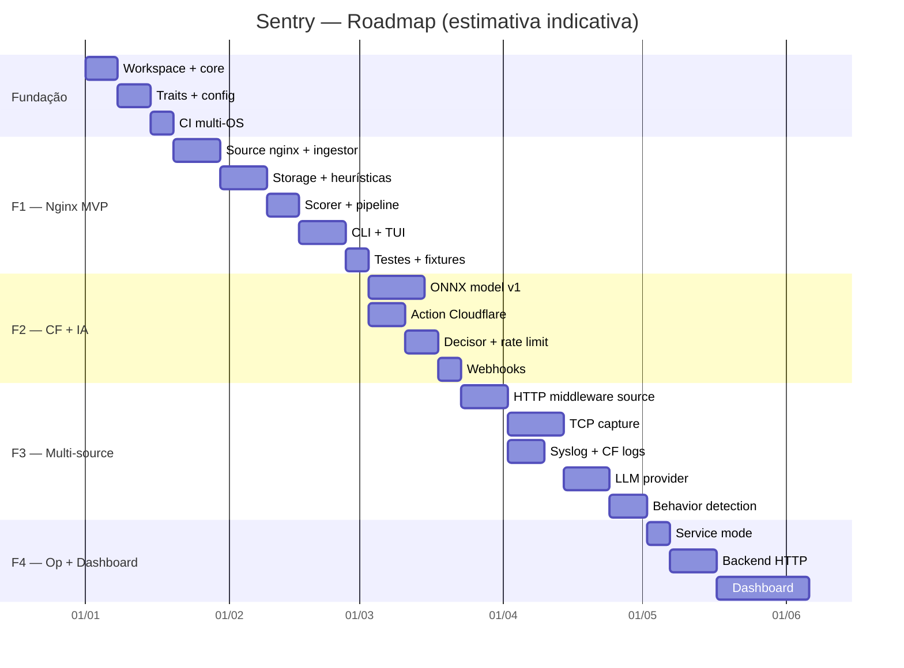

# BACKLOG — Roadmap e Backlog do Sentry

> Movido de `ARCHITECTURE.md` (era §18–§21 e §23). A numeração interna das
> fases (F0–F10) segue a mesma do `ARCHITECTURE.md`.

## 1. Roadmap Visual

---

## 2. Critérios de "Pronto" por Fase

- **F1**: ao apontar para `access.log` real, `sentry tail` mostra eventos coloridos por risco, identifica SQLi/XSS em payloads, marca rotas inexistentes, persiste tudo em SQLite, exporta relatório JSON. Throughput ≥ 5k req/s sem backlog.
- **F2**: evento High dispara challenge no Cloudflare em < 2s; modelo ONNX classifica payloads com F1 ≥ 0.9 em dataset de teste; webhook entrega alerta com contexto.
- **F3**: múltiplas fontes ativas simultaneamente; LLM só acionado em < 2% dos eventos (custo controlado); detecção de brute-force em janela de 5 min.
- **F4**: dashboard mostra eventos live, permite ack/block, histórico de 30 dias sem degradação.

---

## 3. Backlog (subprojeto `sentry auto`)

- [ ] **A.1** `sentry-auto` crate skeleton + `FrameworkDetector` trait
- [ ] **A.2** Scanner de arquivos-âncora + manifestos (composer, package.json, etc.)
- [ ] **A.3** Perfil **WordPress**: wp-config detection, wp-login rate-limit, xmlrpc block, wp-admin allowlist
- [ ] **A.4** Perfil **Laravel**: artisan detection, .env/storage protect, routes/web.php parse (PHP AST)
- [ ] **A.5** Perfil **Django**: manage.py detection, admin/ rate-limit, urls.py parse (Python AST)
- [ ] **A.6** Perfil **Next.js**: next.config.js, `/_next/static` allowlist, `/api/*` routes
- [ ] **A.7** Perfil **Rails**: routes.rb parse (Ruby AST), admin protect
- [ ] **A.8** Perfil **Express**: app.js/routes/ parse (JS AST)
- [ ] **A.9** Perfil **nginx.conf**: parse `location` blocks → rotas conhecidas
- [ ] **A.10** Gerador: profile → `sentry.auto.toml` (rotas + regras + packs)
- [ ] **A.11** `sentry auto` CLI: `--root`, `--dry-run`, `--merge`, `--profile`, `--deep`
- [ ] **A.12** `tree-sitter` integration para AST scan (deep mode)
- [ ] **A.13** Fixtures de testes: 1 projeto real por framework (em `tests/fixtures/`)
- [ ] **A.14** Merge inteligente: preserva regras custom do usuário, só adiciona

> **Fase**: F1.x (pode rodar em paralelo ao MVP nginx — o `auto` gera config que o `run` consome).

---

## 4. Próximos Passos Imediatos

1. Validar este plano (revisar decisões abertas da seção 17).
2. `cargo new --lib` do workspace + crates skeleton. ✅ (F0 concluído)
3. Implementar F1.1 (source nginx) — é o gancho de valor mais rápido.
4. Iniciar `sentry-auto` em paralelo (A.1–A.3) para WordPress como primeiro perfil.

## 5. Roadmap — F5 Performance Engineering (avançada) e F6 Integrações de Firewall/Plataforma

> Performance é critério de design de primeira classe. A F5 prática (§22)
> entregou o hot-path userspace otimizado; esta seção planeja a próxima
> escala (kernel-bypass) e as integrações com plataformas de firewall
> existentes, seguindo o padrão de provider que o projeto já tem
> (`ChallengeProvider` + `build_challenge_action` — novos providers de edge
> não mudam regras, `ActionKind` nem o filtro de verdict).

### 5.1 F5 — Performance Engineering (avançada)

Objetivo: sustentar **≥ 100k eventos/s por nó** em Linux, mantendo o
userspace atual como fallback portável. Pré-requisito: benchmarks da §22
como baseline de regressão (`cargo bench` no CI, budget por cenário).

- **[ ] F5.1 — Budgets de regressão no CI**: `critest`/comparação de
  baseline; falha o pipeline se `pipeline/clean` regredir > 20%.
- **[ ] F5.2 — eBPF/aya (spike Linux)**: observação passiva via kprobe/
  tracepoint (conexões, SYNs, drops) anexada ao mesmo fan-in como uma
  `Source`; ring buffer `aya::BpfRingBuf` → `ProtocolData::Tcp`/eventos
  sintéticos. Sem bloqueio; feature `ebpf` (não-compilável no Windows —
  CI Linux-only com `bpf-linker`).
- **[ ] F5.3 — io_uring para sources**: tail de log e sockets TCP via
  `io-uring` (feature `uring`): menos syscalls por evento no ingest de
  alta taxa; fallback tokio quando a feature está off.
- **[ ] F5.4 — AF_XDP kernel-bypass**: captura de pacotes com zero-copy
  ( feature `xdp`, Linux): UMEM frames → ring buffers de usuário →
  `sentry-source-tcp` em modo de alta performance. Alvo: linha de 1M pps
  por nó em EVH. Requer NUMA-aware ring buffers e pinning de cores.
- **[ ] F5.5 — Ring buffers NUMA-aware no fan-in**: substituir o canal
  tokio por SPSC/MPSC ring buffer crossbeam sem alocação no produtor,
  com pinning por NUMA node quando `--enable-numa`.
- **[ ] F5.6 — Avaliação honesta de kernel module**: protótipo de módulo
  Linux (C) que marca/drops na hook netfilter com decisão consultando
  um map compartilhado com o daemon. Critério de go/no-go: o eBPF (F5.2/
  F5.4) não alcançar o alvo OU necessidade de inspeção que eBPF não
  permite (estado complexo > 512 bytes por pacote). Trade-offs aceitos:
  risco de kernel panic, manutenção por versão de kernel, distribuição
  fora de crates.io — só vale se eBPF comprovar limite.
- **[ ] F5.7 — SIMD explícito onde o ecossistema não cobre**: ingest de
  syslog multi-linha e normalização de payload com `std::simd`
  (nightly-gated atrás de feature) ou crates `memchr`/`aho-corasick`
  adicionais; sem `unsafe`.
- **[x] F5.8 — Agregação de SYN por IP/janela no source TCP** (entregue
  com o overload response F5): `SynAggregator` puro na capture loop
  (`syn_window_ms`, default 100ms, 0 = off) — SYNs do mesmo IP na janela
  colapsam em 1 evento com `TcpData.syn_count` + primeiro fingerprint;
  a taxa de eventos passa a ser função do número de scanners, não de
  pacotes. Complementa o resto do pacote: persistência em lote
  (`insert_batch_with_hash`), coalescência de refreshes benignos
  (`BenignCoalescer`), sampling/shedding por tiers sob pressão medida
  (`[overload]`) e cheap mode na edge inline.

### 5.2 F6 — Integrações de firewall/plataforma

Objetivo: o Sentry decide, a plataforma existente executa — cada provider
segue o trait `ChallengeProvider` (`apply(ip, verdict, opts)`) e entra no
`match` de `build_challenge_action` sem tocar em regras/pipeline.

- **[x] F6.1 — Provider OPNsense/pfSense** (entregue pela F8, §8.8): crate
  `sentry-action-opnsense` (`provider = "opnsense" | "pfsense"`). OPNsense:
  REST `/api/firewall/alias_util/add|delete/<table>` com key/secret via env
  (`api_key_env`/`api_secret_env`); pfSense: `pfctl -t <table> -T add` no
  host (sem shell, args posicionais). TTL em mapa de expiração em memória +
  reaper 30s (a plataforma não tem TTL por entrada); guard never-ban antes
  de qualquer chamada; `Challenge`/`RateLimit` são logados como unenforced
  (a plataforma só conhece drop/reject). Wire no
  `build_challenge_action` sem reconcile daemon-side.
- **[x] F6.2 — Provider nginx** (entregue pelo F7.11, §8.7): gerador de
  include deny-list (`deny <ip>;` em `sentry-deny.conf` incluído do
  `http`/`server` block) + reload (`nginx -s reload`) com debounce
  (≥ 1 reload/s) e `nginx -t` antes (`validate = true`); TTL por bloco
  gerado com carimbo de tempo (`# sentry:<ts>:<ttl>`). Modo desafio: geo
  map `$sentry_challenge_ip` + `if` → `js_challenge on` (módulo
  getpagespeed no host) em vez de njs. Requer co-locação — topologias
  documentadas em §8.7 (F7.11).
- **[ ] F6.3 — HAProxy maps**: `sentry_blocks.map` com `src` como key +
  `http-request deny` — mesmo ciclo gerador/reload do F6.2.
- **[ ] F6.4 — Export Suricata/fast.log + EVE**: Espelho de eventos como
  `fast.log` (formato Snort/Suricata) consumível por ferramentas
  existentes; complementa o CEF/LEEF da F4.6.
- **[ ] F6.5 — GUI/empacotamento OPNsense**: plugin oficial (PHP/XML do
  OPNsense) embutindo `sentry` como serviço — só depois de F6.1 estável.

Critérios de "pronto" da F5/F6:
- F5: benchmark de regressão no CI verde por 2 semanas; spike eBPF
  entregando eventos no fan-in em VM Linux; decisão documentada de
  AF_XDP vs kernel module.
- F6: um provider de firewall E2E (block → edge real → expira) com
  testes de contrato + fixture; doc de deploy por plataforma.

### 5.3 F7 — Roadmap restante (datasets completos)

F7.1–F7.6 estão entregues (§8.7), assim como F7.10 (verificação de bots
via rDNS) e F7.11 (JS challenge na edge inline + provider nginx). Restante:

- **[x] F7.7 — Datasets DB-backed** (entregue pela F8; fecha o F7.9 na
  prática): tabelas `datasets`/`dataset_entries` + `DatasetRepo` (upsert/
  list/entries/set_enabled/delete, cada mutação emite NOTIFY
  `sentry_datasets_changed`); `FeedKind::Ja3` + `RuleMatch::Ja3In`
  (HashSet, case-insensitive) para listas de fingerprint TLS; CLI
  `sentry datasets list|import|enable|disable|delete|fetch` (import aceita
  arquivo ou URL, dedup + cap `MAX_DATASET_ENTRIES`, `--dry-run`); prefilter
  dinâmico — `PREFILTER`/`SENSITIVE_PATH_RE`/`BAD_CRAWLER_RE` são
  `ArcSwap` e `heuristics::reload_dataset_lists` reconstrói os três com os
  literais de datasets `user_agent`/`path` habilitados (UA → gate CRAWLER,
  path → gate SENSITIVE); o daemon aplica no startup e hot-reloada na
  NOTIFY (regras sintéticas `dataset:<name>` trocadas atomicamente via
  `RuleSet::replace_by_prefix`, nunca tocando nas demais); regra:
  `FeedConfig.action` do dataset vira o veredito (`log` default).
  Limitação documentada: datasets só alimentam regras + prefilter — os
  detectores de heurística continuam com os literais builtin (a equivalência
  gated×ungated e os proptests de cobertura dependem deles).
- **[ ] F7.8 — ReportedIP check/lookup**: estender `IpLookupProvider` com
  o ReportedIP (hoje só AbuseIPDB `/check`); mapear severity 1-10 das 63
  categorias para o peso do sinal.
- **[x] F7.9 — CLI de datasets** (entregue junto com o F7.7):
  `sentry datasets list` mostra kind/entries/enabled/source_url;
  `import --kind user_agent|path|ja3 --name <n> [--action <a>] [--dry-run]`
  aceita arquivo ou URL; `enable/disable/delete` notificam o mesmo canal;
  `fetch` re-busca os datasets com `source_url` e re-publica contagens.

### 5.4 F11 — Postura de segurança web (advisories; roadmap de enforce)

F11 (§26 do ARCHITECTURE.md) está entregue no modo **shadow**: checks de
headers (csp/hsts/coop/clickjacking/trusted_types/nosniff/referrer_policy),
dedupe por host+check com TTL, sinais weight-0 imunes a `[scorer.weights]`,
warns de startup para HTTPS/redirect, métrica
`sentry_posture_findings_total{check,host}` e CLI `sentry posture`. Restante:

- **[ ] F11.1 — Enforce (injeção de headers)**: a edge injeta na resposta os
  headers ausentes/habilitados (HSTS só em TLS; **CSP nunca** — sem
  conhecimento dos domínios/nonces/regras do site, injeção automática quebra
  páginas). Valores por `[posture.inject]`, opt-in por check.
- **[ ] F11.2 — Painel de postura no dashboard**: `/api/posture` +
  seção na SPA (checklist ✓/✗ por host, hoje só via `sentry posture`).
- **[ ] F11.3 — Cookie flags** (`Secure`/`HttpOnly`/`SameSite` em
  `Set-Cookie` de sessão) como check adicional.
- **[ ] F11.4 — Permissions-Policy** e avaliações de `object-src 'none'` /
  `base-uri` na eficácia da CSP (paridade completa com o Lighthouse).
