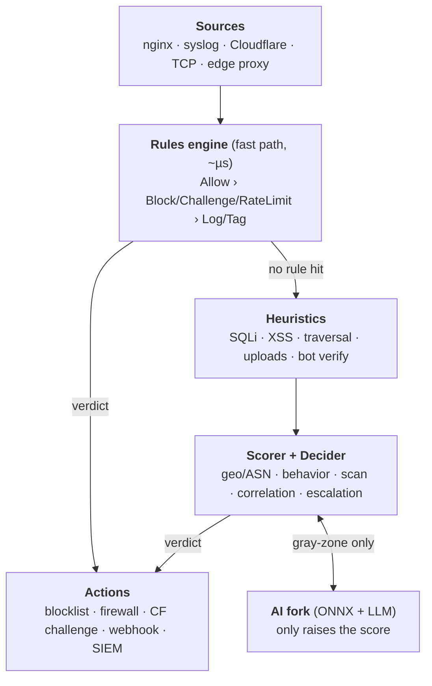
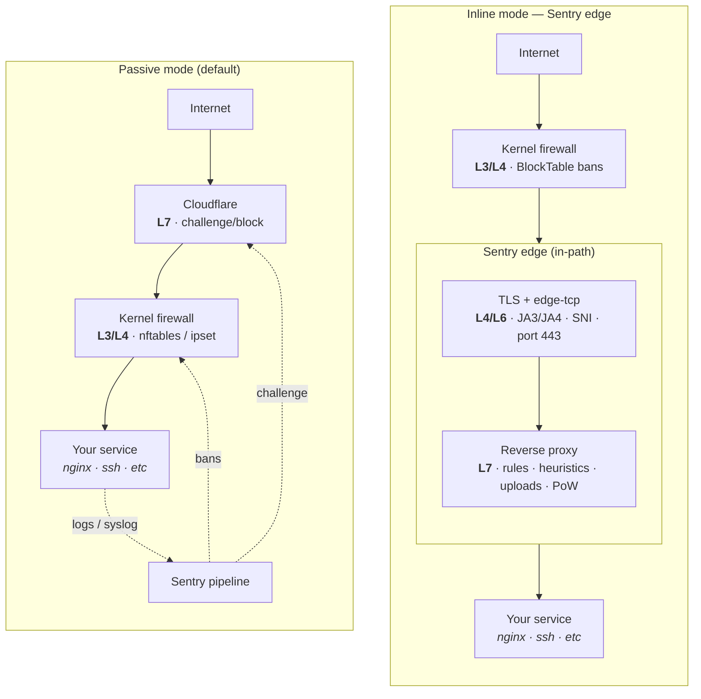

# Sentry

Real-time access monitor for internet-exposed services. Detects threats via
deterministic heuristics + AI (local ONNX / optional LLM), computes a risk
level per request/IP, and acts automatically: block, edge challenge
(Cloudflare, self-hosted JS proof-of-work, or nginx includes), rate-limit,
or webhook alert. Search-engine crawlers are verified via reverse DNS —
real Googlebot passes, spoofers don't.

## Why it exists

Commercial WAFs cover the obvious. Sentry covers the **rest**: encoded
payloads, sensitive-path scanning, malicious crawlers, anomalous access
patterns — combining fast rules (zero known false positives) with AI for the
unknown. All in a single Rust binary, running locally, never shipping your
logs to a third party.

## How it works

Every source and action is a plugin behind the `Source` and `Action` traits.
The core (`sentry-core`) is pure: it defines contracts, no heavy I/O.



1. **Sources** ingest events — log tailing, syslog, Cloudflare Logs API, raw
   TCP capture, or the built-in inline reverse proxy (which sees traffic
   before it reaches your service and can block it in-path).
2. **Rules engine** is the fast path (~µs): DSL-defined packs
   (`sensitive_paths`, `vpn_proxy`, `tor`, rate-scan, …) short-circuit with
   `Allow` / `Block` / `Challenge` / `RateLimit`, or annotate and fall
   through.
3. **Heuristics** run on URL-decoded text with an Aho-Corasick prefilter —
   encoded payloads don't bypass them. Uploads and request bodies are
   inspected for SQLi/XSS in filenames/fields, polyglot images, and
   disguised executables.
4. **AI** (local ONNX model, optional LLM via OpenRouter/Ollama) runs as an
   async fork on gray-zone traffic and can only **raise** the score.
5. **Scorer + decider** combine signal weights, geo/ASN, reputation feeds
   (Tor/Spamhaus), behavioral trackers (brute force, scanning), cross-IP
   correlation, and repeat-offender escalation into a final verdict.
6. **Actions** enforce it: local blocklist shared across nodes, kernel-level
   bans (nftables/ipset/firewalld, OPNsense), CDN/WAF challenges,
   webhooks, SIEM export — with a shared `BlockTable` so a block on one node
   denies at the edge of all of them.

## Where Sentry sits in the network

Each layer is an independent barrier — a threat that slips one still hits the
next. The two deployment modes put Sentry in different places relative to
those barriers:



- **Passive mode** (default): Sentry never touches the traffic. It ingests
  logs/syslog and enforces out-of-band via providers — Cloudflare API at the
  CDN edge (L7), kernel firewall bans (L3/L4), nginx includes, webhooks.
- **Inline mode** (`[deployment] mode = "inline"`): traffic flows *through*
  Sentry — TLS termination and JA3/JA4 fingerprinting at L4/L6, the full
  pipeline at L7, with a `BlockTable` fast-path denying known-bad IPs before
  the pipeline even runs.
- Both modes compose: the CDN challenge filters first (cheapest to serve),
  kernel bans stop everything below HTTP, and the inline proxy catches what
  reaches your host.

Full design, phase-by-phase backlog, and performance numbers:
[`ARCHITECTURE.md`](./ARCHITECTURE.md). Also available as [live docs](https://sentry.lucas-romero.com).

## Deployment modes

| Mode | How it sees traffic | Enforcement |
| --- | --- | --- |
| `passive` (default) | Tails logs / receives events | Cloudflare API, firewalls, webhooks |
| `inline` | Built-in reverse proxy in front of your service (HTTP + optional TLS 443) | 403/429/challenge page in-path, before the backend |

## Quick start

### Docker

```bash
git clone --recurse-submodules <this-repo>
cd sentry
docker compose -f deploy/docker/docker-compose.yml up -d
```

Secrets go in env vars, never in committed config:

```bash
export SENTRY_STORAGE__POSTGRES__URL=postgres://sentry:secret@db/sentry
export SENTRY_CF_TOKEN=xxx        # Cloudflare API token (optional)
export SENTRY_CF_ZONE=yyy         # Cloudflare zone ID (optional)
export SENTRY_LLM_KEY=zzz         # OpenRouter key (optional)
```

### Build from source

See [BUILD.md](./BUILD.md) for requirements, optional features, and
development workflow.

### Configuration

`config/sentry.example.toml` documents every section (`[edge]`, `[rules]`,
`[action]`, `[ai]`, `[uploads]`, …). Any TOML field can be overridden via
env: `SENTRY_<SECTION>__<KEY>` (e.g. `SENTRY_EDGE__LISTEN`).

**Production rollout**: start rule packs in `shadow` (log only), watch the
logs, then switch to `enforce`.

## Extending

- **New source**: crate depending only on `sentry-core`, implementing the
  `Source` trait — wire it in `daemon.rs`.
- **New edge action** (AWS WAF, Fastly, Bunny, …): implement
  `ChallengeProvider` in a new crate + one match arm in
  `daemon::build_challenge_action`. Config stays
  `type = "challenge"`, `provider = "<name>"` — no changes to rules or
  verdict filtering.
- **New protocol schema** for non-HTTP ports: a TOML DSL under
  `[protocol]` (`sentry protocol validate`) — compiled to a sandboxed VM,
  hot-reloaded live.

## Workspace

```
crates/
├── sentry-core/               # Event, ProtocolData, traits, rules engine
├── sentry-storage/            # Postgres (sqlx) + migrations
├── sentry-ai/                 # ThreatModel trait (ONNX) + LlmProvider
├── sentry-geo/                # maxminddb geo/ASN enrichment
├── sentry-source-nginx/       # Source plugin: access.log tail
├── sentry-action-cloudflare/  # ChallengeProvider: block/challenge via CF API
├── sentry-action-webhook/     # Action plugin: alerts
├── sentry-action-blocklist/   # Action plugin: in-memory blocklist
└── sentry-cli/                # binary: clap + ratatui + daemon
```

## Documentation

Full docs live in a separate repo (`IDjinn/sentry-docs`), mounted as a
submodule under [`docs/`](./docs) and deployed online
([live docs](https://sentry.lucas-romero.com)) — Portuguese at `/pt`,
English at `/en`; Fumadocs + Next.js 16 + Tailwind v4, Mermaid support.

Read locally:

```bash
cd docs
bun install
bun run dev   # http://localhost:3000 -> /pt
```

After changes merge into `sentry-docs`, bump the pointer:

```bash
git -C docs pull origin main
git add docs
git commit -m "docs: bump sentry-docs"
```

The logo `sentry.png` at the repo root is the source of truth; a copy lives
in `sentry-docs/public/sentry.png`.

## License

Licensed under the [PolyForm Noncommercial License 1.0.0](./LICENSE).

You may use, copy, modify, and distribute this software for **noncommercial**
purposes only, with attribution. Commercial use requires a separate commercial
license from the copyright holder. See `LICENSE` for the full terms.
